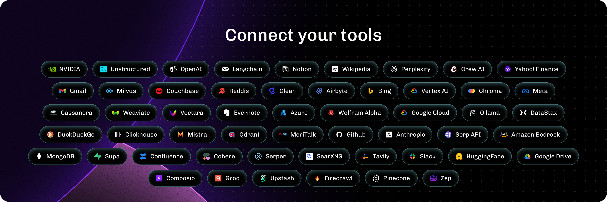

> [!WARNING]
> Tous les liens externes sont susceptibles d'être en anglais.


<p align="center" style="font-size: 12px;">
    Langflow est un générateur d'applications low-code pour les applications RAG et IA multi-agents. Il est basé sur Python et indépendant de tout modèle, API ou base de données.
</p>

<p align="center" style="font-size: 12px;">
    <a href="https://docs.langflow.org" style="text-decoration: underline;">Documentation</a> -
    <a href="https://astra.datastax.com/signup?type=langflow" style="text-decoration: underline;">Service cloud gratuit</a> -
    <a href="https://docs.langflow.org/get-started-installation" style="text-decoration: underline;">Autogéré</a>
</p>

<div align="center">
  <a href="./README.md"></a>
  <a href="./README.PT.md"></a>
  <a href="./README.ES.md"></a>
  <a href="./README.zh_CN.md"></a>
  <a href="./README.ja.md"></a>
  <a href="./README.KR.md"></a>
  <a href="./README.FR.md"></a>
</div>

## ✨ Caractéristiques principales

1. **Basé sur Python** et indépendant des modèles, API, sources de données ou bases de données.
2. **IDE visuel** pour la création et le test de flux de travail par glisser-déposer.
3. **Playground** pour tester et itérer immédiatement les flux de travail avec un contrôle étape par étape.
4. **Orchestration multi-agent** et gestion et récupération des conversations.
5. **Service cloud gratuit** pour démarrer en quelques minutes sans configuration.
6. **Publier en tant qu'API** ou exporter en tant qu'application Python.
7. **Observabilité** avec l'intégration de LangSmith, LangFuse ou LangWatch.
8. **Sécurité et évolutivité de niveau entreprise** avec le service cloud gratuit DataStax Langflow.
9. **Personnalisez les flux de travail** ou créez des flux entièrement à l'aide de Python.
10. **Intégrations d'écosystèmes** en tant que composants réutilisables pour tout modèle, API ou base de données.



## 📦 Démarrage

- **Installer avec pip** (Python 3.10 à 3.12):

```shell
pip install langflow
```

- **Installer avec uv** (Python 3.10 à 3.12):

```shell
uv pip install langflow
```

- **Cloud :** DataStax Langflow est un environnement hébergé sans configuration. [Inscrivez-vous pour un compte gratuit.](https://astra.datastax.com/signup?type=langflow)
- **Autogéré :** exécutez Langflow dans votre environnement. [Installez Langflow](https://docs.langflow.org/get-started-installation) pour exécuter un serveur Langflow local, puis utilisez le guide [Démarrage rapide](https://docs.langflow.org/get-started-quickstart) pour créer et exécuter un flux.
- **Hugging Face :** [Clonez l'espace à l'aide de ce lien](https://huggingface.co/spaces/Langflow/Langflow?duplicate=true) pour créer un espace de travail Langflow.

[](https://www.youtube.com/watch?v=kinngWhaUKM)

## ⭐ Restez à jour

Ajoute une étoile à Langflow sur GitHub pour être instantanément informé des nouvelles versions.


## 👋 Contribuer

Nous acceptons les contributions des développeurs de tous niveaux. Si vous souhaitez contribuer, veuillez consulter nos [consignes de contribution](./CONTRIBUTING.md) et contribuez à rendre Langflow plus accessible.

---

[](https://star-history.com/#langflow-ai/langflow&Date)

## ❤️ Contributeurs

[](https://github.com/langflow-ai/langflow/graphs/contributors)
