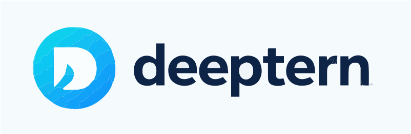

<!-- markdownlint-disable MD030 -->




[](https://github.com/langflow-ai/langflow/releases)
[](https://opensource.org/licenses/MIT)
[](https://pypistats.org/packages/langflow)
[](https://star-history.com/#langflow-ai/langflow)
[](https://github.com/langflow-ai/langflow/issues)
[](https://twitter.com/langflow_ai)
[](https://www.youtube.com/@Langflow)
[](https://discord.gg/EqksyE2EX9)

> [!CAUTION]
> Users must update to Langflow >= 1.3 to protect against [CVE-2025-3248](https://nvd.nist.gov/vuln/detail/CVE-2025-3248).

[Langflow](https://langflow.org) is a powerful tool for building and deploying AI-powered agents and workflows. It provides developers with both a visual authoring experience and a built-in API server that turns every agent into an API endpoint that can be integrated into applications built on any framework or stack. Langflow comes with batteries included and supports all major LLMs, vector databases and a growing library of AI tools.

## ✨ Highlight features

1. **Visual Builder** to get started quickly and iterate. 
1. **Access to Code** so developers can tweak any component using Python.
1. **Playground** to immediately test and iterate on their flows with step-by-step control.
1. **Multi-agent** orchestration and conversation management and retrieval.
1. **Deploy as an API** or export as JSON for Python apps.
1. **Observability** with LangSmith, LangFuse and other integrations.
1. **Enterprise-ready** security and scalability.

## ⚡️ Quickstart

Langflow works with Python 3.10 to 3.13.

Install with uv **(recommended)** 

```shell
uv pip install langflow
```

Install with pip

```shell
pip install langflow
```

## 📦 Deployment

### Self-managed

Langflow is completely open source and you can deploy it to all major deployment clouds. Follow this [guide](https://docs.langflow.org/deployment-docker) to learn how to use Docker to deploy Langflow.

### Fully-managed by DataStax

DataStax Langflow is a full-managed environment with zero setup. Developers can [sign up for a free account](https://astra.datastax.com/signup?type=langflow) to get started.

## ⭐ Stay up-to-date

Star Langflow on GitHub to be instantly notified of new releases.


## 👋 Contribute

We welcome contributions from developers of all levels. If you'd like to contribute, please check our [contributing guidelines](./CONTRIBUTING.md) and help make Langflow more accessible.

---

[](https://star-history.com/#langflow-ai/langflow&Date)

## ❤️ Contributors

[](https://github.com/langflow-ai/langflow/graphs/contributors)

