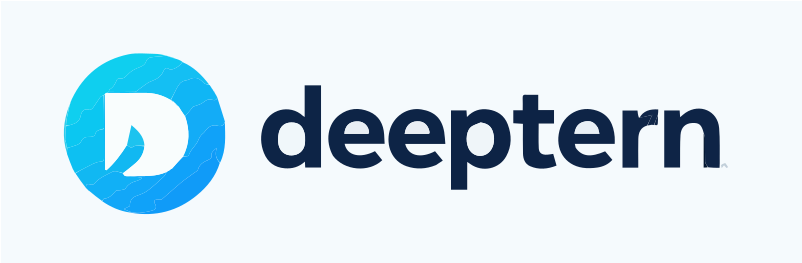

<!-- markdownlint-disable MD030 -->

<picture>
  <source media="(prefers-color-scheme: dark)" srcset="./docs/static/img/langflow-logo-color-blue-bg.svg">
  
</picture>

[](https://github.com/langflow-ai/langflow/releases)
[](https://opensource.org/licenses/MIT)
[](https://pypistats.org/packages/langflow)
[](https://twitter.com/langflow_ai)
[](https://www.youtube.com/@Langflow)
[](https://discord.gg/EqksyE2EX9)
[](https://deepwiki.com/langflow-ai/langflow)

[Langflow](https://langflow.org) is a powerful platform for building and deploying AI-powered agents and workflows. It provides developers with both a visual authoring experience and built-in API and MCP servers that turn every workflow into a tool that can be integrated into applications built on any framework or stack. Langflow comes with batteries included and supports all major LLMs, vector databases and a growing library of AI tools.

## ✨ Highlight features

- **Visual builder interface** to quickly get started and iterate.
- **Source code access** lets you customize any component using Python.
- **Interactive playground** to immediately test and refine your flows with step-by-step control.
- **Multi-agent orchestration** with conversation management and retrieval.
- **Modular Extension Bundles** — 80+ vendor integrations ship as independent `lfx-*` packages that can be installed, updated, and developed in isolation.
- **Deploy as an API** or export as JSON for Python apps.
- **Deploy as an MCP server** and turn your flows into tools for MCP clients.
- **Observability** with LangSmith, LangFuse and other integrations.
- **Enterprise-ready** security and scalability.

## 🖥️  Langflow Desktop

Langflow Desktop is the easiest way to get started with Langflow. All dependencies are included, so you don't need to manage Python environments or install packages manually.
Available for Windows and macOS.

[📥 Download Langflow Desktop](https://www.langflow.org/desktop)

## ⚡️ Quickstart

### Install locally (recommended)

Requires Python 3.10–3.14 and [uv](https://docs.astral.sh/uv/getting-started/installation/) (recommended package manager).

#### Install

From a fresh directory, run:
```shell
uv pip install langflow -U
```

The latest Langflow package is installed.
For more information, see [Install and run the Langflow OSS Python package](https://docs.langflow.org/get-started-installation#install-and-run-the-langflow-oss-python-package).

#### Run

To start Langflow, run:
```shell
uv run langflow run
```

Langflow starts at http://127.0.0.1:7860.

That's it! You're ready to build with Langflow! 🎉

## 📦 Other install options

### Run from source
If you've cloned this repository and want to contribute, run this command from the repository root:
```shell
make run_cli
```
For more information, see [DEVELOPMENT.md](./DEVELOPMENT.md).

### Docker
Start a Langflow container with default settings:
```shell
docker run -p 7860:7860 langflowai/langflow:latest
```
Langflow is available at http://localhost:7860/.
For configuration options, see the [Docker deployment guide](https://docs.langflow.org/deployment-docker).

## 🧩 Extension Bundles

Langflow's vendor-specific integrations (LLM providers, vector stores, search tools, SaaS connectors, and agent frameworks) are shipped as **Extension Bundles** — standalone `lfx-*` Python packages under [`src/bundles/`](src/bundles/). Each bundle is an independent distribution with its own dependencies, tests, and release lifecycle.

A default `pip install langflow` still includes every bundle, so nothing changes for end users. For bundle authors and contributors:

- **[`BUNDLE_API.md`](./BUNDLE_API.md)** — the stable API surface that bundles consume.
- **[`src/bundles/PORTING.md`](src/bundles/PORTING.md)** — step-by-step recipe for extracting a component into a bundle.
- **[`src/bundles/EXTRACTION_PLAN.md`](src/bundles/EXTRACTION_PLAN.md)** — the full mass-extraction plan and bundle inventory.

Develop a bundle in isolation with hot reload:
```shell
uv run lfx extension dev src/bundles/<bundle>
```

Validate a bundle:
```shell
uv run lfx extension validate src/bundles/<bundle>/src/lfx_<bundle>
```

## 🛡️ Security

For security information, see our [Security Policy](./SECURITY.md).

## 🚀 Deployment

Langflow is completely open source and you can deploy it to all major deployment clouds. To learn how to deploy Langflow, see our [Langflow deployment guides](https://docs.langflow.org/deployment-overview).

## ⭐ Stay up-to-date

Star Langflow on GitHub to be instantly notified of new releases.


## 👋 Contribute

We welcome contributions from developers of all levels. If you'd like to contribute, please check our [contributing guidelines](./CONTRIBUTING.md) and help make Langflow more accessible.

---

[](https://star-history.com/#langflow-ai/langflow&Date)

## ❤️ Contributors

[](https://github.com/langflow-ai/langflow/graphs/contributors)
