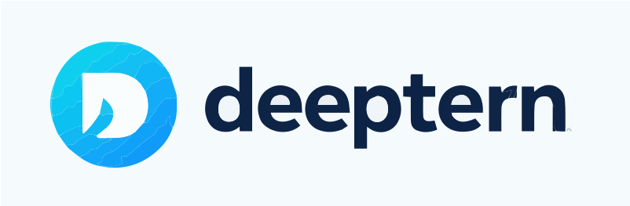

<!-- markdownlint-disable MD030 -->

<picture>
  <source media="(prefers-color-scheme: dark)" srcset="./docs/static/img/langflow-logo-color-blue-bg.svg">
  
</picture>

[](https://github.com/langflow-ai/langflow/releases)
[](https://opensource.org/licenses/MIT)
[](https://pypistats.org/packages/langflow)
[](https://twitter.com/langflow_ai)
[](https://www.youtube.com/@Langflow)
[](https://discord.gg/EqksyE2EX9)
[](https://deepwiki.com/langflow-ai/langflow)

[Langflow](https://langflow.org) 是一个用于构建和部署 AI 驱动的智能体与工作流的强大平台。它为开发者提供可视化的编排体验，并内置了 API 和 MCP 服务器，可将每一个工作流转化为工具，集成到基于任何框架或技术栈构建的应用中。Langflow 开箱即用，支持所有主流的大语言模型（LLM）、向量数据库，以及不断扩充的 AI 工具库。

## ✨ 核心特性

- **可视化构建界面**：助您快速上手并迭代开发。
- **源代码访问**：可使用 Python 自定义任意组件。
- **交互式演练场**：通过逐步控制即时测试和优化您的工作流。
- **多智能体编排**：支持对话管理与检索。
- **以 API 形式部署**：或以 JSON 格式导出，用于 Python 应用。
- **以 MCP 服务器形式部署**：将您的工作流转化为 MCP 客户端可用的工具。
- **可观测性**：集成 LangSmith、LangFuse 等服务。
- **企业级就绪**：具备安全性与可扩展性。

## 🖥️ Langflow 桌面版

Langflow 桌面版是上手 Langflow 最便捷的方式。所有依赖均已内置，您无需管理 Python 环境或手动安装软件包。
支持 Windows 和 macOS 平台。

[📥 下载 Langflow 桌面版](https://www.langflow.org/desktop)

## ⚡️ 快速开始

### 本地安装（推荐）

需要 Python 3.10–3.14 和 [uv](https://docs.astral.sh/uv/getting-started/installation/)（推荐的包管理器）。

#### 安装

在全新的目录下运行：
```shell
uv pip install langflow -U
```

最新版本的 Langflow 包将被安装。
更多信息请参阅[安装并运行 Langflow OSS Python 包](https://docs.langflow.org/get-started-installation#install-and-run-the-langflow-oss-python-package)。

#### 运行

启动 Langflow，运行：
```shell
uv run langflow run
```

Langflow 将在 http://127.0.0.1:7860 启动。

大功告成！您已准备好使用 Langflow 开始构建！🎉

## 📦 其他安装方式

### 从源码运行
如果您已克隆本仓库并希望参与贡献，请在仓库根目录运行以下命令：
```shell
make run_cli
```
更多信息请参阅 [DEVELOPMENT.md](./DEVELOPMENT.md)。

### Docker
使用默认配置启动 Langflow 容器：
```shell
docker run -p 7860:7860 langflowai/langflow:latest
```
Langflow 可通过 http://localhost:7860/ 访问。
配置选项请参阅 [Docker 部署指南](https://docs.langflow.org/deployment-docker)。

## 🛡️ 安全

安全信息请参阅我们的[安全策略](./SECURITY.md)。

## 🚀 部署

Langflow 完全开源，您可将其部署到所有主流云平台。了解如何部署 Langflow，请参阅我们的 [Langflow 部署指南](https://docs.langflow.org/deployment-overview)。

## ⭐ 保持关注

在 GitHub 上 Star Langflow，第一时间获取新版本发布通知。


## 👋 贡献

我们欢迎各个水平的开发者参与贡献。如希望贡献，请查阅我们的[贡献指南](./CONTRIBUTING.md)，助力 Langflow 更加普及。

---

[](https://star-history.com/#langflow-ai/langflow&Date)

## ❤️ 贡献者

[](https://github.com/langflow-ai/langflow/graphs/contributors)
