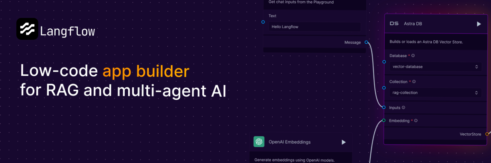

<!-- markdownlint-disable MD030 -->

# [](https://www.langflow.org)

<p align="center"><strong>
    一种用于构建多智能体和RAG应用的可视化框架
</strong></p>
<p align="center" style="font-size: 12px;">
    开源、Python驱动、完全可定制、大模型且不依赖于特定的向量存储
</p>

<p align="center" style="font-size: 12px;">
    <a href="https://docs.langflow.org" style="text-decoration: underline;">文档</a> -
    <a href="https://discord.com/invite/EqksyE2EX9" style="text-decoration: underline;">加入我们的Discord社区</a> -
    <a href="https://twitter.com/langflow_ai" style="text-decoration: underline;">在X上关注我们</a> -
    <a href="https://huggingface.co/spaces/Langflow/Langflow-Preview" style="text-decoration: underline;">在线体验</a>
</p>

<p align="center">
    <a href="https://github.com/langflow-ai/langflow">
        
    </a>
    <a href="https://discord.com/invite/EqksyE2EX9">
        
    </a>
</p>

<div align="center">
  <a href="./README.md"></a>
  <a href="./README.PT.md"></a>
  <a href="./README.ES.md"></a>
  <a href="./README.zh_CN.md"></a>
  <a href="./README.ja.md"></a>
  <a href="./README.KR.md"></a>
</div>

<p align="center">
  
</p>

# 📝 目录

- [📝 目录](#-目录)
- [📦 快速开始](#-快速开始)
- [🎨 创建工作流](#-创建工作流)
- [部署](#部署)
  - [在 Google Cloud Platform 上部署 Langflow](#在google-cloud-platform上部署langflow)
  - [在 Railway 上部署](#在railway上部署)
  - [在 Render 上部署](#在render上部署)
- [🖥️ 命令行界面 (CLI)](#️-命令行界面-cli)
  - [用法](#用法)
    - [环境变量](#环境变量)
- [👋 贡献](#-贡献)
- [🌟 贡献者](#-贡献者)
- [📄 许可证](#-许可证)

# 📦 快速开始

使用 pip 安装 Langflow：

```shell
# 确保您的系统已经安装上>=Python 3.10
# 安装Langflow预发布版本
python -m pip install langflow --pre --force-reinstall

# 安装Langflow稳定版本
python -m pip install langflow -U
```

然后运行 Langflow：

```shell
python -m langflow run
```

您可以在[HuggingFace Spaces](https://huggingface.co/spaces/Langflow/Langflow-Preview)中在线体验 Langflow，也可以使用该链接[克隆空间](https://huggingface.co/spaces/Langflow/Langflow-Preview?duplicate=true)，在几分钟内创建您自己的 Langflow 运行工作空间。

# 🎨 创建工作流

使用 Langflow 来创建工作流非常简单。只需从侧边栏拖动组件到画布上，然后连接组件即可开始构建应用程序。

您可以通过编辑提示参数、将组件分组到单个高级组件中以及构建您自己的自定义组件来展开探索。

完成后，可以将工作流导出为 JSON 文件。

然后使用以下脚本加载工作流：

```python
from langflow.load import run_flow_from_json

results = run_flow_from_json("path/to/flow.json", input_value="Hello, World!")
```

# 部署

## 在 Google Cloud Platform 上部署 Langflow

请按照我们的分步指南使用 Google Cloud Shell 在 Google Cloud Platform (GCP) 上部署 Langflow。该指南在 [**Langflow in Google Cloud Platform**](GCP_DEPLOYMENT.md) 文档中提供。

或者，点击下面的 "Open in Cloud Shell" 按钮，启动 Google Cloud Shell，克隆 Langflow 仓库，并开始一个互动教程，该教程将指导您设置必要的资源并在 GCP 项目中部署 Langflow。

[](https://console.cloud.google.com/cloudshell/open?git_repo=https://github.com/langflow-ai/langflow&working_dir=scripts/gcp&shellonly=true&tutorial=walkthroughtutorial_spot.md)

## 在 Railway 上部署

使用此模板在 Railway 上部署 Langflow 1.0 预览版：

[](https://railway.app/template/UsJ1uB?referralCode=MnPSdg)

或者使用此模板部署 Langflow 0.6.x：

[](https://railway.app/template/JMXEWp?referralCode=MnPSdg)

## 在 Render 上部署

<a href="https://render.com/deploy?repo=https://github.com/langflow-ai/langflow/tree/dev">

</a>

# 🖥️ 命令行界面 (CLI)

Langflow 提供了一个命令行界面以便于平台的管理和配置。

## 用法

您可以使用以下命令运行 Langflow：

```shell
langflow run [OPTIONS]
```

命令行参数的详细说明：

- `--help`: 显示所有可用参数。
- `--host`: 定义绑定服务器的主机 host 参数，可以使用 LANGFLOW_HOST 环境变量设置，默认值为 127.0.0.1。
- `--workers`: 设置工作进程的数量，可以使用 LANGFLOW_WORKERS 环境变量设置，默认值为 1。
- `--worker-timeout`: 设置工作进程的超时时间（秒），默认值为 60。
- `--port`: 设置服务监听的端口，可以使用 LANGFLOW_PORT 环境变量设置，默认值为 7860。
- `--config`: 定义配置文件的路径，默认值为 config.yaml。
- `--env-file`: 指定包含环境变量的 .env 文件路径，默认值为 .env。
- `--log-level`: 定义日志记录级别，可以使用 LANGFLOW_LOG_LEVEL 环境变量设置，默认值为 critical。
- `--components-path`: 指定包含自定义组件的目录路径，可以使用 LANGFLOW_COMPONENTS_PATH 环境变量设置，默认值为 langflow/components。
- `--log-file`: 指定日志文件的路径，可以使用 LANGFLOW_LOG_FILE 环境变量设置，默认值为 logs/langflow.log。
- `--cache`: 选择要使用的缓存类型，可选项为 InMemoryCache 和 SQLiteCache，可以使用 LANGFLOW_LANGCHAIN_CACHE 环境变量设置，默认值为 SQLiteCache。
- `--dev/--no-dev`: 切换开发/非开发模式，默认值为 no-dev 即非开发模式。
- `--path`: 指定包含前端构建文件的目录路径，此参数仅用于开发目的，可以使用 LANGFLOW_FRONTEND_PATH 环境变量设置。
- `--open-browser/--no-open-browser`: 切换启动服务器后是否打开浏览器，可以使用 LANGFLOW_OPEN_BROWSER 环境变量设置，默认值为 open-browser 即启动后打开浏览器。
- `--remove-api-keys/--no-remove-api-keys`: 切换是否从数据库中保存的项目中移除 API 密钥，可以使用 LANGFLOW_REMOVE_API_KEYS 环境变量设置，默认值为 no-remove-api-keys。
- `--install-completion [bash|zsh|fish|powershell|pwsh]`: 为指定的 shell 安装自动补全。
- `--show-completion [bash|zsh|fish|powershell|pwsh]`: 显示指定 shell 的自动补全，使您可以复制或自定义安装。
- `--backend-only`: 此参数默认为 False，允许仅运行后端服务器而不运行前端，也可以使用 LANGFLOW_BACKEND_ONLY 环境变量设置。
- `--store`: 此参数默认为 True，启用存储功能，使用 --no-store 可禁用它，可以使用 LANGFLOW_STORE 环境变量配置。

这些参数对于需要定制 Langflow 行为的用户尤其重要，特别是在开发或者特殊部署场景中。

### 环境变量

您可以使用环境变量配置许多 CLI 参数选项。这些变量可以在操作系统中导出，或添加到 .env 文件中，并使用 --env-file 参数加载。

项目中包含一个名为 .env.example 的示例 .env 文件。将此文件复制为新文件 .env，并用实际设置值替换示例值。如果同时在操作系统和 .env 文件中设置值，则 .env 设置优先。

# 👋 贡献

我们欢迎各级开发者为我们的 GitHub 开源项目做出贡献，并帮助 Langflow 更加易用，如果您想参与贡献，请查看我们的贡献指南 [contributing guidelines](./CONTRIBUTING.md) 。

---

[](https://star-history.com/#langflow-ai/langflow&Date)

# 🌟 贡献者

[](https://github.com/langflow-ai/langflow/graphs/contributors)

# 📄 许可证

Langflow 以 MIT 许可证发布。有关详细信息，请参阅 [LICENSE](LICENSE) 文件。
