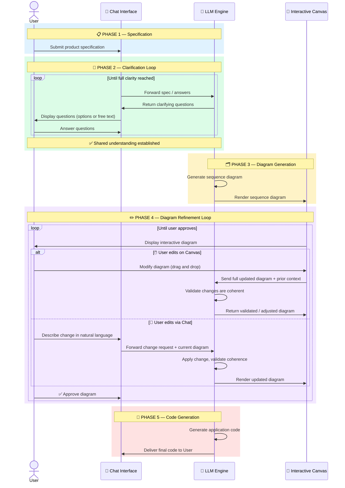

# Sequence Diagram — Product Building Flow

This diagram captures the meta-flow: how a user goes from a product idea to generated code.

## Notes

- The clarification loop terminates on LLM confidence, not a fixed number of turns.
- Canvas edits and chat edits are equivalent paths — LLM remains the single source of truth for diagram state.
- Code generation is a single step here; it will be expanded into its own sequence diagram in a later iteration.
