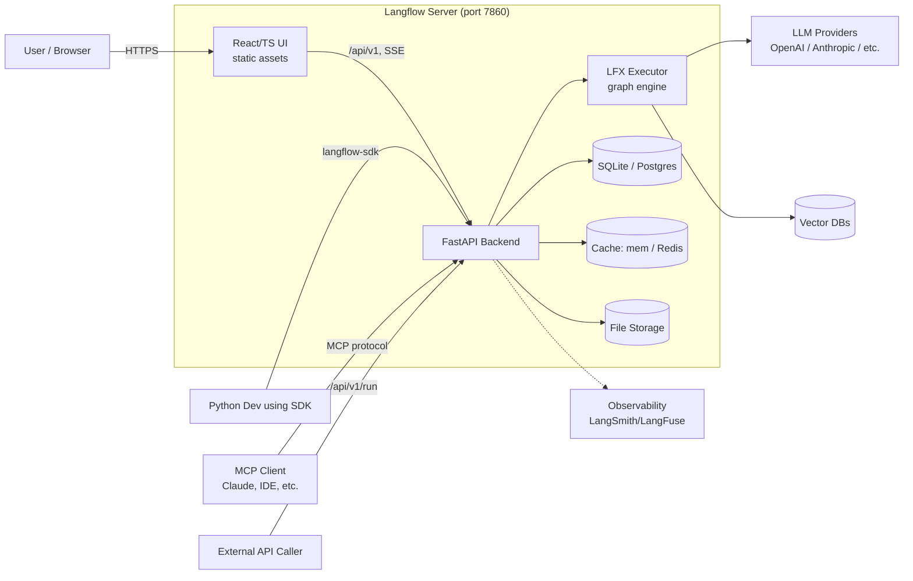

# 1. System Context — Who Talks to What

At the highest level, Langflow is a single server (default port `7860`) that serves a React UI, exposes a REST/SSE API, and embeds a graph execution engine that calls out to LLM providers, vector DBs, and tools.

## Actors

- **User / Browser** — interactive canvas use.
- **Python developer** — uses `langflow-sdk` to embed flows in their own apps.
- **MCP client** — any MCP-aware tool (Claude Desktop, IDEs) can call a flow as if it were a tool.
- **External API caller** — runs published flows over plain HTTP.

## What lives inside the server

- **React UI** — built static assets mounted by FastAPI.
- **FastAPI backend** — auth, persistence, request orchestration.
- **LFX executor** — turns a flow definition into running Python code.
- **Database** — SQLite by default, Postgres in production.
- **Cache + storage** — in-memory/Redis cache, file storage for uploads.

## What lives outside

- **LLM providers** (OpenAI, Anthropic, etc.) and **vector DBs** — called by individual components at run time.
- **Observability** — optional integrations with LangSmith, LangFuse, OpenTelemetry collectors.
