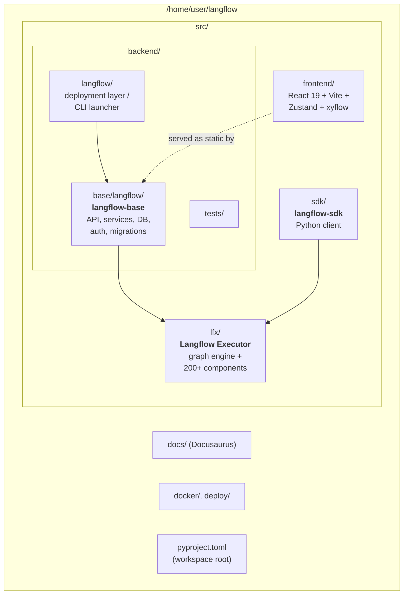

# 2. Monorepo Layout

Langflow is a **uv workspace** of four cooperating Python packages plus a frontend.

## Why the split?

- **`lfx`** is the pure execution engine. It has no web server, no auth, no database — it can run flows standalone via `lfx run` or `lfx serve`. This is the *kernel*.
- **`langflow-base`** wraps `lfx` with a FastAPI server, persistence, auth, and a React UI. This is what most users actually run.
- **`langflow`** (top-level package) is a thin deployment / CLI layer that packages everything for `pip install langflow`.
- **`langflow-sdk`** lets Python programs call into Langflow without going through HTTP.
- **`frontend`** builds to static assets that `langflow-base` serves directly.

## Workspace wiring

The root `pyproject.toml` declares a uv workspace so the four Python packages share a lockfile and can be developed together. During dev:

- `make backend` runs FastAPI on `:7860`.
- `make frontend` runs Vite on `:3000` with a proxy to the backend.
- `make run_cli` builds the frontend, installs the workspace, and boots a single combined server.
