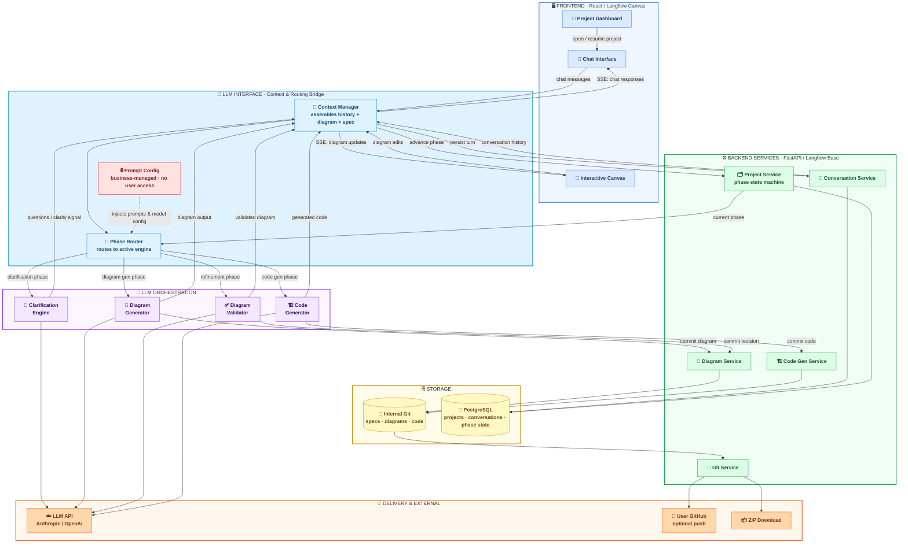

# System Architecture

## Component Glossary

| Component | Layer | Responsibility |
|---|---|---|
| **Project Dashboard** | Frontend | List projects; open or resume — navigates user into Chat Interface |
| **Chat Interface** | Frontend | Spec input, clarification Q&A, code delivery — SSE streaming |
| **Interactive Canvas** | Frontend | Render and edit architecture diagrams (xyflow, repurposed from Langflow pipeline canvas) |
| **Context Manager** | LLM Interface | Assembles full LLM context per turn: conversation history + current diagram + spec answers |
| **Phase Router** | LLM Interface | Reads current project phase from Project Service; routes assembled context to the correct LLM engine |
| **Prompt Config** | LLM Interface | Business-managed prompt templates and model config; injected server-side, never exposed to user |
| **Project Service** | Backend | Owns the project phase state machine: `CLARIFICATION → DIAGRAM_GENERATION → DIAGRAM_REFINEMENT → CODE_GENERATION → DONE` |
| **Conversation Service** | Backend | Persists every chat turn; feeds history back to Context Manager on each request |
| **Diagram Service** | Backend | Receives diagram artifacts from LLM engines; commits each version to Git |
| **Code Gen Service** | Backend | Receives generated code from Code Generator; commits files to Git |
| **Git Service** | Backend | All Git operations — push to user GitHub, export ZIP |
| **Clarification Engine** | LLM Orchestration | Multi-turn Q&A; emits a clarity signal when spec is complete |
| **Diagram Generator** | LLM Orchestration | Converts locked spec into a sequence diagram on clarity signal |
| **Diagram Validator** | LLM Orchestration | Given a user-edited diagram + prior context, checks coherence and flags contradictions |
| **Code Generator** | LLM Orchestration | Converts approved diagram + full spec into application code files |
| **Internal Git** | Storage | System of record for all versioned artifacts — specs, diagram revisions, final code |
| **PostgreSQL** | Storage | Operational state — projects, users, conversation history, current phase |
| **LLM API** | External | Anthropic / OpenAI — provider and model fixed by business config |
| **User GitHub** | External | Optional — Git Service pushes final repo on user request |
| **ZIP Download** | External | Git Service packages codebase as a downloadable archive |

## Key Design Decisions

- **Project Dashboard is navigation-only**: It has no direct backend connections. Opening or resuming a project simply navigates to the Chat Interface, which loads the full session state (prior messages + current diagram) from the backend.
- **LLM Interface as the bridge**: Chat Interface and Interactive Canvas both funnel into the Context Manager, which assembles a complete, coherent context before any LLM call. The Phase Router then decides which engine to invoke — the frontend never calls LLM engines directly.
- **Prompt Config is server-side only**: LLM selection, model parameters, and all prompt templates are business-configured at deploy time. The frontend has no visibility into them.
- **Git as the artifact store**: Every intermediate state (spec answers, each diagram revision, final code) is a versioned Git commit. This enables future re-architecture flows — user opens an old project, modifies the diagram, and regenerates code with full history intact.
- **Canvas repurposed, not replaced**: The Interactive Canvas reuses Langflow's xyflow infrastructure but renders architecture diagram nodes, not LLM pipeline nodes. Node types and semantics are completely new.
- **SSE streaming end-to-end**: All LLM responses flow back through the Context Manager as Server-Sent Events to Chat Interface or Interactive Canvas — users see questions and diagram updates in real time.
- **Phase state machine prevents out-of-order actions**: A user cannot trigger code generation before diagram approval, and cannot modify diagrams before the clarification phase is complete.
