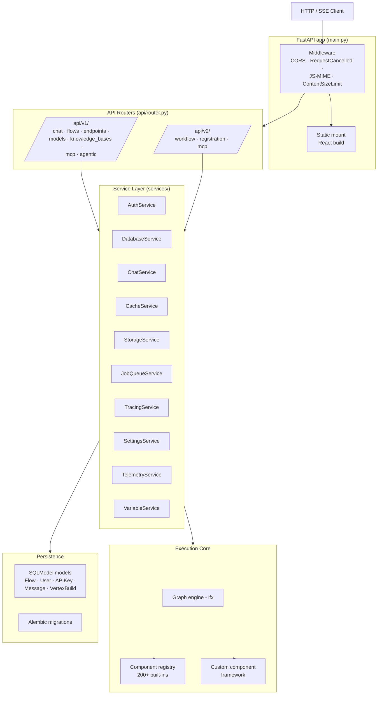

# 3. Backend — Layered View

The backend is a classic layered FastAPI app with a **service-locator dependency-injection pattern**.



## Entry-point chain

```
langflow run              # CLI
  └── langflow_launcher:main
        └── langflow.__main__
              └── Gunicorn + Uvicorn workers (LangflowApplication, server.py)
                    └── main.py::setup_app()  ──► FastAPI instance
```

## Routers

Two versioned APIs under `api/router.py`:

- **v1** (`/api/v1`): `chat`, `flows`, `endpoints`, `models`, `knowledge_bases`, `deployments`, `mcp`, `mcp_projects`, `agentic`
- **v2** (`/api/v2`): `workflow`, `registration`, `mcp`

## Services (the DI registry)

All stateful subsystems are resolved through `services/deps.py::get_service(ServiceType.X)` — a typed singleton lookup. Services are constructed lazily, swappable in tests, and shared across requests:

| Service | Responsibility |
|---|---|
| `AuthService` | JWT auth, API-key validation |
| `DatabaseService` | SQLModel session, pool, migrations |
| `ChatService` | Flow build/run caching, session state |
| `CacheService` | In-memory or Redis cache |
| `StorageService` | File uploads / downloads |
| `JobQueueService` | Background tasks |
| `TracingService` | OpenTelemetry tracing |
| `SettingsService` | Config + env vars |
| `TelemetryService` | Anonymous usage pings |
| `VariableService` | Global variables for flows |

This keeps routers thin (just HTTP wiring) and makes the execution core unit-testable without a server.

## Middleware

Defined in `main.py`:

- `RequestCancelledMiddleware` — cleans up when clients disconnect from streams.
- `JavaScriptMIMETypeMiddleware` — content-type fixes for the React bundle.
- `ContentSizeLimitMiddleware` — bounds payload size.
- `CORSMiddleware` — standard CORS.
