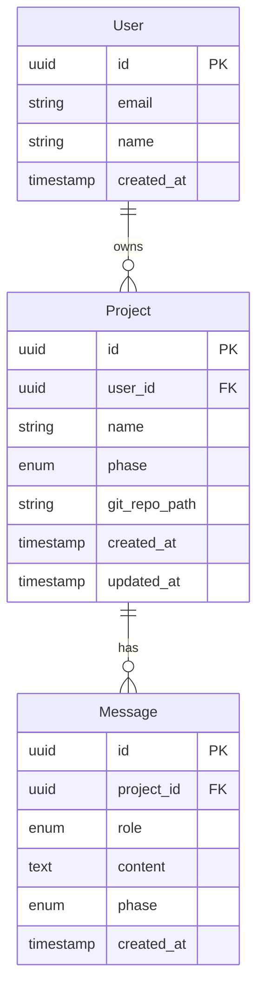

# Data Model

## Entity Relationship Diagram



---

## PostgreSQL Entities

### Project
The top-level entity. One project = one Git repository.

| Field | Type | Notes |
|---|---|---|
| `id` | UUID | Primary key |
| `user_id` | UUID FK | Owner |
| `name` | string | User-provided project name |
| `phase` | enum | Current phase — see Phase State Machine in wiki |
| `git_repo_path` | string | Absolute path to the project's internal Git repo |
| `created_at` | timestamp | |
| `updated_at` | timestamp | Updated on every phase transition |

**Phase enum values:** `CLARIFICATION` · `DIAGRAM_GENERATION` · `DIAGRAM_REFINEMENT` · `CODE_GENERATION` · `DONE`

Phase advancing to `CODE_GENERATION` is the diagram approval signal — no separate approval field needed.

---

### Message
Stores every conversation turn as a **backup**. The primary LLM context source is `prd.md` in Git. Used for audit and session restore only.

| Field | Type | Notes |
|---|---|---|
| `id` | UUID | Primary key |
| `project_id` | UUID FK | Parent project |
| `role` | enum | `USER` or `ASSISTANT` |
| `content` | text | Raw message content |
| `phase` | enum | Which phase this message was sent in |
| `created_at` | timestamp | |

---

## Git Repository Structure

Each project gets its own Git repository at `git_repo_path`. The repo is initialised when the project is created.

```
project-{id}/
├── prd.md                        ← synthesised PRD, committed after clarification
├── diagrams/
│   ├── sequence.mmd              ← Mermaid source — LLM reads and writes this
│   ├── sequence.layout.json      ← canvas node positions — LLM never sees this
│   ├── architecture.mmd          ← future
│   ├── architecture.layout.json  ← future
│   └── erd.mmd                   ← future
└── code/                         ← generated application code
    └── ...
```

### Diagram Format — Mermaid (`.mmd`)

Mermaid is the canonical format for all diagrams. It is:
- **LLM input and output** — the LLM receives Mermaid and returns Mermaid. Fully symmetric.
- **Human-readable** — Git diffs on `.mmd` files are meaningful
- **Canvas source** — parsed into xyflow nodes/edges for rendering via a Mermaid → xyflow converter

### Canvas Layout — `.layout.json`

Stores xyflow node positions only — not diagram structure. Kept separate so the Mermaid file stays clean and LLM-readable. On canvas load:
1. Parse `sequence.mmd` → xyflow nodes/edges (structure)
2. Apply positions from `sequence.layout.json` if it exists
3. Otherwise, auto-layout via elkjs (same as Langflow)

The LLM never reads or writes `.layout.json`. It is a canvas-only concern.

---

## Diagram Flow

```
LLM generates/edits Mermaid
        ↓
  sequence.mmd (Git)
        ↓
  Mermaid → xyflow parser
        ↓
  Canvas renders (xyflow)
        ↑
  User edits on canvas
        ↓
  xyflow → Mermaid serialiser
        ↓
  sequence.mmd updated
        ↓
  LLM validates (reads Mermaid)
```

---

## Commit Strategy

All artifact changes (PRD, diagrams, code) are written to the Git working tree immediately as they happen. **Nothing is committed until the user explicitly saves.** This is standard file-handling behaviour — edits are buffered, saves are intentional.

| Trigger | What gets committed | Commit message |
|---|---|---|
| User saves | All changed files in working tree | User-provided label, or timestamp if none given |
| User exits without saving | All changed files in working tree | `auto-save: session end` |

A single save commits everything that has changed — PRD, diagrams, layout, code — in one atomic commit. No per-artifact commit rules.

Version history is `git log` on the repo. No separate version table needed.

---

## What Lives Where

| Artifact | Storage | Reason |
|---|---|---|
| PRD document | Git (`prd.md`) | Versioned, primary LLM context source |
| Diagram structure | Git (`diagrams/*.mmd`) | LLM reads/writes Mermaid; Git tracks history |
| Canvas positions | Git (`diagrams/*.layout.json`) | Restores exact layout; LLM never touches it |
| Generated code | Git (`code/`) | Delivery-ready — push to GitHub or ZIP |
| Project phase | PostgreSQL | Fast reads on every request |
| Conversation messages | PostgreSQL | Backup only |
