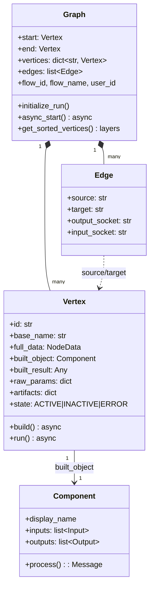
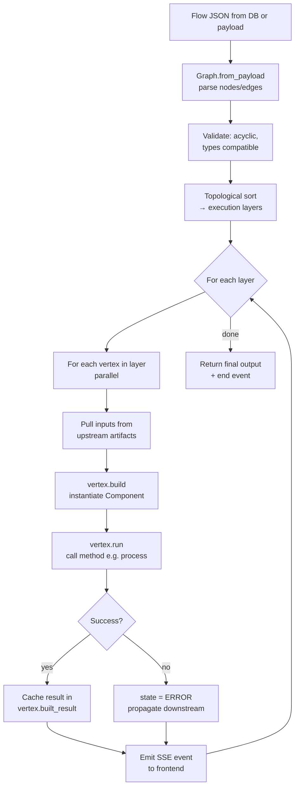

# 4. The Graph Engine (LFX) — Heart of Langflow

Everything you draw on the canvas becomes a **Graph** of **Vertex** nodes connected by **Edge** objects.

## Core types



## Execution algorithm



## Key files

- `src/lfx/src/lfx/graph/graph/base.py` — `Graph` class
- `src/lfx/src/lfx/graph/vertex/base.py` — `Vertex` class (states: `ACTIVE`, `INACTIVE`, `ERROR`)
- `src/lfx/src/lfx/graph/edge/base.py` — `Edge` and `CycleEdge`
- `src/lfx/src/lfx/custom/custom_component/component.py` — base `Component`
- `src/lfx/src/lfx/components/` — 200+ built-in components (LLMs, vector stores, tools, agents…)
- `src/lfx/src/lfx/interface/initialize.py` — component auto-discovery

## What a Component looks like

A Component is just a Python class declaring `inputs`, `outputs`, and a method per output. The framework introspects those declarations to auto-generate the UI panel, the JSON schema, and the typed wiring rules — so the same class is both UI and runtime.

```python
from langflow.custom import Component
from langflow.io import MessageTextInput, Output

class MyComponent(Component):
    display_name = "My Component"
    description  = "What it does"
    icon         = "component-icon"

    inputs = [
        MessageTextInput(name="input_value", display_name="Input"),
    ]
    outputs = [
        Output(display_name="Output", name="output", method="process"),
    ]

    def process(self) -> Message:
        return Message(text=self.input_value)
```

> **Heads up:** the *class name* is the stable identifier the UI uses to match nodes in saved flows. Renaming it is a breaking change.

## Why layered execution?

A topological sort partitions vertices into **layers** where everything in one layer can run in parallel. The engine:

1. Computes the layers once per build.
2. For each layer, runs all vertices concurrently.
3. Pulls each vertex's inputs from upstream vertices' cached `built_result`.
4. Emits an SSE event after every vertex so the UI can light up nodes as they complete.

Errors don't abort the whole graph — they mark the failing vertex `ERROR`, and downstream vertices that depended on it become `INACTIVE`.
