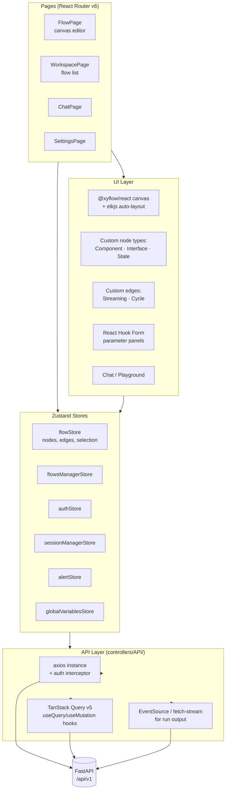

# 5. Frontend — React + Zustand + xyflow

## Stack

- **React 19** + TypeScript, bundled by **Vite**.
- **Zustand** for client state (canvas, selection, auth, alerts).
- **TanStack Query v5** for server state (caching, mutations, invalidation).
- **`@xyflow/react` v12** for the graph canvas, with **elkjs** for auto-layout.
- **Tailwind CSS** + **Radix UI** + **Chakra UI** for styling/primitives.
- **React Hook Form** for parameter panels, **i18next** for i18n.

## State split

State is split by concern rather than packed into one global store:

| Store | What it owns |
|---|---|
| `flowStore` | Current canvas: nodes, edges, selection, run output |
| `flowsManagerStore` | The list of flows, CRUD operations |
| `authStore` | User, JWT, login state |
| `sessionManagerStore` | Per-session run state |
| `globalVariablesStore` | Shared variables across flows |
| `alertStore` | Toast / notification queue |
| `darkStore` | Theme preference |

This keeps re-renders localized — editing canvas state doesn't disturb the flow list or auth.

## How it talks to the backend

- **Reads / writes**: `controllers/API/queries/*` — TanStack Query hooks wrapping an axios instance with auth interceptors.
- **Runs**: `POST /api/v1/chat/{flow_id}` opens an SSE stream. The frontend listens for `message` / `end` / `error` events and pushes incremental output into `flowStore`, which the canvas mirrors live.

## Custom canvas nodes

The renderer registers custom node types (`ComponentNode`, `InterfaceNode`, `StateNode`) and custom edges (`StreamingEdge`, `CycleEdge`) with xyflow. Each node renders the component's auto-generated input form using the schema served by the backend, so the UI stays in sync with the Python component definitions automatically.

## Custom icons (for new components)

1. Create the SVG component in `src/frontend/src/icons/YourIcon/` exporting via `forwardRef` with `isDark` support.
2. Register it in `lazyIconImports.ts`.
3. Set `icon = "YourIcon"` in the Python component class — the canvas picks it up automatically.
