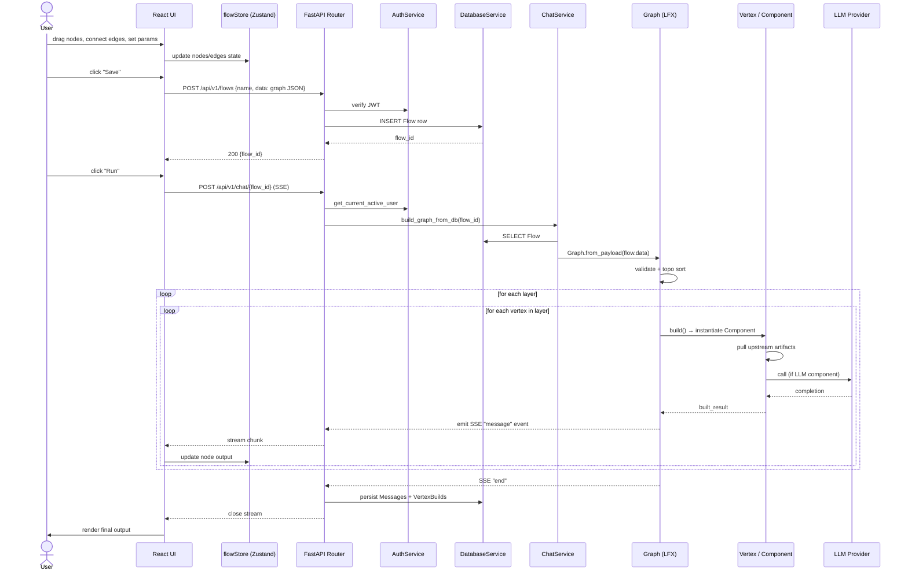

# 6. End-to-End Request Lifecycle

What actually happens when a user creates a flow and clicks **Run**?

## What's happening at each phase

### Authoring
The canvas is purely client-side state in `flowStore`. **Save** serializes nodes + edges to JSON and posts to `/api/v1/flows`, which writes a `Flow` row. No execution yet.

### Run
`POST /api/v1/chat/{flow_id}` is a **streaming** endpoint (`StreamingResponse` of Server-Sent Events). The handler in `api/v1/chat.py`:

1. Authenticates via `AuthService`.
2. Asks `ChatService` to build (or reuse a cached) `Graph` from the flow's JSON.
3. Calls `Graph.async_start()`, iterating async over emitted events.
4. Each event is forwarded as SSE to the browser.

### Per-vertex
Inside the engine each `Vertex` is **built** (its `Component` is instantiated and its parameters are bound) and then **run** (the method named in the wired `Output` is called). If the component is an LLM node, this is where the external call happens.

### Persistence
On `end`, the chat router persists:
- Conversation messages → `Message` table
- Per-vertex build artifacts → `VertexBuild` table

These feed the Playground's history view and the observability integrations.

### Frontend response
The frontend's SSE consumer pushes each chunk into `flowStore`, which causes the corresponding canvas node to update its output preview live. When the `end` event arrives, the stream closes and the final state is committed.
