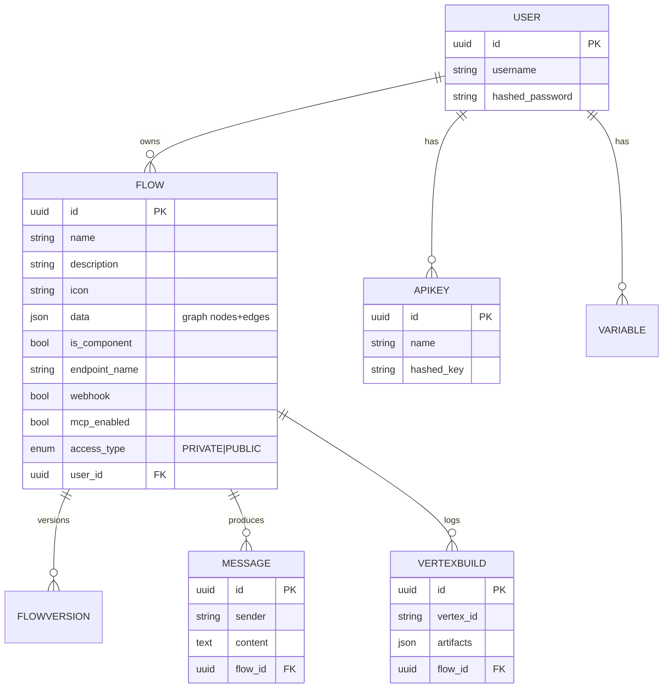

# 7. Data Model (core tables)

Persistence uses **SQLModel** (Pydantic + SQLAlchemy) with **Alembic** migrations in `src/backend/base/langflow/alembic/versions/`. SQLite is the default; Postgres is supported in production.



## The `Flow` table is the keystone

The most important column is **`data` (JSON)** — it stores the entire graph (nodes, positions, edges, parameter values) as a single document. This means:

- Saving a flow is one row write.
- Versioning is a snapshot copy.
- The execution engine doesn't need a schema migration when you add a new component type.

The trade-off: rich queries over flow content require JSON operators, not relational joins. That's deliberate — the relational layer tracks *flows as artifacts*, while the engine treats the JSON as the source of truth.

## Other key columns on `Flow`

| Column | Meaning |
|---|---|
| `endpoint_name` | Custom URL slug used for public execution endpoints. |
| `webhook` | If true, the flow accepts webhook triggers. |
| `mcp_enabled` | If true, the flow is exposed as an MCP tool. |
| `access_type` | `PRIVATE` or `PUBLIC`. Controls auth requirements at run time. |
| `is_component` | Distinguishes reusable sub-components from standalone flows. |

## Auxiliary tables

- **`User` / `APIKey`** — authentication.
- **`Variable`** — global key/value store available to components at run time.
- **`Message`** — chat history per flow / session.
- **`VertexBuild`** — per-vertex execution log (artifacts, errors). Drives the Playground inspector and observability exports.
- **`FlowVersion`** — versioned snapshots of `Flow.data`.

## Migrations

Alembic migrations live alongside the models:

```
src/backend/base/langflow/alembic/
  env.py
  versions/
    20XX_..._add_xyz.py
```

Use `make alembic-revision message="..."` to scaffold and `make alembic-upgrade` to apply.
