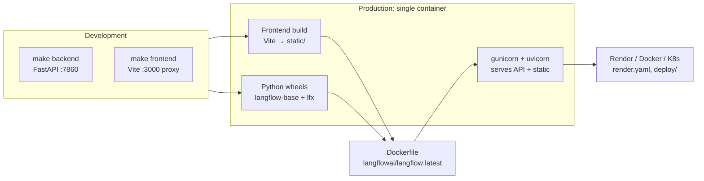

# 8. Build & Deployment



## Local development

Two terminals:

```bash
make backend     # FastAPI on :7860 with hot reload
make frontend    # Vite dev server on :3000, proxies API to :7860
```

For component hacking, enable dynamic component loading:

```bash
LFX_DEV=1 make backend                # load all components dynamically
LFX_DEV=mistral,openai make backend   # load only specific modules
```

## Single-command run

```bash
make run_cli     # builds frontend, installs workspace, boots combined server
make run_clic    # same but clean-builds (use when frontend gets weird)
```

## pip install

```bash
uv pip install langflow -U
uv run langflow run
```

This pulls the published `langflow` wheel (which depends on `langflow-base` and `lfx`) and starts the combined server on `:7860`.

## Docker

```bash
docker run -p 7860:7860 langflowai/langflow:latest
```

A reference Dockerfile lives at `docker_example/Dockerfile`:

```dockerfile
FROM langflowai/langflow:latest
CMD ["python", "-m", "langflow", "run", "--host", "0.0.0.0", "--port", "7860"]
```

## Cloud

- `render.yaml` for one-click Render deploys.
- `deploy/` and `docker/` directories hold Kubernetes manifests and additional Docker setups.

## Configuration

Driven by environment variables, surfaced through `SettingsService`. Common ones:

| Variable | Purpose |
|---|---|
| `LANGFLOW_DATABASE_URL` | Postgres / SQLite connection string |
| `LANGFLOW_AUTO_LOGIN` | Skip auth for local dev |
| `LANGFLOW_SECRET_KEY` | JWT signing key |
| `LANGFLOW_CACHE_TYPE` | `memory` or `redis` |
| `LFX_DEV` | Enable dynamic component loading |

See `src/backend/base/langflow/services/settings/` for the full list.
