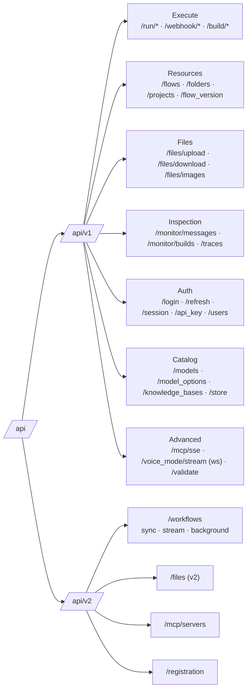
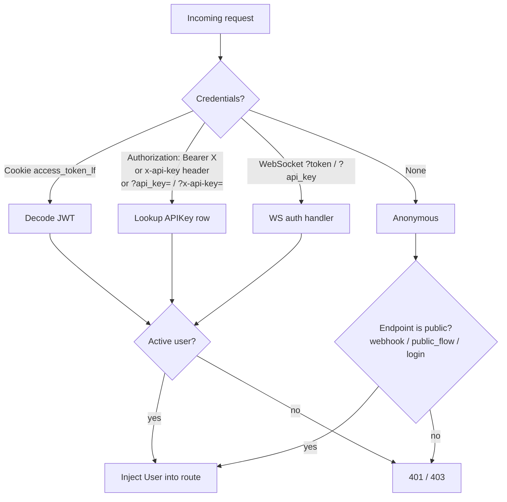
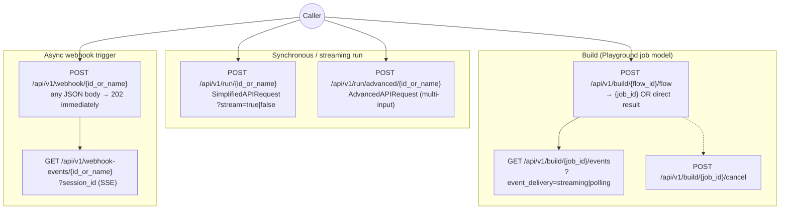
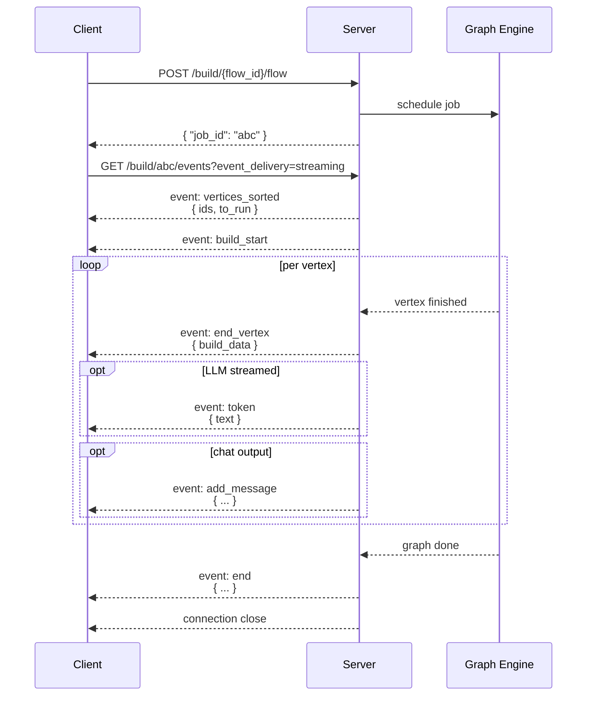
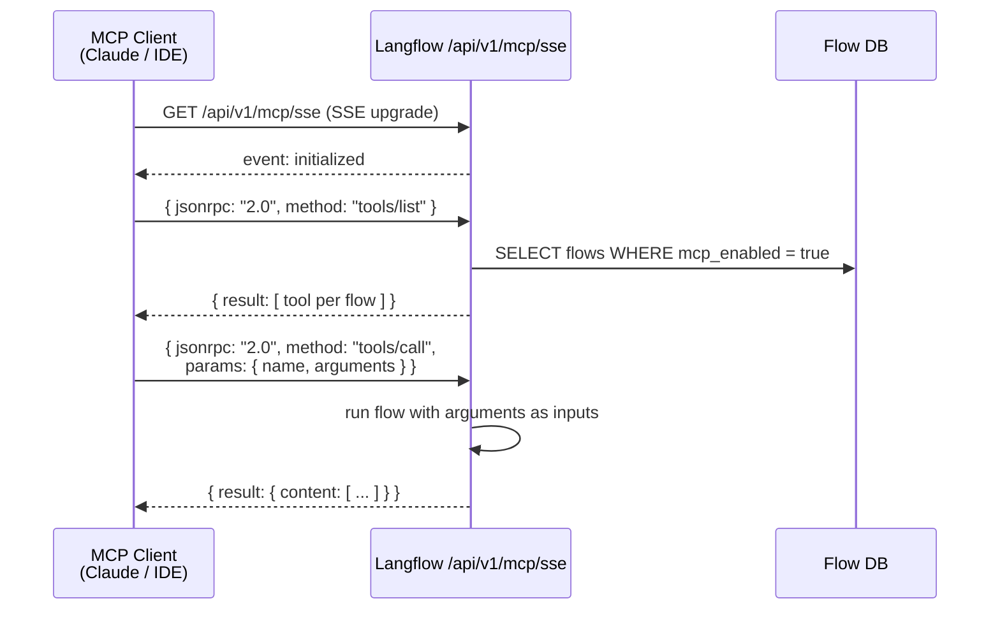

# 10. API Contracts

Langflow's HTTP surface is split into two versioned namespaces, both mounted under `/api`:

- **`/api/v1`** — the mature, batteries-included surface (chat, flows, files, auth, MCP, monitor, …)
- **`/api/v2`** — the newer, more opinionated developer API (workflows, file v2, registration)

Composition happens in `src/backend/base/langflow/api/router.py`; per-router code lives in `api/v1/*.py` and `api/v2/*.py`.

---

## 1. The URL surface (at a glance)



There are ~20 router modules in v1 and 4 in v2. Below we cover the contracts you actually call.

---

## 2. Authentication — three accepted credentials



Defined in `src/backend/base/langflow/services/auth/utils.py:133-166`:

| Dependency | Behavior |
|---|---|
| `get_current_user` | Resolves JWT cookie **or** API key. 401 if neither valid. |
| `get_current_active_user` | Above + checks `user.is_active`. 403 otherwise. |
| `api_key_security` | API-key only (used by `/run/*`, public surfaces). |
| `CurrentActiveMCPUser` | User context augmented for MCP sessions. |

Cookies set on login (`/api/v1/login`): `access_token_lf`, `refresh_token_lf`, `apikey_tkn_lflw` — all `HttpOnly`, `Secure`.

---

## 3. The execution surface — three ways to run a flow



### 3a. `/run` — "give me an answer"

```http
POST /api/v1/run/{flow_id_or_name}?stream=false
Authorization: Bearer <api_key>
Content-Type: application/json

{
  "input_value": "Hello",
  "input_type":  "chat",          // chat | text | ...
  "output_type": "chat",          // chat | debug | any
  "output_component": "",         // pick specific node, or "" for all
  "tweaks": { "ComponentID-xxx": { "temperature": 0.2 } },
  "session_id": "user-42"
}
```

Response (non-streaming) — `RunResponse`:

```json
{
  "session_id": "user-42",
  "outputs": [ { "...RunOutputs..." : true } ]
}
```

Response with `?stream=true` — `text/event-stream` of NDJSON events (see §4).

### 3b. `/build` — the Playground's protocol

The canvas uses a two-step job model so it can show per-vertex progress:

1. `POST /api/v1/build/{flow_id}/flow` → returns `{ "job_id": "..." }`
2. `GET  /api/v1/build/{job_id}/events?event_delivery=streaming` → live SSE
3. `POST /api/v1/build/{job_id}/cancel` to stop

The `event_delivery` query parameter switches behavior:

- `streaming` — SSE (`text/event-stream`)
- `polling` — NDJSON (`application/x-ndjson`) of all accumulated events
- `direct` — synchronous: returns the first layer's vertex IDs immediately

### 3c. `/webhook` — fire-and-forget

```http
POST /api/v1/webhook/{flow_id_or_name}
Content-Type: application/json

{ "...any JSON payload, forwarded to the Webhook component..." : true }
```

Returns **202** immediately:

```json
{ "message": "Task started in the background", "status": "in progress" }
```

The UI (or any client) can subscribe to `GET /api/v1/webhook-events/{id_or_name}?session_id=...` to follow execution.

---

## 4. The streaming protocol

Whether you stream via `/run?stream=true`, `/build/{id}/events`, or `/webhook-events`, the wire format is the same: a sequence of small JSON envelopes.



Event envelope shape (one per line, `\n\n` separator in SSE mode):

```json
{ "event": "<type>", "data": { } }
```

| `event` | Emitted when | Payload highlights |
|---|---|---|
| `vertices_sorted` | After topo sort | `ids`, `to_run` |
| `build_start` | Engine starts | `{}` |
| `end_vertex` | Vertex completes | `build_data` (full `VertexBuildResponse`) |
| `token` | LLM streams a token | `{ text }` |
| `add_message` | New chat message | `MessageResponse` |
| `log` | Component logged | arbitrary |
| `end` | Whole graph done | summary |
| `error` | Anything blew up | `{ message }` |

Defined in `src/lfx/src/lfx/events/event_manager.py:112-137`; bridged to HTTP in `src/backend/base/langflow/api/build.py:217-337`.

---

## 5. Resource CRUD — Flows, Files, Monitor, Validate

```mermaid
graph LR
    subgraph Flows["/api/v1/flows"]
        C[POST / · create]
        L[GET / · list, paginated]
        G[GET /{id}]
        P[PATCH /{id}]
        U[PUT /{id} · upsert]
        D[DELETE /{id}]
        Pub[GET /public_flow/{id}<br/>no auth, must be PUBLIC]
    end

    subgraph Files["/api/v1/files"]
        FU[POST /upload/{flow_id}<br/>multipart]
        FD[GET /download/{flow_id}/{name}]
        FI[GET /images/{flow_id}/{name}]
    end

    subgraph Mon["/api/v1/monitor"]
        MS[GET /messages]
        MD[DELETE /messages]
        MSes[GET /messages/sessions]
        MB[GET /builds]
    end

    subgraph Vali["/api/v1/validate"]
        VC[POST /code]
        VP[POST /prompt]
    end
```

Flow CRUD highlights:

- `GET /flows?header_flows=true` — lightweight list (only id/name/description) for sidebars.
- `GET /flows?page=1&size=20` — pagination via `fastapi-pagination`.
- `PUT /flows/{id}` — upsert; returns 200 on update, 201 on create.
- `GET /flows/public_flow/{id}` — unauthenticated, only returns the flow if `access_type == PUBLIC`.

Files: written to whatever `StorageService` is configured (local FS by default, S3/GCS optional). Upload returns `{id, name, path, size, provider}`.

Monitor: thin wrapper over the `Message` and `VertexBuild` tables. Filter by `flow_id`, `session_id`, `sender`, `sender_name`.

Validate: `/validate/code` returns import + function errors for custom-component Python; `/validate/prompt` extracts `{{variables}}` from a template.

---

## 6. Schema cheat-sheet

All Pydantic models live in `src/backend/base/langflow/api/v1/schemas/__init__.py`.

### Request models

| Model | Used by | Important fields |
|---|---|---|
| `SimplifiedAPIRequest` | `/run/*` | `input_value`, `input_type`, `output_type`, `output_component`, `tweaks`, `session_id` |
| `InputValueRequest` (from `lfx`) | `/run/advanced`, `/build` | per-component input + session id |
| `FlowDataRequest` | `/build/*/flow` | `nodes`, `edges`, `viewport` |
| `FlowCreate` / `FlowUpdate` | `/flows` CRUD | `name`, `description`, `data`, `is_component`, `folder_id` |
| `ValidatePromptRequest` | `/validate/prompt` | `name`, `template`, `mustache`, `custom_fields` |
| `ApiKeyCreate` | `/api_key` | `name` |
| `WorkflowExecutionRequest` | v2 `/workflows` | `workflow_id`, `inputs`, `background`, `stream`, `timeout` |

### Response models

| Model | Notes |
|---|---|
| `RunResponse` | `{ session_id, outputs: List[RunOutputs] }` |
| `ResultDataResponse` | per-vertex result; `results`, `outputs`, `logs`, `artifacts`, `duration`, `token_usage` — auto-truncated for large outputs via a field serializer |
| `VertexBuildResponse` | `{ id, valid, params, data: ResultDataResponse, timestamp }` |
| `StreamData` | wraps `{event, data}` and has a custom `__str__` so it serializes correctly to SSE |
| `MessageResponse` | `{ id, flow_id, session_id, sender, sender_name, message, timestamp }` |
| `UploadFileResponse` | `{ id, name, path, size, provider }` |
| `ConfigResponse` / `PublicConfigResponse` | server config; public version exposes only safe fields |

`Tweaks` is the recurring shape `Dict[component_id, Dict[param_name, value]]` — the universal mechanism for overriding flow parameters at run time without editing the saved flow.

---

## 7. Hidden endpoints

These endpoints exist but are excluded from the OpenAPI schema (`include_in_schema=False`):

- `POST /api/v1/login`, `/refresh`, `/logout`, `GET /session`
- The whole `/api/v1/api_key/*` surface
- `/api/v1/run/session/{id}` (cookie-auth twin of `/run/{id}`)
- `/api/v1/webhook-events/{id}` (UI-only SSE)
- Deprecated per-vertex `/build/*/vertices/*` endpoints

The login family is hidden because the canonical entry point is the cookie-based `/session`, not a direct token grab. They still work — they're just not advertised in `/docs`.

---

## 8. MCP — flows as agent tools



- Transport: SSE at `/api/v1/mcp/sse` (also accepts `HEAD` for capability probing).
- Each flow with `mcp_enabled = true` becomes a tool; its inputs become the tool's JSON schema.
- v2 adds `/api/v2/mcp/servers/{server_name}` for managing *outbound* MCP servers (Langflow as MCP client).

---

## 9. v2 Workflow API

`POST /api/v2/workflows` is feature-gated (`developer_api_enabled`) and built around three execution modes:

| Mode | How | Response |
|---|---|---|
| Sync | `{ stream: false, background: false }` | `WorkflowExecutionResponse` |
| Stream | `{ stream: true }` | `text/event-stream` of NDJSON |
| Background | `{ background: true }` | 202 `{ job_id }`; later `GET /api/v2/workflows?job_id=...` for status, `POST /api/v2/workflows/stop` to cancel |

Compared to v1 `/run`, v2 has cleaner job semantics, explicit timeouts, and a single endpoint per verb.

---

## 10. Mental model

- **v1** is *flow-centric*: every endpoint is "do X to a Flow by id/name."
- **v2** is *workflow-centric*: cleaner job/queue semantics, intended for embedding from external apps.
- **Everything that runs anything streams the same envelope**: `{ "event": "...", "data": {...} }`.
- **Three credential types coexist** (JWT cookie / API key / WebSocket query) and all funnel through `get_current_active_user`.
- **Tweaks are the universal override mechanism** — never edit the saved flow when you just need different parameter values at call time.
- **The Playground uses `/build`**, public callers use `/run`, async triggers use `/webhook`, agents use `/mcp/sse`. Pick the one that matches your latency/control needs.
