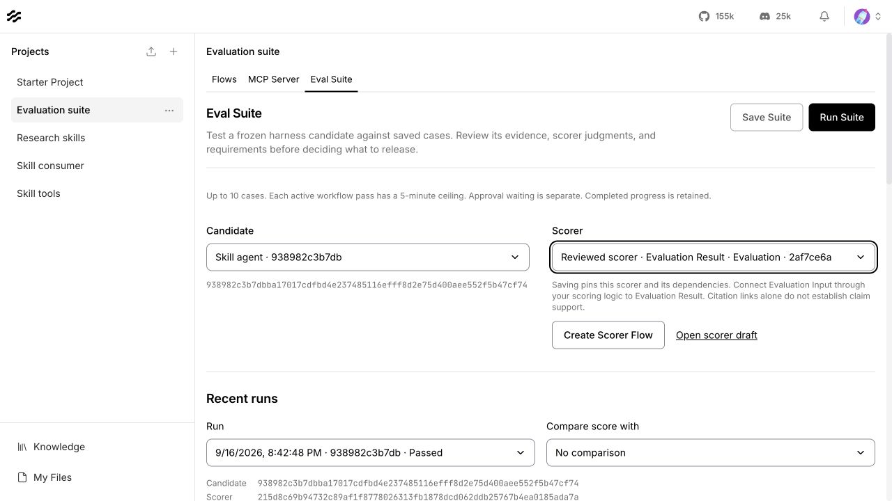
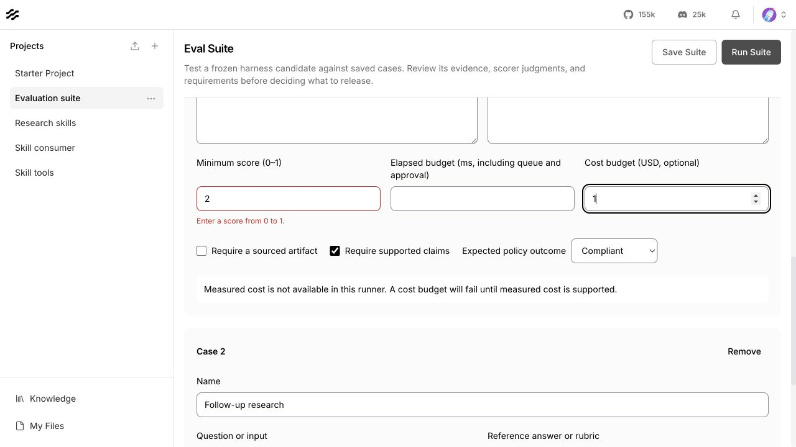
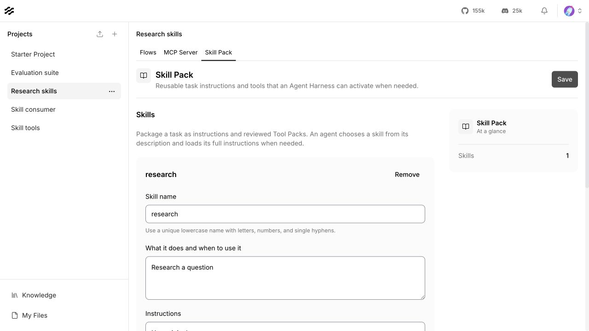
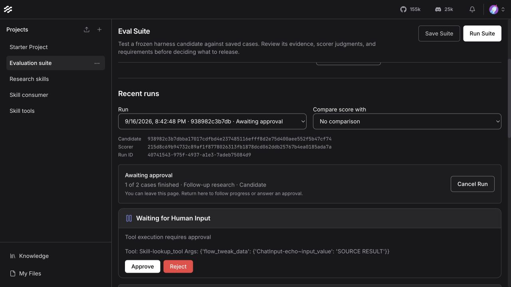
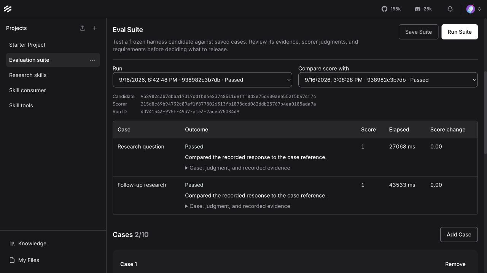

# Harness delivery completion review

September 16, 2026 · updated September 17 · `feat/harness-delivery-completion`

This pass completes and polishes the delivered project types and Harness work.
It adds no project type, integration, runtime capability, or deployment profile.
The branch starts at `aa8076985a873fddeaadd0f0ed93dc1784ae79fa`
(`feat/harness-ui-polish`). No pull requests were created.

Reviewable commits: `3897588568` contains the runtime fix and its API regressions;
`0e53d8de90` contains the editor fixes, form polish, localization, and UI regressions.
Secret-baseline changes update line locations only; no detections or exclusions
were added or removed.

## Review scope

The delivery was assessed against the existing taxonomy, Harness, Tool Pack,
Skill Pack, sourced-report, immutable-candidate, Workflows, and native-evaluation
contracts. The original comparison point is
`dbc322600835d47428b67cc07ddaedbf5edc2d31`; the delivered stack through the start
of this branch spans 327 files. This is a focused contract and risk review with
regression coverage, not a claim that every line of that stack was audited.

Two independent read-only reviews examined repository standards/UI state and
runtime/evaluation contracts. Both re-reviewed the fixes. The desktop walkthrough
used an isolated local database and deterministic provider fixture, not live
provider credentials or the user's projects.

## Contract findings resolved

| Finding | Completed correction | Evidence |
|---|---|---|
| An accepted evaluation could fail after normal canvas-version pruning, despite retaining its scorer archive. | Scorer dispatch uses retained definitions and checks current read/execute access to the root and every declared dependency. Initial submission still validates and packages reviewed snapshots. | A real API test failed before the fix when both root/dependency snapshots were pruned during approval. It now completes. Separate tests revoke root and dependency access and still require failure. |
| Suite edits could disappear during a delayed or failed save refresh. | The form stays locked across PATCH and refresh. A failed refresh preserves the draft and explains recovery. | Delayed-refresh and failed-refresh regressions. |
| Changes only inside scorer dependencies had no acceptance path; outputs on the same node could collide. | Output identity includes the output name. “Use updated scorer” explicitly accepts changed root/dependency definitions; saving pins the update. | Nested-only changes and distinct-output regressions. |
| A completed scorer-creation request could redirect the user after they left the page. | Navigation and follow-up creation work are guarded by the originating page generation. | Deferred creation with the suite unmounted and router still alive. |
| Invalid case values silently disabled Save. | Required fields explain errors after blur; score, elapsed-budget, and cost fields expose precise bounds and accessible error descriptions. | Browser checks and invalid-to-valid field regressions. |
| Skill Packs reported “No flows picked yet” despite having a skill. | The summary reflects skill counts and only shows tool-flow state for project types that configure it. | Page regression and populated Skill Pack walkthrough. |

## Standards and visual review

No additional documented repository-standard violation was found in the focused
review. The fixes follow the existing shared binding helpers, authorization
guards, input components, localization files, and test conventions.

The Eval Suite now shares the Harness's control boundaries, corner treatment,
spacing, and surface colors. Its Save/Run actions remain available while scrolling.
Duplicate section rules and unnecessary outer padding were removed. Case groups
use a quiet background, aligned budget controls, consistent labels, and monochrome
checkboxes. Skill definitions use the shared Input/Textarea components, retain a
large instruction editor, and separate selected packs with simple dividers.

The cost-availability notice previously used a foreground color intended for a
colored warning surface; it was unreadable on the light background. It now uses
normal readable foreground text. New guidance is present in all seven locales.
Light/dark controls, focus, disabled states, and inline errors were visually checked.

The September 17 follow-up replaces the remaining native Harness dropdowns with
the existing `ProjectChoiceField`, backed by Langflow's shared Select. It creates
no new UI component. Candidate, scorer, run, comparison, policy, pack, and report
selectors now share arrow placement, menu behavior, and focus handling. Selected
labels truncate without shrinking the arrow. Browser measurements confirmed a
centered 16px arrow with a 13px right inset in each Eval Suite selector. Keyboard
opening, selection, dismissal, and focus return were checked in the browser.

## Verification

| Check | Result |
|---|---|
| All Harness frontend suites plus the shared Select accessibility suite after the dropdown follow-up | **184 passed**, 15 suites |
| Backend project write-through, composition archives, starters, Skill Packs, evaluations, candidate Workflows, and skill Workflows selection | **95 passed, 22 skipped** before the targeted runtime fix |
| Evaluation suites, durability, and scaled-queue selection after the runtime fix | **28 passed, 15 skipped**, including three new retention/access cases |
| Shared project primitives and Harness middleware, skills, permissions, hooks in isolated LFX environment | **331 passed** |
| TypeScript comparison against the branch's starting commit | **255 identical existing diagnostics**, after normalizing absolute checkout paths; none in the changed files |
| Changed-file Biome, Ruff, whitespace checks and commit hooks | Passed |

Skipped backend cases require a configured PostgreSQL test environment. They were
not counted as passing and were not rerun against a deployed topology. The LFX
selection was run in its standalone environment: running it first in the hosted
Langflow environment produced fixture/user-ID authorization failures, so that
environment mismatch was corrected without weakening authorization.

The browser walkthrough submitted a fresh two-case evaluation, approved each
fixture tool call, observed the first completed case while the second awaited
approval, returned after a page reload, and compared the completed run with its
retained baseline. Both cases passed with score **1** and score change **0.00**.
The fixture establishes UI/API continuity; it does not establish research quality
or live-provider acceptance.

Useful reproduction commands:

```sh
cd src/frontend
npx jest --runInBand src/pages/MainPage/pages/harnessPage/__tests__
npx tsc --noEmit --pretty false
```

```sh
# From the repository root; PostgreSQL variants require the documented test DB setup.
LANGFLOW_UPDATE_STARTER_PROJECTS=false uv run --no-sync pytest \
  src/backend/tests/unit/api/v1/test_eval_suites.py \
  src/backend/tests/unit/api/v1/test_eval_durability.py \
  src/backend/tests/unit/api/v1/test_eval_scaled.py -q
```

## Screenshots

These are unaltered desktop screenshots from the isolated fixture environment.
The Eval Suite layout screenshot was refreshed September 17 after the dropdown
correction; the remaining screenshots document the September 16 walkthrough.

Eval Suite layout:



Invalid score, persistent actions, readable cost limitation, and keyboard focus:



Skill Pack editor and corrected summary:



Approval progress with the first case retained:



Completed results and retained comparison:



## Boundaries unchanged

Live-provider acceptance and verification in the intended deployed topology remain
production gates. Deployment-topology work and external evaluation integrations
remain deferred. Measured provider costs, portable Eval Suite archives, and
candidate-aware release/promotion/rollback are not delivered by this pass.

Accepted evaluations no longer depend on prunable scorer snapshots; **starting a
new evaluation still requires an available reviewed scorer binding**. This pass
does not change the broader authoring-version retention policy.

See the current contracts for
[runtime artifacts](harness-runtime-artifacts.md),
[Workflows reliability](harness-workflow-reliability.md),
[native evaluations](harness-eval-suites.md),
[durability](harness-eval-durability.md), and
[database workers](harness-eval-scaled-db.md).
