# IBM DB2 Vector Search Integration
## Technical Documentation

**Version:** 1.0
**Date:** May 2026
**Platform:** Langflow AI Workflow Builder

---

## 1. Overview

### 1.1 Introduction

The IBM DB2 Vector Search integration enables enterprise-grade semantic search and Retrieval-Augmented Generation (RAG) capabilities within Langflow, leveraging IBM's robust database infrastructure for AI-powered applications.

### 1.2 Key Features

- ✅ **Vector Storage**: High-dimensional embedding storage with automatic table management
- ✅ **Semantic Search**: Similarity search with multiple distance metrics (Cosine, Euclidean, Dot Product)
- ✅ **Security-First**: Comprehensive SQL injection prevention and input validation
- ✅ **Multi-Format Support**: Ingest data from CSV, JSON, DataFrame, and more
- ✅ **Production-Ready**: Connection pooling, error handling, and monitoring

### 1.3 Use Cases

| Use Case | Description |
|----------|-------------|
| **RAG Applications** | Retrieve relevant context for LLM prompts |
| **Semantic Search** | Find documents by meaning, not keywords |
| **Document Classification** | Organize large document collections |
| **Recommendation Systems** | Suggest similar items based on embeddings |

---

## 2. Architecture

### 2.1 System Architecture

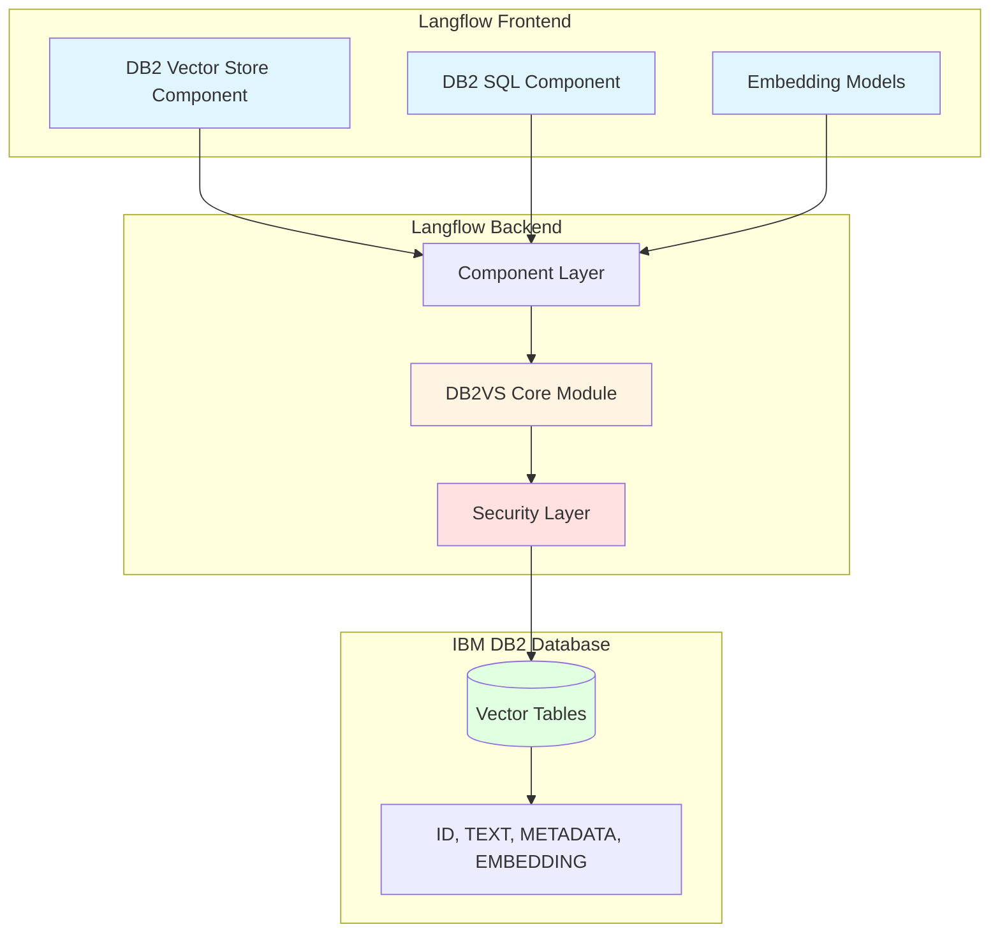

### 2.2 Component Architecture

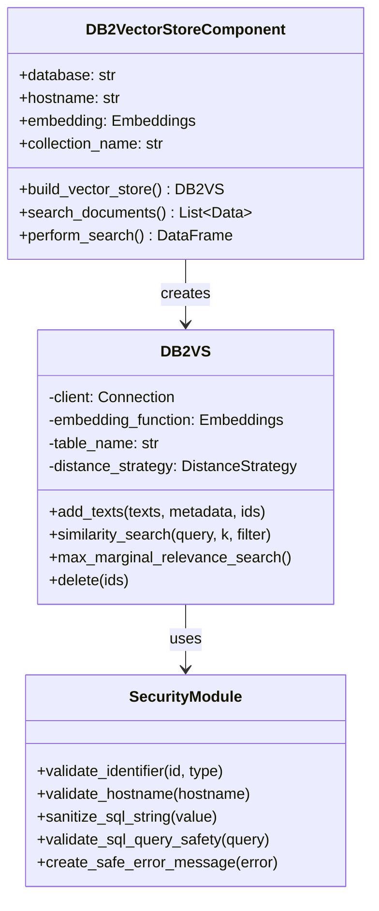

### 2.3 Data Flow

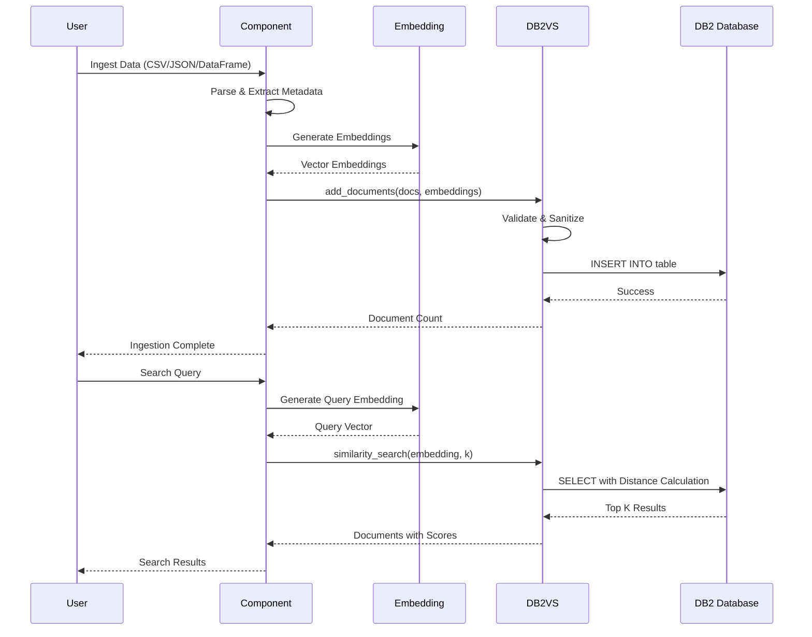

---

## 3. Security Architecture

### 3.1 Defense-in-Depth Security

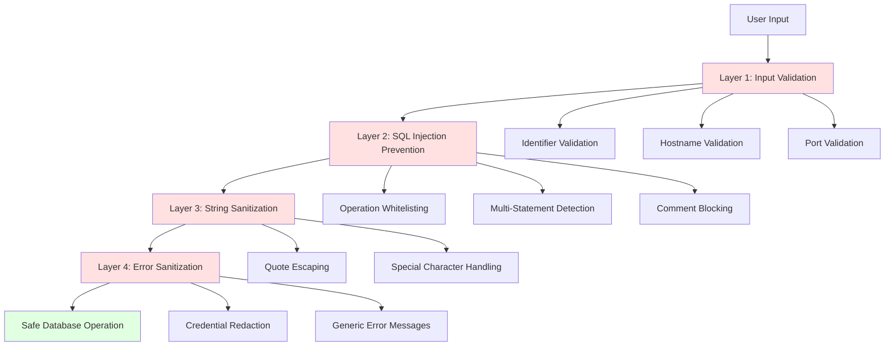

### 3.2 Security Features

| Feature | Implementation | Protection Against |
|---------|----------------|---------------------|
| **Identifier Validation** | Regex pattern matching, reserved keyword blocking | SQL injection via table/column names |
| **Query Safety** | Operation whitelisting, multi-statement detection | Malicious query execution |
| **String Sanitization** | Single quote escaping (SQL standard) | String-based injection |
| **Error Sanitization** | Generic error messages, credential redaction | Information disclosure |
| **Read-Only Mode** | SELECT-only enforcement | Unauthorized data modification |
| **Query Timeout** | Configurable timeout (1-300s) | Resource exhaustion |

### 3.3 SQL Injection Prevention

```python
# ✅ SAFE: Validated identifier
validate_identifier("my_table")  # Returns: "my_table"

# ❌ BLOCKED: SQL injection attempt
validate_identifier("table; DROP TABLE users")
# Raises: ValueError("Invalid identifier")

# ❌ BLOCKED: Reserved keyword
validate_identifier("SELECT")
# Raises: ValueError("reserved SQL keyword")

# ✅ SAFE: Sanitized string
sanitize_sql_string("it's working")  # Returns: "it''s working"

# ✅ SAFE: Query validation
validate_sql_query_safety(
    "SELECT * FROM users",
    allowed_operations={"SELECT"}
)  # Passes

# ❌ BLOCKED: Multiple statements
validate_sql_query_safety(
    "SELECT * FROM users; DROP TABLE users"
)  # Raises: ValueError("Multiple statements detected")
```

---

## 4. Implementation Guide

### 4.1 Search & Filtering Capabilities

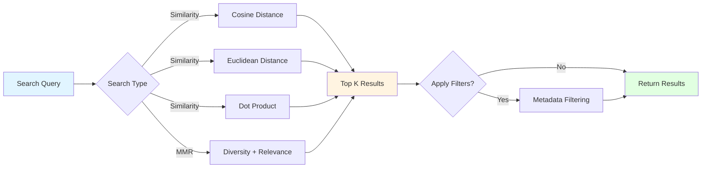

#### Distance Metrics Comparison

| Metric | Formula | Best For | Range |
|--------|---------|----------|-------|
| **Cosine** | `1 - (A·B)/(‖A‖‖B‖)` | Normalized vectors, text embeddings | [0, 2] |
| **Euclidean** | `√Σ(Ai-Bi)²` | Spatial data, image embeddings | [0, ∞) |
| **Dot Product** | `A·B` | Pre-normalized vectors | (-∞, ∞) |

#### Metadata Filtering Examples

```python
# Single condition
filter = {"category": "electronics"}

# Multiple conditions (AND)
filter = {
    "category": "electronics",
    "price": {"$lt": 1000}
}

# Range query
filter = {
    "price": {"$gte": 100, "$lte": 500},
    "tenant_id": "customer_123"
}
```

### 4.2 Search Types

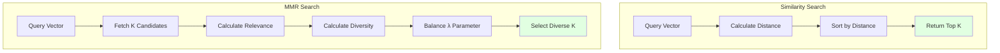

**MMR Formula:**
```
MMR = λ × Similarity(query, doc) - (1-λ) × max(Similarity(doc, selected))
```

- `λ = 1.0`: Pure relevance (same as similarity search)
- `λ = 0.5`: Balanced relevance and diversity
- `λ = 0.0`: Maximum diversity

---

## 5. Testing & Quality Assurance

### 5.1 Test Coverage Strategy

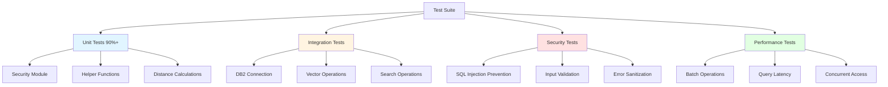

### 5.2 Security Test Coverage

| Test Category | Test Cases | Coverage |
|---------------|------------|----------|
| **Identifier Validation** | Valid identifiers, SQL injection attempts, reserved keywords | 15 tests |
| **String Sanitization** | Quote escaping, special characters, null handling | 8 tests |
| **Query Safety** | Operation whitelisting, multi-statements, comments | 12 tests |
| **Port Validation** | Valid ranges, type checking, boundary conditions | 6 tests |
| **Hostname Validation** | Valid formats, SQL metacharacters, injection patterns | 10 tests |

### 5.3 Test Execution

```bash
# Run all unit tests
make unit_tests

# Run security tests only
uv run pytest -k "security" src/backend/tests/unit/components/ibm/

# Run with coverage report
uv run pytest --cov=src/lfx/src/lfx/components/ibm --cov-report=html

# Run specific test file
uv run pytest src/backend/tests/unit/components/ibm/test_db2_security.py
```

---

## 6. Platform Guidelines & Best Practices

### 6.1 Langflow Component Standards

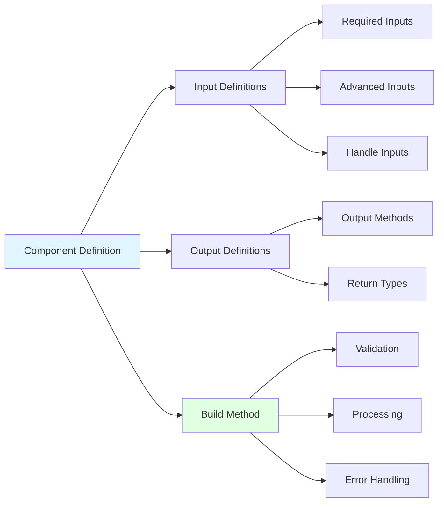

### 6.2 Global Variable Usage

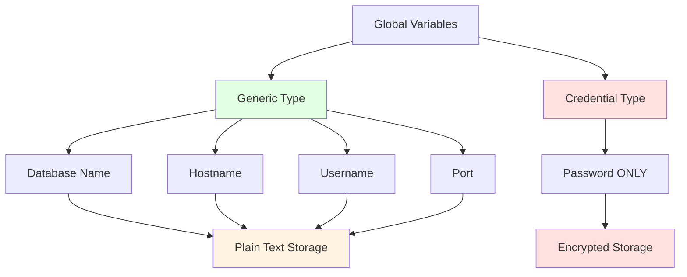

**Security Rule:** Only passwords use Credential-typed variables. All other connection parameters use Generic-typed variables.

### 6.3 Error Handling Pattern

```python
try:
    # Database operation
    connection = ibm_db_dbi.connect(conn_str, "", "")

except ibm_db_dbi.DatabaseError as e:
    # Database-specific errors
    safe_msg = create_safe_error_message(e, "while connecting")
    self.log(f"Connection failed: {safe_msg}")
    raise ConnectionError(safe_msg) from e

except Exception as e:
    # Generic errors
    safe_msg = create_safe_error_message(e, "during operation")
    self.log(f"Error: {safe_msg}")
    raise RuntimeError(safe_msg) from e

finally:
    # Always cleanup resources
    if cursor:
        cursor.close()
    if connection:
        connection.close()
```

### 6.4 Performance Best Practices

| Practice | Implementation | Benefit |
|----------|----------------|---------|
| **Batch Operations** | Insert 100-1000 docs at once | 10x faster than individual inserts |
| **Duplicate Detection** | Hash-based comparison (MD5) | Efficient memory usage |
| **Connection Pooling** | Reuse connections | Reduced connection overhead |
| **Query Timeout** | 30s default, configurable | Prevents resource exhaustion |
| **Pagination** | Fetch results in batches | Memory efficient for large datasets |

---

## 7. Deployment & Configuration

### 7.1 Setup Workflow

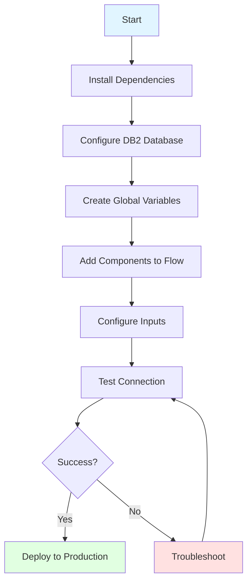

### 7.2 Configuration Checklist

#### Prerequisites
```bash
# Install Python packages
uv add ibm_db ibm_db_dbi

# System dependencies (Linux)
sudo apt-get install gcc python3-dev

# System dependencies (macOS)
brew install gcc
```

#### Database Setup
```sql
-- Create database
CREATE DATABASE MYDB;

-- Grant permissions
GRANT CONNECT ON DATABASE TO USER db2user;
GRANT CREATETAB ON DATABASE TO USER db2user;
```

#### Langflow Configuration
1. **Create Generic Variables:**
   - `db2_database` = `MYDB`
   - `db2_hostname` = `db2.example.com`
   - `db2_username` = `db2user`

2. **Create Credential Variable:**
   - `db2_password` = `your_secure_password`

3. **Component Settings:**
   - Collection Name: `LANGFLOW_VECTORS`
   - Distance Strategy: `COSINE`
   - Search Type: `Similarity`
   - Number of Results: `4`

### 7.3 Monitoring & Health Checks

```python
# Connection health check
try:
    conn = ibm_db_dbi.connect(conn_str, "", "")
    conn.close()
    print("✓ DB2 connection successful")
except Exception as e:
    print(f"✗ DB2 connection failed: {e}")

# Performance metrics
self.log(f"Ingested {count} documents in {elapsed:.2f}s")
self.log(f"Search returned {len(results)} results in {latency:.0f}ms")
```

---

## 8. Troubleshooting Guide

### 8.1 Common Issues

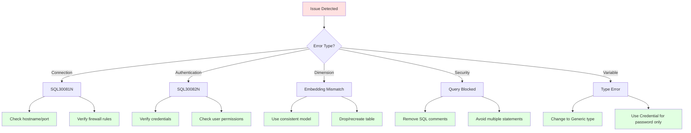

### 8.2 Quick Solutions

| Error | Solution |
|-------|----------|
| **SQL30081N: Unable to connect** | Verify hostname, port, and firewall rules |
| **SQL30082N: Authentication failed** | Check username/password, ensure Credential variable for password |
| **Embedding dimension mismatch** | Use consistent embedding model or different table name |
| **Potentially unsafe SQL query** | Remove comments (`--`, `/**/`), avoid semicolons |
| **Credential-typed variable error** | Change to Generic type for non-password fields |

### 8.3 Debug Mode

```python
# Enable detailed logging
import logging
logging.getLogger('lfx.components.ibm').setLevel(logging.DEBUG)

# Test security functions
from lfx.components.ibm.db2_security import (
    validate_hostname,
    validate_port,
    validate_identifier
)

validate_hostname("db2.example.com")  # Should pass
validate_port(50000)  # Should pass
validate_identifier("my_table")  # Should pass
```

---

## 9. Performance Benchmarks

### 9.1 Operation Performance

| Operation | Documents | Time | Throughput |
|-----------|-----------|------|------------|
| **Insertion** | 1,000 | ~5s | 200 docs/s |
| **Insertion** | 10,000 | ~45s | 222 docs/s |
| **Search (k=10)** | 10,000 | ~50ms | 20 queries/s |
| **MMR (k=10)** | 10,000 | ~100ms | 10 queries/s |

*Benchmarks: DB2 11.5, 4 CPU, 16GB RAM*

### 9.2 Optimization Tips

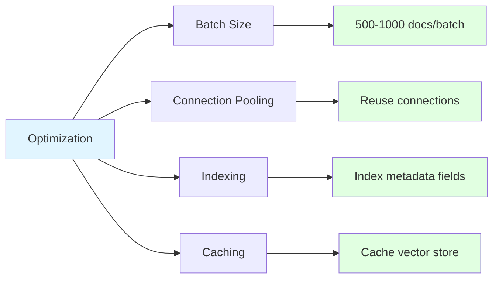

---

## 10. Summary & Resources

### 10.1 Key Takeaways

✅ **Security-First Design**: Multi-layer defense against SQL injection and data breaches
✅ **Production-Ready**: Comprehensive error handling, monitoring, and performance optimization
✅ **Developer-Friendly**: Clear APIs, extensive documentation, and intuitive components
✅ **Enterprise-Grade**: Leverages IBM DB2's robust infrastructure for scalable AI applications

### 10.2 Resources

- **IBM DB2 Documentation**: [ibm.com/docs/en/db2/11.5](https://www.ibm.com/docs/en/db2/11.5)
- **Langflow Documentation**: [docs.langflow.org](https://docs.langflow.org/)
- **Component Guide**: `src/lfx/src/lfx/components/ibm/DB2_VARIABLE_USAGE.md`
- **Security Module**: `src/lfx/src/lfx/components/ibm/db2_security.py`

### 10.3 Support

For issues or questions:
1. Review this documentation
2. Check component info text (hover ℹ️ icon)
3. Consult Langflow documentation
4. Contact system administrator

---

**Document Version**: 1.0
**Last Updated**: May 2026
**Maintained By**: Langflow IBM Integration Team
**License**: MIT
