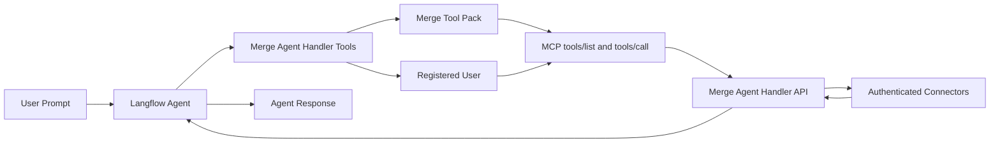

import Icon from "@site/src/components/icon";

<Icon name="Blocks" aria-hidden="true" /> [**Bundles**](/components-bundle-components) contain custom components that support specific third-party integrations with Langflow.

This page describes the components that are available in the **Merge** bundle.

The **Merge Agent Handler Tools** component connects an agent to [Merge Agent Handler](https://merge.dev/agent-handler) using MCP (Model Context Protocol) so your agent can call tools from pre-configured integrations.

For more information about the provider, see the [Merge Agent Handler documentation](https://docs.ah.merge.dev/Overview/Agent-Handler-intro).

## How it works

## Key concepts

### Tool Packs

**Tool Packs** define which integrations and operations are exposed as tools. When you select a Tool Pack in Langflow, the component fetches its MCP tool list and exposes those tools to the connected agent.

### Registered Users

**Registered Users** represent authenticated identities in Merge Agent Handler. Tool calls execute on behalf of the selected Registered User, using that user’s connected accounts.

## Prerequisites

1. A [Merge Agent Handler account](https://ah.merge.dev/)
2. A Merge Agent Handler API key (Test or Production)
3. At least one Tool Pack configured in Merge
4. At least one Registered User with authenticated connectors

## Use Merge Agent Handler Tools in a flow

1. Start with a flow that includes an **Agent** component.
2. In <Icon name="Blocks" aria-hidden="true" /> **Bundles**, add **Merge Agent Handler Tools** from the **Merge** bundle.
3. Enter your API key in **API Key**.
4. Select a **Tool Pack**.
5. Select **Environment** (`Production` or `Test`).
6. Select a **Registered User**.
7. Connect the component output to the **Agent** component's **Tools** input.
8. Open **Playground** and test prompts that require actions from your selected Tool Pack.

The agent can then choose and call the available Merge tools when useful for the request.

## Merge parameters

| Name | Type | Description |
|------|------|-------------|
| `api_key` | SecretString | Input parameter. Merge Agent Handler API key used for authentication. |
| `tool_pack_id` | Dropdown | Input parameter. Tool Pack selection that determines which tools are exposed to the agent. |
| `environment` | Dropdown | Input parameter. Select `Production` or `Test` to filter the available Registered Users. |
| `registered_user_id` | Dropdown | Input parameter. The identity whose authenticated connectors are used for tool execution. |
| `use_dispatch_mode` | Boolean | Optional input parameter (advanced). If enabled, exposes one dispatch tool instead of one tool per MCP capability. |

## Output behavior

This component outputs [`Tools`](/data-types#tool) for use by an **Agent** component.

At runtime, the agent decides which tool to call. The tool result is returned to the agent and incorporated into the final response.

## Troubleshooting

- **Tool Pack dropdown is empty**: Confirm your API key is valid and has access to Merge Agent Handler Tool Packs.
- **Registered User dropdown is empty**: Check that the selected environment matches available users and that users have authenticated connectors.
- **Tool call fails with validation errors**: The selected MCP tool requires specific input fields. Ask the agent to retry with all required fields.
- **Auth or environment mismatch**: Ensure the API key type (Test vs Production) matches the selected environment and available entities.

## See also

- [Merge Agent Handler dashboard](https://ah.merge.dev/)
- [Merge Agent Handler docs](https://docs.ah.merge.dev/)
- [Model Context Protocol](https://modelcontextprotocol.io/)
