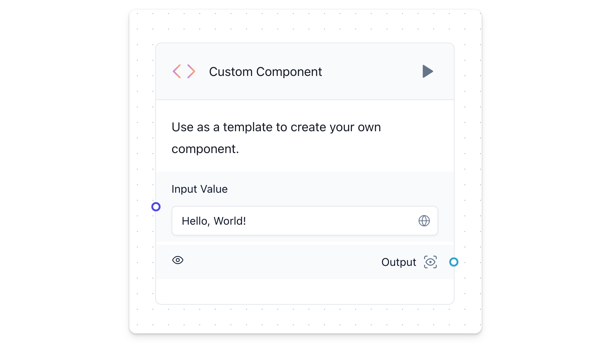
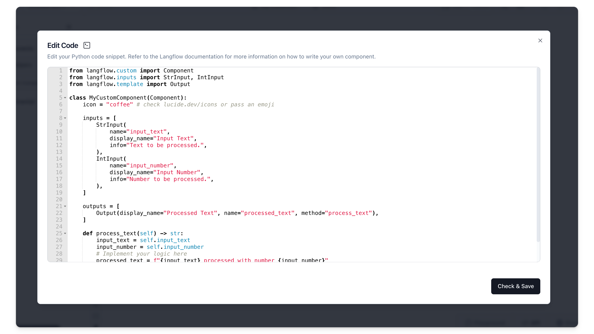
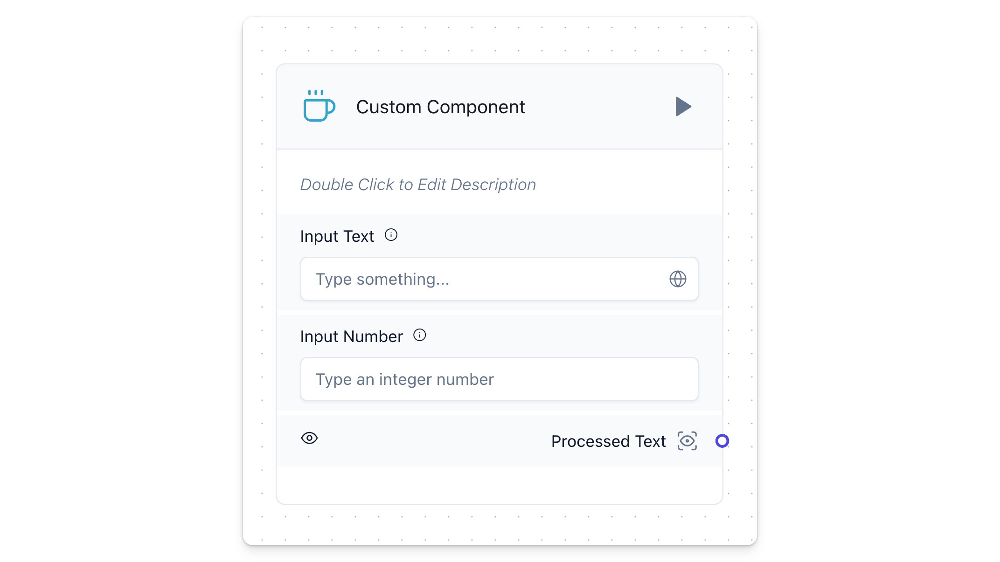

Langflow components can be created from within the platform, allowing users to extend the platform's functionality using Python code. They encapsulate are designed to be independent units, reusable across different workflows. 


These components can be easily connected within a language model pipeline, adding freedom and flexibility to what can be included in between user and AI messages. 





Since Langflow operates with Python behind the scenes, you can implement any Python function within a Custom Component. This means you can leverage the power of libraries such as Pandas, Scikit-learn, Numpy, and thousands of packages to create components that handle data processing in unlimited ways. 


Custom Components are not just about extending functionality; they also streamline the development process. By creating reusable and configurable components, you can enhance the capabilities of Langflow, making it a powerful tool for developing complex workflows.


### Key Characteristics: {#d3a151089a9e4584bd420461cd1432c6}

1. **Modular and Reusable**: Designed as independent units, components encapsulate specific functionality, making them reusable across different projects and workflows.
2. **Integration with Python Libraries**: You can import libraries like Pandas, Scikit-learn, Numpy, etc., to build components that handle data processing, machine learning, numerical computations, and more.
3. **Flexible Inputs and Outputs**: While Langflow offers native input and output types, you can use any type as long as they are properly annotated in the output methods (e.g., `> list[int]`).
4. **Python-Powered**: Since Langflow operates with Python behind the scenes, any Python function can be implemented within a custom component.
5. **Enhanced Workflow**: Custom components serve as reusable building blocks, enabling you to create pre-processing visual blocks with ease and integrate them into your language model pipeline.

### Why Use Custom Components? {#827a2b5acec94426a4a2106a8332622d}

- **Customization**: Tailor the functionality to your specific needs by writing Python code that suits your workflow.
- **Flexibility**: Add any Python-based logic or processing step between user/AI messages, enhancing the flexibility of Langflow.
- **Efficiency**: Streamline your development process by creating reusable, configurable components that can be easily deployed.

### How to Write Them {#2088ade519514bb3923cdf7f2ac2089a}


---


Writing custom components in Langflow involves creating a Python class that defines the component's functionality, inputs, and outputs. The process involves a few key steps:

1. **Define the Class**: Start by defining a Python class that inherits from `Component`. This class will encapsulate the functionality of your custom component.
2. **Specify Inputs and Outputs**: Use Langflow's input and output classes to define the inputs and outputs of your component. They should be declared as class attributes.
3. **Implement Output Methods**: Implement methods for each output, which contains the logic of your component. These methods can access input values using `self.<input_name>` , return processed values and define what to be displayed in the component with the `self.status` attribute.
4. **Use Proper Annotations**: Ensure that output methods are properly annotated with their types. Langflow uses these annotations to validate and handle data correctly.

Here's a basic structure of a custom component:


```python
from langflow.custom import Component
from langflow.inputs import StrInput, IntInput
from langflow.template import Output

class MyCustomComponent(Component):
    icon = "coffee" # check lucide.dev/icons or pass an emoji

    inputs = [
        StrInput(
            name="input_text",
            display_name="Input Text",
            info="Text to be processed.",
        ),
        IntInput(
            name="input_number",
            display_name="Input Number",
            info="Number to be processed.",
        ),
    ]

    outputs = [
        Output(display_name="Processed Text", name="processed_text", method="process_text"),
    ]

    def process_text(self) -> str:
        input_text = self.input_text
        input_number = self.input_number
        # Implement your logic here
        processed_text = f"{input_text} processed with number {input_number}"
        self.status = processed_text
        return processed_text


```


Paste that code into the Custom Component code snippet and click **Check & Save.**





You should see something like the component below. Double click the name or description areas to edit them.





## Input Types {#3815589831f24ab792328ed233c8b00d}


---


Langflow provides several higher-level input types to simplify the creation of custom components. These input types standardize how inputs are defined, validated, and used. Here’s a guide on how to use these inputs and their primary purposes:


### **HandleInput** {#fb06c48a326043ffa46badc1ab3ba467}


Represents an input that has a handle to a specific type (e.g., `BaseLanguageModel`, `BaseRetriever`, etc.).

- **Usage:** Useful for connecting to specific component types in a flow.

### **DataInput** {#0e1dcb768e38487180d720b0884a90f5}


Represents an input that receives a `Data` object.

- **Usage:** Ideal for components that process or manipulate data objects.
- **Input Types:** `["Data"]`

### **StrInput** {#4ec6e68ad9ab4cd194e8e607bc5b3411}


Represents a standard string input field.

- **Usage:** Used for any text input where the user needs to provide a string.
- **Input Types:** `["Text"]`

### **MessageInput** {#9292ac0105e14177af5eff2131b9c71b}


Represents an input field specifically for `Message` objects.

- **Usage:** Used in components that handle or process messages.
- **Input Types:** `["Message"]`

### **MessageTextInput** {#5511f5e32b944b4e973379a6bd5405e4}


Represents a text input for messages.

- **Usage:** Suitable for components that need to extract text from message objects.
- **Input Types:** `["Message"]`

### **MultilineInput** {#e6d8315b0fb44a2fb8c62c3f3184bbe9}


Represents a text field that supports multiple lines.

- **Usage:** Ideal for longer text inputs where the user might need to write extended text.
- **Input Types:** `["Text"]`
- **Attributes:** `multiline=True`

### **SecretStrInput** {#2283c13aa5f745b8b0009f7d40e59419}


Represents a password input field.

- **Usage:** Used for sensitive text inputs where the input should be hidden (e.g., passwords, API keys).
- **Attributes:** `password=True`
- **Input Types:** Does not accept input types, meaning it has no input handles for previous nodes/components to connect to it.

### **IntInput** {#612680db6578451daef695bd19827a56}


Represents an integer input field.

- **Usage:** Used for numeric inputs where the value should be an integer.
- **Input Types:** `["Integer"]`

### **FloatInput** {#a15e1fdae15b49fc9bfbf38f8bd7b203}


Represents a float input field.

- **Usage:** Used for numeric inputs where the value should be a floating-point number.
- **Input Types:** `["Float"]`

### **BoolInput** {#3083671e0e7f4390a03396485114be66}


Represents a boolean input field.

- **Usage:** Used for true/false or yes/no type inputs.
- **Input Types:** `["Boolean"]`

### **NestedDictInput** {#2866fc4018e743d8a45afde53f1e57be}


Represents an input field for nested dictionaries.

- **Usage:** Used for more complex data structures where the input needs to be a dictionary.
- **Input Types:** `["NestedDict"]`

### **DictInput** {#daa2c2398f694ec199b425e2ed4bcf93}


Represents an input field for dictionaries.

- **Usage:** Suitable for inputs that require a dictionary format.
- **Input Types:** `["Dict"]`

### **DropdownInput** {#14dcdef11bab4d3f8127eaf2e36a77b9}


Represents a dropdown input field.

- **Usage:** Used where the user needs to select from a predefined list of options.
- **Attributes:** `options` to define the list of selectable options.
- **Input Types:** `["Text"]`

### **FileInput** {#73e6377dc5f446f39517a558a1291410}


Represents a file input field.

- **Usage:** Used to upload files.
- **Attributes:** `file_types` to specify the types of files that can be uploaded.
- **Input Types:** `["File"]`

Here is an example of how these inputs can be defined in a custom component:


```python
from langflow.custom import Component
from langflow.inputs import StrInput, MultilineInput, SecretStrInput, IntInput, DropdownInput
from langflow.template import Output, Input

class MyCustomComponent(Component):
    display_name = "My Custom Component"
    description = "An example of a custom component with various input types."

    inputs = [
        StrInput(
            name="username",
            display_name="Username",
            info="Enter your username."
        ),
        SecretStrInput(
            name="password",
            display_name="Password",
            info="Enter your password."
        ),
        MultilineInput(
            name="description",
            display_name="Description",
            info="Enter a detailed description.",
        ),
        IntInput(
            name="age",
            display_name="Age",
            info="Enter your age."
        ),
        DropdownInput(
            name="gender",
            display_name="Gender",
            options=["Male", "Female", "Other"],
            info="Select your gender."
        )
    ]

    outputs = [
        Output(display_name="Result", name="result", method="process_inputs"),
    ]

    def process_inputs(self):
        # Your processing logic here
        return "Processed"
```


By defining inputs this way, Langflow can automatically handle the validation and display of these fields in the user interface, making it easier to create robust and user-friendly custom components.


All of the types detailed above derive from a general class that can also be accessed through the generic `Input` class.


### Generic Input {#278e2027493e45b68746af0a5b6c06f6}


---


Langflow offers native input types, but you can use any type as long as they are properly annotated in the output methods (e.g., `-> list[int]`).


The `Input` class is highly customizable, allowing you to specify a wide range of attributes for each input field. It has several attributes that can be customized:

- `field_type`: Specifies the type of field (e.g., `str`, `int`). Default is `str`.
- `required`: Boolean indicating if the field is required. Default is `False`.
- `placeholder`: Placeholder text for the input field. Default is an empty string.
- `is_list`: Boolean indicating if the field should accept a list of values. Default is `False`.
- `show`: Boolean indicating if the field should be shown. Default is `True`.
- `multiline`: Boolean indicating if the field should allow multi-line input. Default is `False`.
- `value`: Default value for the input field. Default is `None`.
- `file_types`: List of accepted file types (for file inputs). Default is an empty list.
- `file_path`: File path if the field is a file input. Default is `None`.
- `password`: Boolean indicating if the field is a password. Default is `False`.
- `options`: List of options for the field (for dropdowns). Default is `None`.
- `name`: Name of the input field. Default is `None`.
- `display_name`: Display name for the input field. Default is `None`.
- `advanced`: Boolean indicating if the field is an advanced parameter. Default is `False`.
- `input_types`: List of accepted input types. Default is `None`.
- `dynamic`: Boolean indicating if the field is dynamic. Default is `False`.
- `info`: Additional information or tooltip for the input field. Default is an empty string.
- `real_time_refresh`: Boolean indicating if the field should refresh in real-time. Default is `None`.
- `refresh_button`: Boolean indicating if the field should have a refresh button. Default is `None`.
- `refresh_button_text`: Text for the refresh button. Default is `None`.
- `range_spec`: Range specification for numeric fields. Default is `None`.
- `load_from_db`: Boolean indicating if the field should load from the database. Default is `False`.
- `title_case`: Boolean indicating if the display name should be in title case. Default is `True`.

Below is an example of how to define inputs for a component using the `Input` class:


```python
from langflow.template import Input, Output
from langflow.custom import Component
from langflow.field_typing import Text

class ExampleComponent(Component):
    display_name = "Example Component"
    description = "An example component demonstrating input fields."

    inputs = [
        Input(
            name="input_text",
            display_name="Input Text",
            field_type="str",
            required=True,
            placeholder="Enter some text",
            multiline=True,
            info="This is a required text input.",
            input_types=["Text"]
        ),
        Input(
            name="max_length",
            display_name="Max Length",
            field_type="int",
            required=False,
            placeholder="Maximum length",
            info="Enter the maximum length of the text.",
            range_spec={"min": 0, "max": 1000},
        ),
        Input(
            name="options",
            display_name="Options",
            field_type="str",
            is_list=True,
            options=["Option 1", "Option 2", "Option 3"],
            info="Select one or more options."
        ),
    ]

    outputs = [
        Output(display_name="Result", name="result", method="process_input"),
    ]

    def process_input(self) -> Text:
        # Process the inputs and generate output
        return Text(value=f"Processed: {self.input_text}, Max Length: {self.max_length}, Options: {self.options}")

# Define how to use the inputs and outputs
component = ExampleComponent()


```


In this example:

- The `input_text` input is a required multi-line text field.
- The `max_length` input is an optional integer field with a range specification.
- The `options` input is a list of strings with predefined options.

These attributes allow for a high degree of customization, making it easy to create input fields that suit the needs of your specific component.


### Multiple Outputs {#6f225be8a142450aa19ee8e46a3b3c8c}


---


In Langflow, custom components can have multiple outputs. Each output can be associated with a specific method in the component, allowing you to define distinct behaviors for each output path. This feature is particularly useful when you want to route data based on certain conditions or process it in multiple ways.

1. **Definition of Outputs**: Each output is defined in the `outputs` list of the component. Each output is associated with a display name, an internal name, and a method that gets called to generate the output.
2. **Output Methods**: The methods associated with outputs are responsible for generating the data for that particular output. These methods are called when the component is executed, and each method can independently produce its result.

Below is an example of a component with two outputs:

- `process_data`: Processes the input text (e.g., converts it to uppercase) and returns it.
- `get_processing_function`: Returns the `process_data` method itself to be reused in composition.

```python
from typing import Callable
from langflow.custom import Component
from langflow.inputs import StrInput
from langflow.template import Output
from langflow.field_typing import Text

class DualOutputComponent(Component):
    display_name = "Dual Output"
    description = "Processes input text and returns both the result and the processing function."
    icon = "double-arrow"

    inputs = [
        StrInput(
            name="input_text",
            display_name="Input Text",
            info="The text input to be processed.",
        ),
    ]

    outputs = [
        Output(display_name="Processed Data", name="processed_data", method="process_data"),
        Output(display_name="Processing Function", name="processing_function", method="get_processing_function"),
    ]

    def process_data(self) -> Text:
        # Process the input text (e.g., convert to uppercase)
        processed = self.input_text.upper()
        self.status = processed
        return processed

    def get_processing_function(self) -> Callable[[], Text]:
        # Return the processing function itself
        return self.process_data
```


This example shows how to define multiple outputs in a custom component. The first output returns the processed data, while the second output returns the processing function itself.


The `processing_function` output can be used in scenarios where the function itself is needed for further processing or dynamic flow control. Notice how both outputs are properly annotated with their respective types, ensuring clarity and type safety.


## Special Operations {#b1ef2d18e2694b93927ae9403d24b96b}


---


Advanced methods and attributes offer additional control and functionality. Understanding how to leverage these can enhance your custom components' capabilities.

- `self.inputs`: Access all defined inputs. Useful when an output method needs to interact with multiple inputs.
- `self.outputs`: Access all defined outputs. This is particularly useful if an output function needs to trigger another output function.
- `self.status`: Use this to update the component's status or intermediate results. It helps track the component's internal state or store temporary data.
- `self.graph.flow_id`: Retrieve the flow ID, useful for maintaining context or debugging.
- `self.stop("output_name")`: Use this method within an output function to prevent data from being sent through other components. This method stops next component execution and is particularly useful for specific operations where a component should stop from running based on specific conditions.
