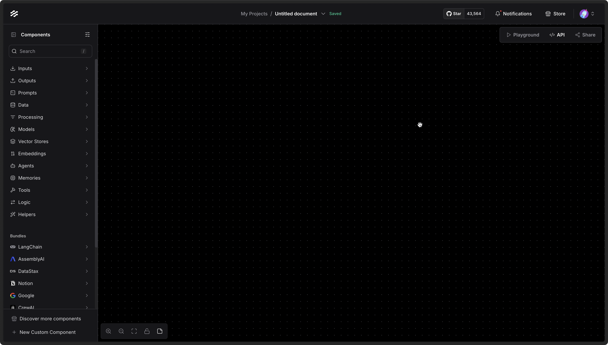

# Flows

Flows in Langflow are fully serializable and can be saved and loaded from the file system. In this guide, we'll explore how to import and export flows.

## Import Flow

If you've already got a Langflow JSON file, import it into Langflow by clicking on the project name and choosing **Import Flow**.

Once imported, your flow is ready to use.

## Export Flow

The option to export a flow is available in the same menu as shown above. Once exported as JSON, you can import your flow into another Langflow instance.
