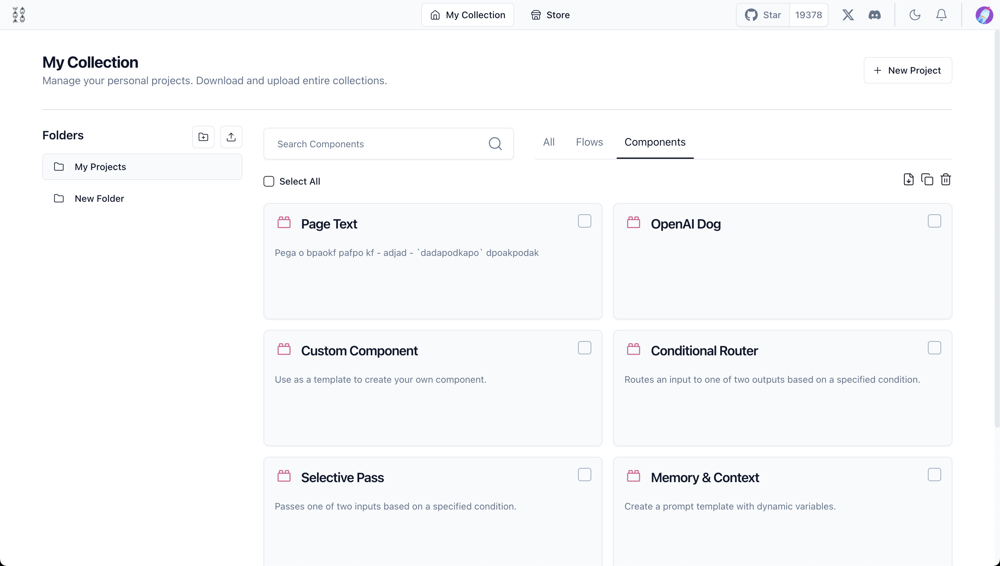
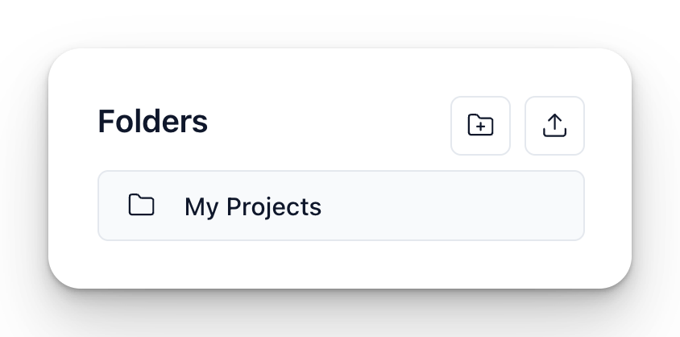
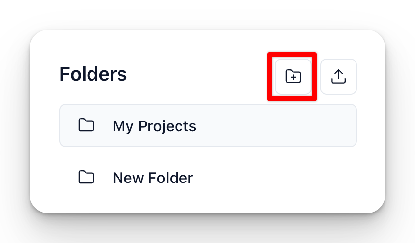
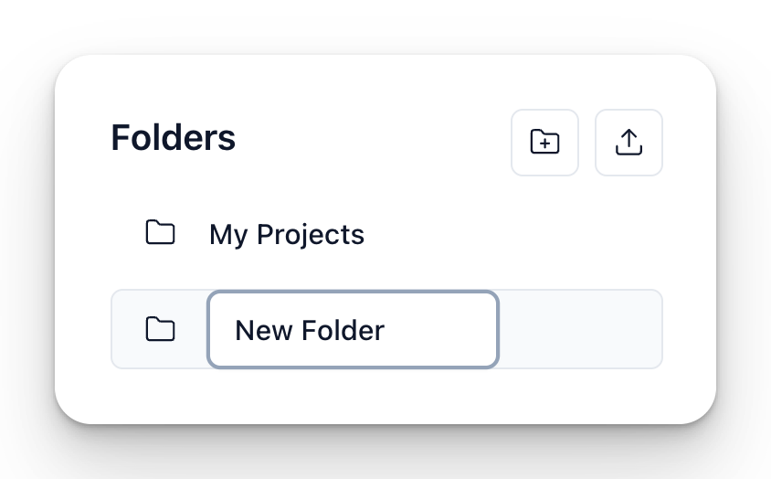
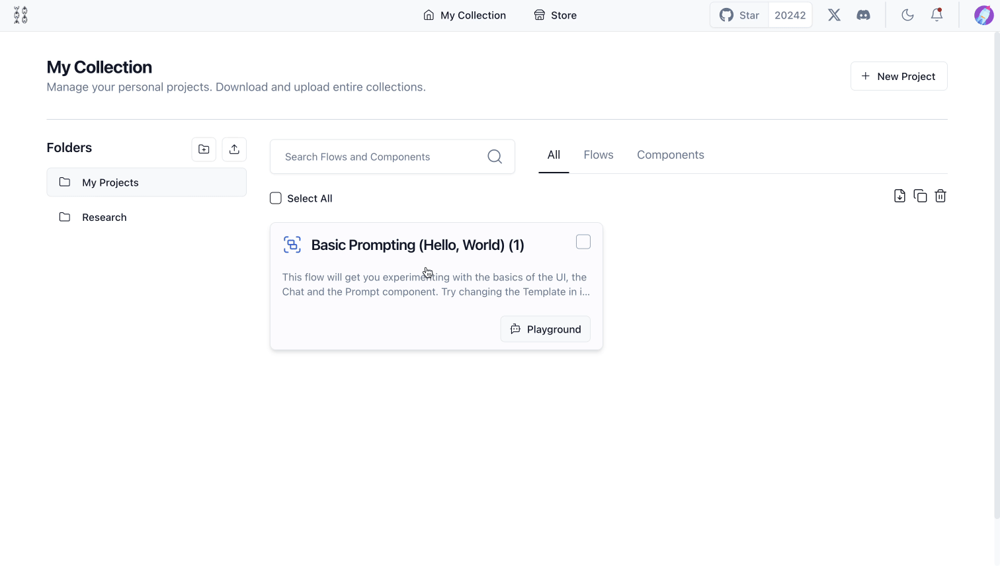

:::info

This page may contain outdated information. It will be updated as soon as possible.

:::


My Collection is a space in Langflow where users can manage, organize, and access their flows and components. Flows and components are displayed as individual cards that provide relevant information.




- **Folders**: Users can organize their projects into folders. Default folders include "My Projects" and the ability to create new folders. Hover over a folder to access options to download or delete it.
- **Search Bar** Enables users to quickly search through their flows and components.
- **Select All**: This feature allows users to select all projects displayed on the page for batch actions like moving, deleting, or exporting.

Click on a flow card to open it in Langflow Workspace or use the **Playground Button** for direct access to execute and interact with the flow’s chatbot interface.


## Folders {#776a3866273f4efbbbb2febdfc1baa12}


---


Folders can help you keep your projects organized in Langflow. They help you manage and categorize your work efficiently, making it easier to find and access the resources you need.





Multiple projects can be stored in **folders**.


Folders allow you to categorize flows and components into manageable groups. This makes it easier to find and access specific projects quickly.


**My Projects** is a default folder where all new projects and components are initially stored unless specified otherwise. Users can create custom folders to better organize their work according to specific needs.


Hovering over a folder in Langflow provides options to either remove or download the entire folder, allowing you to keep an offline copy or migrate projects between environments


Create new folders with the **New folder** button. One folder can store multiple projects (as the default My Projects folder does).


You can download folders of projects as a single JSON file, and upload files and flows to your folder.


Click the **Trash** icon to delete a folder.


### How to Create Folders {#5ba5abe995c843e4a429e41413f9d539}

1. **Navigate to the Home Screen:**
	- Go to your Langflow Home Page (outside of projects).
2. **Create a New Folder:**
	- Click on the "New Folder" button

	

	- Double-click the new folder created to rename your folder appropriately to reflect its contents.

	

3. **Move Files:**
	- Drag and drop files into the corresponding folders and subfolders to keep everything organized.

	


### Best Practices for Organizing Folders {#66f23f8e129a48598a7bb4565a508360}

- **Categorize by Project:** Create a main folder for each project, then add projects for different aspects such as research, drafts, and final documents.
- **Use Descriptive Names:** Use clear and descriptive names for your folders to easily identify their contents at a glance.

### Example Structure {#ebe6acad99c24d6f9aaabf18e4a17ff4}


Here's an example of how you might organize folders and subfolders for a Langflow project:


```text
Langflow
├── Research
│   ├── Articles Project
│   ├── Data Project
│   └── Notes Project
└── Documents
    ├── RAG Project
    └── Advanced RAG Project
```

