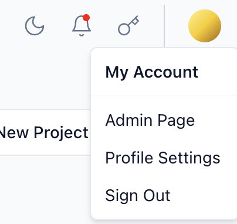

:::info

This page may contain outdated information. It will be updated as soon as possible.

:::


## Sign Up and Sign In {#f480dac5d2094d75a433de0b8e195641}


---


The login functionality in Langflow serves to authenticate users and protect sensitive routes in the application. Starting from version 0.5, Langflow introduces an enhanced login mechanism that is governed by a few environment variables. This allows new secure features.


## Environment Variables {#3ed7cae6f5324ba0ac14783cf2a6cc07}


The following environment variables are crucial in configuring the login settings:

- _`LANGFLOW_AUTO_LOGIN`_: Determines whether Langflow should automatically log users in. Default is `True`.
- _`LANGFLOW_SUPERUSER`_: The username of the superuser.
- _`LANGFLOW_SUPERUSER_PASSWORD`_: The password for the superuser.
- _`LANGFLOW_SECRET_KEY`_: A key used for encrypting the superuser's password.
- _`LANGFLOW_NEW_USER_IS_ACTIVE`_: Determines whether new users are automatically activated. Default is `False`.

All of these variables can be passed to the CLI command _`langflow run`_ through the _`--env-file`_ option. For example:


```shell
langflow run --env-file .env

```


> ℹ︎ INFO  
> It is critical not to expose these environment variables in your code repository. Always set them securely in your deployment environment, for example, using Docker secrets, Kubernetes ConfigMaps/Secrets, or dedicated secure environment configuration systems like AWS Secrets Manager.  
> 


### _`LANGFLOW_AUTO_LOGIN`_ {#8b10059e0fbc44f3bc8ce63fe7692e7e}


By default, this variable is set to `True`. When enabled (`True`), Langflow operates as it did in versions prior to 0.5—automatic login without requiring explicit user authentication.


To disable automatic login and enforce user authentication:


```shell
export LANGFLOW_AUTO_LOGIN=False
```


### _`LANGFLOW_SUPERUSER`_ and _`LANGFLOW_SUPERUSER_PASSWORD`_ {#a61a651a0fc7443a82cec93c07a14503}


These environment variables are only relevant when `LANGFLOW_AUTO_LOGIN` is set to `False`. They specify the username and password for the superuser, which is essential for administrative tasks.


To create a superuser manually:


```shell
export LANGFLOW_SUPERUSER=admin
export LANGFLOW_SUPERUSER_PASSWORD=securepassword
```


You can also use the CLI command `langflow superuser` to set up a superuser interactively.


### _`LANGFLOW_SECRET_KEY`_ {#977aea34e6174c58bd76107990d62a1f}


This environment variable holds a secret key used for encrypting the superuser's password. Make sure to set this to a secure, randomly generated string.


```shell
export LANGFLOW_SECRET_KEY=randomly_generated_secure_key

```


### _`LANGFLOW_NEW_USER_IS_ACTIVE`_ {#c8f5df9283be4e20be51e14518f5272e}


By default, this variable is set to `False`. When enabled (`True`), new users are automatically activated and can log in without requiring explicit activation by the superuser.


## Manage superusers with the CLI {#3b0c36a5cc0f4acc95c884d3de858d46}


Langflow provides a command-line utility for managing superusers:


```shell
langflow superuser
```


This command prompts you to enter the username and password for the superuser, unless they are already set using environment variables.


## Sign in {#736ebb8c854b4c268d5e748c119a08ea}


With _`LANGFLOW_AUTO_LOGIN`_ set to _`False`_, Langflow requires users to sign up before they can log in. The sign-up page is the default landing page when a user visits Langflow for the first time.


## Profile settings {#dd5926e12471448d99bd6849d2149dc8}


Once signed in, you can change your profile settings by clicking on the profile icon in the top right corner of the Langflow dashboard. This opens a dropdown menu with the following options:

- **Admin Page**: Opens the admin page, which is only accessible to the superuser.
- **Profile Settings**: Opens the profile settings page.
- **Sign Out**: Logs the user out.

	


Select **Profile Settings** to change your password and your profile picture.


Select **Admin Page** to manage users and groups as the superuser.


