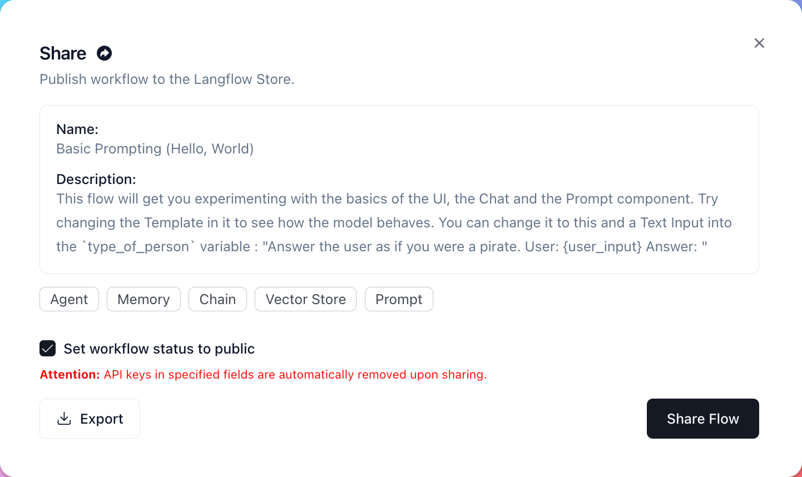

:::info

This page may contain outdated information. It will be updated as soon as possible.

:::

👋 Hello there! 

We welcome contributions from developers of all levels to our open-source project on [GitHub](https://github.com/langflow-ai/langflow). If you'd like to contribute, please check our contributing guidelines and help make Langflow more accessible.

As an open-source project in a rapidly developing field, we are extremely open to contributions, whether in the form of a new feature, improved infra, or better documentation.

To contribute to this project, please follow a ["fork and pull request"](https://docs.github.com/en/get-started/quickstart/contributing-to-projects) workflow. Please do not try to push directly to this repo unless you are a maintainer.

## Local Development {#0388cc3c758d434d994022863a6bafa9}

---

You can develop Langflow using docker compose, or locally.

We provide a `.vscode/launch.json` file for debugging the backend in VSCode, which is a lot faster than using docker compose.

Setting up hooks:

`make init`

This will install the pre-commit hooks, which will run `make format` on every commit.

It is advised to run `make lint` before pushing to the repository.

## Run Locally {#5225c2ef0cd6403c9f6c6bbd888115e0}

---

Langflow can run locally by cloning the repository and installing the dependencies. We recommend using a virtual environment to isolate the dependencies from your system.

Before you start, make sure you have the following installed:

- Poetry (&gt;=1.4)
- Node.js

Then, in the root folder, install the dependencies and start the development server for the backend:

`make backend`

And the frontend:

`make frontend`

## Docker Compose {#b07f359414ff4220ac615afc364ee46e}

---

The following snippet will run the backend and frontend in separate containers. The frontend will be available at `localhost:3000` and the backend at `localhost:7860`.

`docker compose up --build# ormake dev build=1`

## Documentation {#5f34bcaeccdc4489b0c5ee2c4a21354e}

---

The documentation is built using [Docusaurus](https://docusaurus.io/). To run the documentation locally, run the following commands:

`cd docsnpm installnpm run start`

The documentation will be available at `localhost:3000` and all the files are located in the `docs/docs` folder. Once you are done with your changes, you can create a Pull Request to the `main` branch.

## Submitting Components {#9676353bc4504551a4014dd572ac8be8}

---

New components are added as objects of the [CustomComponent](https://github.com/langflow-ai/langflow/blob/dev/src/backend/base/langflow/interface/custom/custom_component/custom_component.py) class and any dependencies are added to the [pyproject.toml](https://github.com/langflow-ai/langflow/blob/dev/pyproject.toml#L27) file.

### Add an example component {#8caae106c853465d83183e7f5272e4d8}

You have a new document loader called **MyCustomDocumentLoader** and it would look awesome in Langflow.

1. Write your loader as an object of the [CustomComponent](https://github.com/langflow-ai/langflow/blob/dev/src/backend/base/langflow/interface/custom/custom_component/custom_component.py) class. You'll create a new class, `MyCustomDocumentLoader`, that will inherit from `CustomComponent` and override the base class's methods.
2. Define optional attributes like `display_name`, `description`, and `documentation` to provide information about your custom component.
3. Implement the `build_config` method to define the configuration options for your custom component.
4. Implement the `build` method to define the logic for taking input parameters specified in the `build_config` method and returning the desired output.
5. Add the code to the [/components/documentloaders](https://github.com/langflow-ai/langflow/tree/dev/src/backend/base/langflow/components) folder.
6. Add the dependency to [/documentloaders/__init__.py](https://github.com/langflow-ai/langflow/blob/dev/src/backend/base/langflow/components/documentloaders/__init__.py) as `from .MyCustomDocumentLoader import MyCustomDocumentLoader`.
7. Add any new dependencies to the outer [pyproject.toml](https://github.com/langflow-ai/langflow/blob/dev/pyproject.toml#L27) file.
8. Submit documentation for your component. For this example, you'd submit documentation to the [loaders page](https://github.com/langflow-ai/langflow/blob/dev/docs/docs/components/loaders).
9. Submit your changes as a pull request. The Langflow team will have a look, suggest changes, and add your component to Langflow.

## User Sharing {#34ac32e11f344eab892b94531a21d2c9}

---

You might want to share and test your custom component with others, but don't need it merged into the main source code.

If so, you can share your component on the Langflow store.

1. [Register at the Langflow store](https://www.langflow.store/login/).

2. Undergo pre-validation before receiving an API key.

3. To deploy your amazing component directly to the Langflow store, without it being merged into the main source code, navigate to your flow, and then click **Share**. The share window appears:

4. Choose whether you want to flow to be public or private. You can also **Export** your flow as a JSON file from this window. When you're ready to share the flow, click **Share Flow**. You should see a **Flow shared successfully** popup.

5. To confirm, navigate to the **Langflow Store** and filter results by **Created By Me**. You should see your new flow on the **Langflow Store**.

