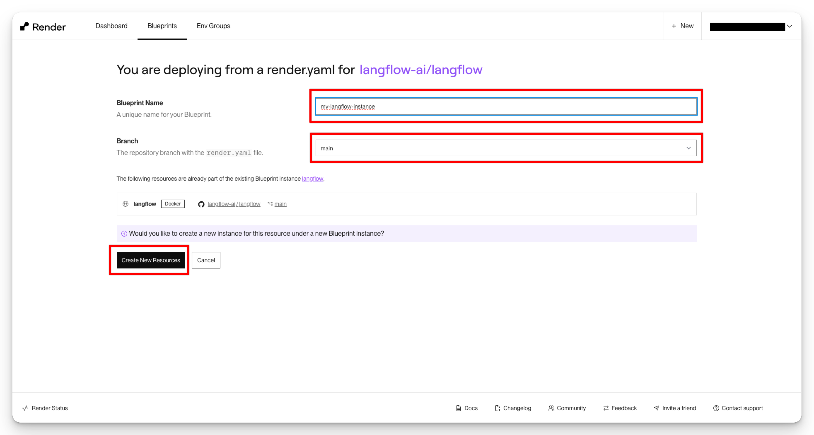
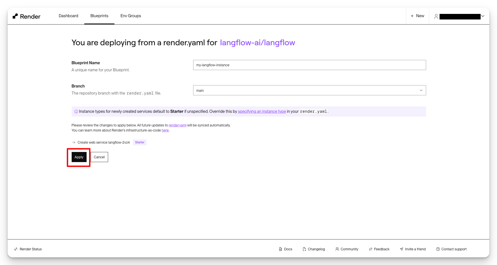

## Deploy on Render {#20a959b7047e44e490cc129fd21895c0}

---

[Render.com](http://render.com/) is a unified cloud platform designed to make deploying web applications, APIs, and static sites easy. It provides a streamlined experience with powerful features like automatic SSL, managed databases, and auto-deploy from Git, making it a popular choice for developers looking to simplify their deployment workflows.

Deploying Langflow to Render is a straightforward process that can be completed in just a few steps:

1. **Click the Button Below**: Start by clicking the deployment button provided below. This will redirect you to the Render platform.

	[https://render.com/deploy?repo=https://github.com/langflow-ai/langflow/tree/dev](https://render.com/deploy?repo=https%3A%2F%2Fgithub.com%2Flangflow-ai%2Flangflow%2Ftree%2Fdev)

2. **Select the Default Configuration**: Once on the Render platform, you will be prompted to provide a blueprint name and to select the default configuration for Langflow. This configuration includes all the necessary settings and resources to run Langflow efficiently. You can change the branch of the repo to “main” or “dev” based on your preference. Click “Create New Resources” to proceed.

	

3. **Deploy**: After selecting the configuration, proceed to deploy your Langflow instance. You can keep the default Starter instance, or change it to another instance based on your specific needs. Click Apply to deploy the instance. Render will handle the rest, including setting up the database, deploying the Langflow instance, and starting the application.

	

By following these steps, your Langflow instance will be successfully deployed on Render. Remember to review the pricing details on the Render platform to understand any costs involved.

