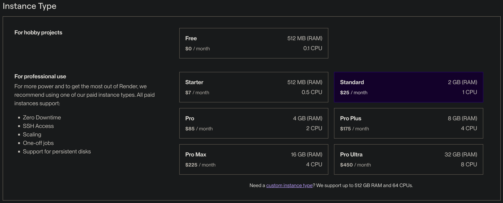
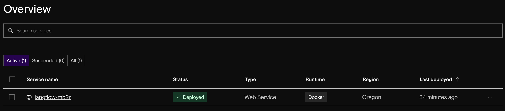

## Deploy on Render {#20a959b7047e44e490cc129fd21895c0}

---

[Render.com](http://render.com/) is a unified cloud platform designed to make deploying web applications, APIs, and static sites easy. It provides a streamlined experience with powerful features like automatic SSL, managed databases, and auto-deploy from Git, making it a popular choice for developers looking to simplify their deployment workflows.

Deploying Langflow to Render is a straightforward process that can be completed in just a few steps:

1. **Click the Button Below**: Start by clicking the deployment button provided below. This will redirect you to the Render platform.

   

2. **Select the Blueprint Configuration**: Once on the Render platform, you will be prompted to provide a blueprint name and to select the branch for your `render.yaml` file in Langflow. This configuration file includes all the necessary settings and resources to deploy Langflow in Render. The default is `main`.
3. The `render.yaml` file specifies a `standard` Render instance, because Langflow requires at least 2 GB of RAM to run. This may require a credit card to sign up. Review the pricing details on the Render platform to understand any costs involved before proceeding. If you need to change your plan later, from the Render dashboard, go to **Settings** > **Instance Type**.

   

4. Click **Deploy Blueprint** to deploy Langflow. Render will handle the rest, including setting up the database, deploying the Langflow instance, and starting the application.

   

By following these steps, your Langflow instance will be successfully deployed on Render.
