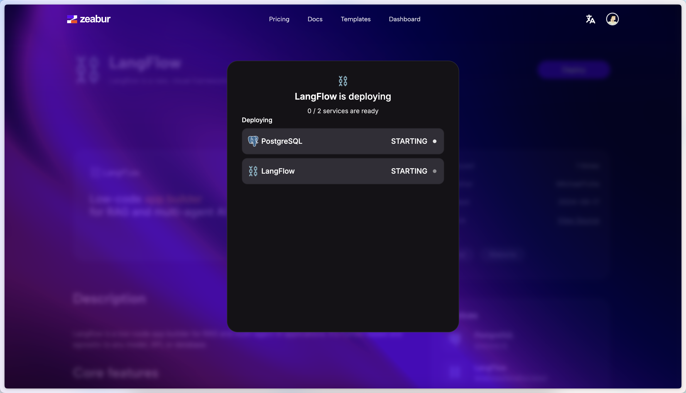

## Deploy on Zeabur {#a9a1ce4d39e74cc29aef4d30c6172d10}

---

Zeabur is a cloud platform for hosting and scaling full stack applications easily.

Deploying Langflow to Zeabur involves a few simple steps:

1. **Click the Button Below**: Start by clicking the deployment button provided below. This will redirect you to the Zeabur platform.

   

2. **Deploy**: Proceed to deploy your Langflow instance. Click "Deploy", and select a domain and region for your LangFlow instance, then Zeabur will start the deployment for LangFlow and PostgreSQL automatically.

   

By following these steps, your Langflow instance will be successfully deployed on Zeabur.
