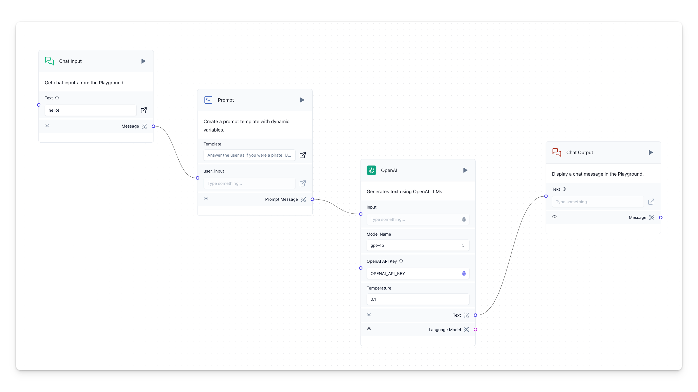
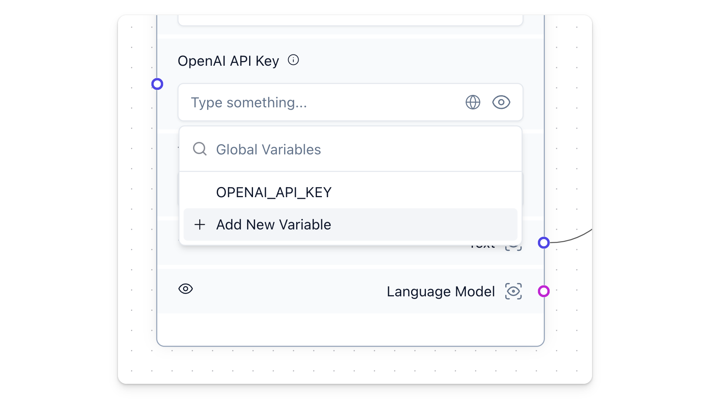

## Prerequisites {#b5f154a3a1d242c7bdf57acf0a552732}

---

- [Python &gt;=3.10](https://www.python.org/downloads/release/python-3100/) and [pip](https://pypi.org/project/pip/) or [pipx](https://pipx.pypa.io/stable/installation/)
- [OpenAI API key](https://platform.openai.com/)
- [Langflow installed and running](/getting-started-installation)

## Basic Prompting {#67e7cd59d0fa43e3926bdc75134f7472}

---

### Create the basic prompting project {#c029603ddb1f42f5b28df92e58426ab3}

1. From the Langflow dashboard, click **New Project**. 

2. Select **Basic Prompting**.

3. The **Basic Prompting** flow is created.

This flow allows you to chat with the **OpenAI** component through the **Prompt** component. 

Examine the **Prompt** component. The **Template** field instructs the LLM to `Answer the user as if you were a pirate.` This should be interesting...

4. To create an environment variable for the **OpenAI** component, in the **OpenAI API Key** field, click the **Globe** button, and then click **Add New Variable**.

	1. In the **Variable Name** field, enter `openai_api_key`.
	2. In the **Value** field, paste your OpenAI API Key (`sk-...`).
	3. Click **Save Variable**.

### Run {#ef0e8283bfb646f99bbb825462d8cbab}

1. Click the **Playground** button on the control panel (bottom right side of the workspace). This is where you can interact with your AI.
2. Type a message and press Enter. The bot should respond in a markedly piratical manner!

### Modify the prompt for a different result {#dcea9df0cd51434db76717c78b1e9a94}

1. To modify your prompt results, in the **Prompt** template, click the **Template** field. The **Edit Prompt** window opens.
2. Change `Answer the user as if you were a pirate` to a different character, perhaps `Answer the user as if you were Hermione Granger.`
3. Run the workflow again. The response will be markedly different.

## Next steps {#63b6db6cb571489c86b3ae89051f1a4f}

---

Well done! You've built your first prompt in Langflow. 🎉

By dragging Langflow components to your workspace, you can create all sorts of interesting behaviors. Here are a couple of examples:

- [Memory Chatbot](https://docs.langflow.org/starter-projects/memory-chatbot)
- [Blog Writer](https://docs.langflow.org/starter-projects/blog-writer)
- [Document QA](https://docs.langflow.org/starter-projects/document-qa)
