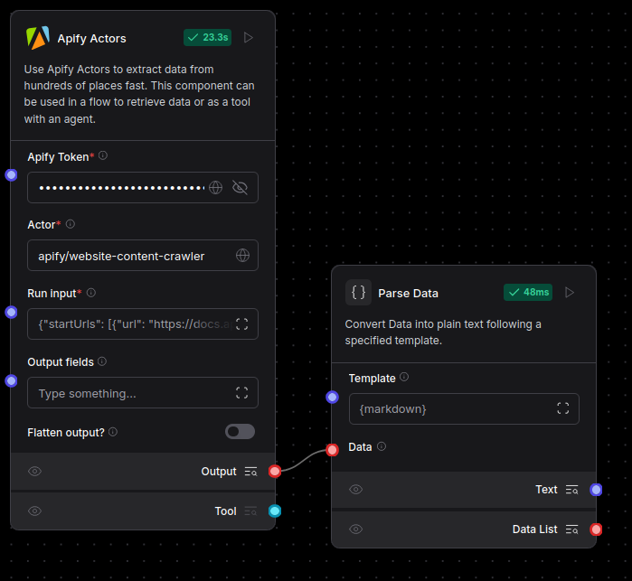

# Integrate Apify with Langflow

[Apify](https://apify.com/) is a web scraping and data extraction platform. It provides an app store with more than three thousand ready-made cloud tools called Actors.

The Apify components allow you to run Apify Actors in your flow to accomplish tasks such as:

- Crawling websites and extracting text content
- Scraping social media platforms like Instagram and Facebook
- Extracting data from Google Maps
- Inserting data into a PostgreSQL/MySQL/MSSQL database
- Running various other automation tasks

More info about Apify:

- [Website](https://apify.com/)
- [Apify Actor Store](https://apify.com/store)
- [Actor Whitepaper](https://whitepaper.actor/)

## Prerequisites

You need an **Apify API token**. You can create a free account on [Apify](https://apify.com/) and generate your API key in the Apify Console. [Get a Free API key here](https://docs.apify.com/platform/integrations/api).

Enter the key in the *Apify Token* field in all components that require the key.

## Example flows

### Extract website content in Markdown format

This example flow demonstrates the use of the Apify Actors component to extract text content from a website in Markdown format. The flow includes a [Website Content Crawler Actor](https://apify.com/apify/website-content-crawler) that extracts text content from a website. The extracted content can then be used for various purposes in your flow.

### Simple example with Agent

This example flow demonstrates the use of the Apify Actors component to run a simple web scraping task. The flow includes a [Website Content Crawler Actor](https://apify.com/apify/website-content-crawler) that extracts text content from a website. The agent triggers the Actor to scrape the website and retrieve the content, which can then be summarized or analyzed by the agent in the chat.

### Multiple Apify Actors with Agent

This example flow demonstrates the use of multiple Apify Actors to complete a comprehensive web scraping task. The flow includes a [Google Search Results Scraper Actor](https://apify.com/apify/google-search-scraper) that extracts search results from Google and a [TikTok Data Extractor Actor](https://apify.com/clockworks/free-tiktok-scraper) that gathers data from TikTok. Initially, the agent collects social media links related to an entity (person, company, etc.) from Google. It then utilizes the TikTok Data Extractor to retrieve data and videos from the corresponding TikTok profile.

## Components

### Apify Actors

This component allows you to run Apify Actors in your flow. It can be used manually by providing run input or integrated as a tool for an AI Agent. When used with an AI Agent, the agent can leverage the Apify Actors to perform various tasks.

- **Input**:
    - Apify Token: Your API key.
    - Actor: The Apify Actor to run. Example: `apify/website-content-crawler`.
    - Run Input: The JSON input for configuring the Actor run.

- **Output**:
    - Actor Run Result: The JSON response containing the output of the Actor run.

- **Manual Usage**:
    - Create the Apify Actors component.
    - Input the Apify Token, an Actor ID, and configure the Run Input JSON.
      - Example input can be obtained from the Actor documentation Input section in the JSON Example tab. See [Website Content Crawler](https://apify.com/apify/website-content-crawler/input-schema).
    - Run the component manually to retrieve data.

- **AI Agent Integration**:
    - Create the Apify Actors component.
    - Input the Apify Token and an Actor ID.
    - Connect the component Tool output to the Agent, allowing it to trigger the Actor as needed.

## How to use Apify Actors in Langflow

First, you need to pick an Actor that you want to use in your flow from the [Apify Actor Store](https://apify.com/store). Then, create the **Apify Actors** component and input your Apify API token and the Actor ID. You can find the Actor ID in the Apify Actor Store, for example, `apify/website-content-crawler`. Now you can either connect the **Tool** output to an AI Agent or configure the Run input JSON manually and run the component to retrieve data from the **Output Data**. Example Run input can be obtained from the Actor details page in the Apify Actor Store. See the **JSON Example** in the input schema section [here](https://apify.com/apify/website-content-crawler/input-schema).
