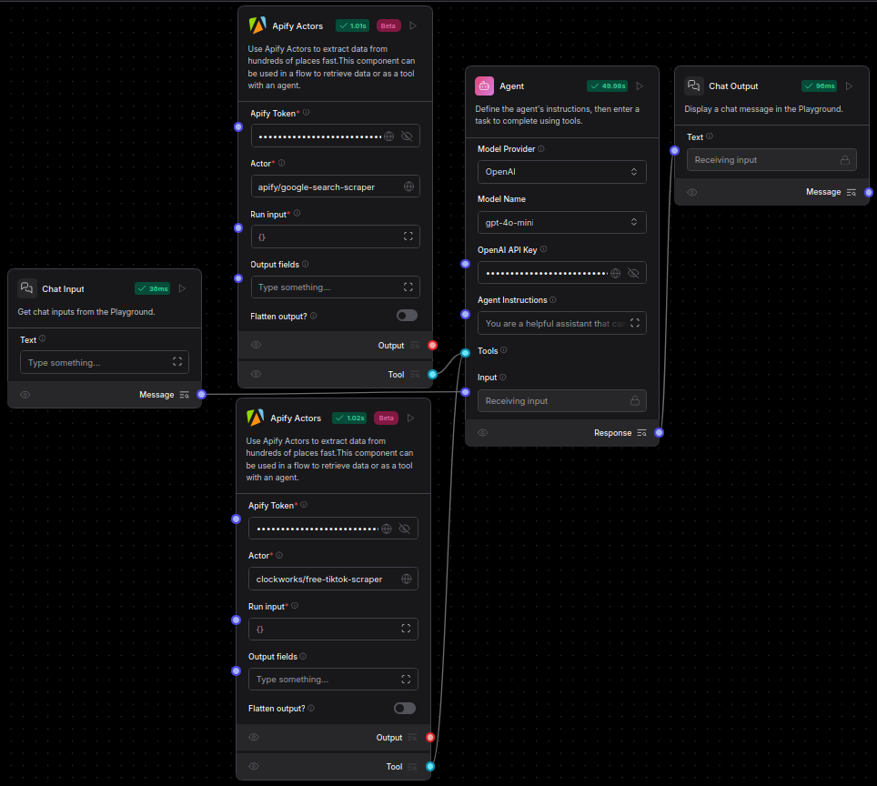

# Integrate Apify with Langflow

[Apify](https://apify.com/) is a web scraping and data extraction platform. It provides an app store with more than three thousand ready-made cloud tools called Actors.

The Apify components allow you to run Apify Actors in your flow to accomplish tasks such as:

- Crawling websites and extracting text content
- Scraping social media platforms like Instagram and Facebook
- Extracting data from Google Maps
- Inserting data into a PostgreSQL/MySQL/MSSQL database
- Running various other automation tasks

More info about Apify:

- [Website](https://apify.com/)
- [Apify Actor Store](https://apify.com/store)
- [Actor Whitepaper](https://whitepaper.actor/)

## Prerequisites

You need an **Apify API token**. You can create a free account on [Apify](https://apify.com/) and generate your API key in the Apify Console. [Get a Free API key here](https://docs.apify.com/platform/integrations/api).

Enter the key in the *Apify Token* field in all components that require the key.

## Example flows

### Extract website text content in Markdown format

Use the [Website Content Crawler Actor](https://apify.com/apify/website-content-crawler) to extract text content in Markdown format from a website and process it in your flow.

### Analyze and process website content with an Agent

Building on the previous example, this flow not only extracts website content using the [Website Content Crawler Actor](https://apify.com/apify/website-content-crawler) but also processes and analyzes it with an agent. The agent takes the extracted data and transforms it into summaries, insights, or structured responses, making the information more actionable. Unlike simple extraction, this approach enables automated content understanding and contextual processing.

### Search and analyze social media profiles with an Agent

Perform comprehensive social media research with multiple Apify Actors. Start with the [Google Search Results Scraper Actor](https://apify.com/apify/google-search-scraper) to find relevant social media profiles, then use the [TikTok Data Extractor Actor](https://apify.com/clockworks/free-tiktok-scraper) to gather data and videos. The agent streamlines the process by collecting links from Google and retrieving content from TikTok, enabling deeper analysis of a person, brand, or topic.

## Components

### Apify Actors

This component allows you to run Apify Actors in your flow. It can be used manually by providing run input or integrated as a tool for an AI Agent. When used with an AI Agent, the agent can leverage the Apify Actors to perform various tasks.

- **Input**:
    - Apify Token: Your API key.
    - Actor: The Apify Actor to run. Example: `apify/website-content-crawler`.
    - Run Input: The JSON input for configuring the Actor run.

- **Output**:
    - Actor Run Result: The JSON response containing the output of the Actor run.

## How to use Apify Actors in Langflow

First, you need to pick an Actor that you want to use in your flow from the [Apify Actor Store](https://apify.com/store). Then, create the **Apify Actors** component and input your Apify API token and the Actor ID. You can find the Actor ID in the Apify Actor Store, for instance, the [Website Content Crawler](https://apify.com/apify/website-content-crawler) has Actor ID `apify/website-content-crawler`. Now you can either connect the **Tool** output to an AI Agent or configure the Run input JSON manually and run the component to retrieve data from the **Output Data**. Example Run input can be obtained from the Actor details page in the Apify Actor Store. See the **JSON Example** in the input schema section [here](https://apify.com/apify/website-content-crawler/input-schema).
