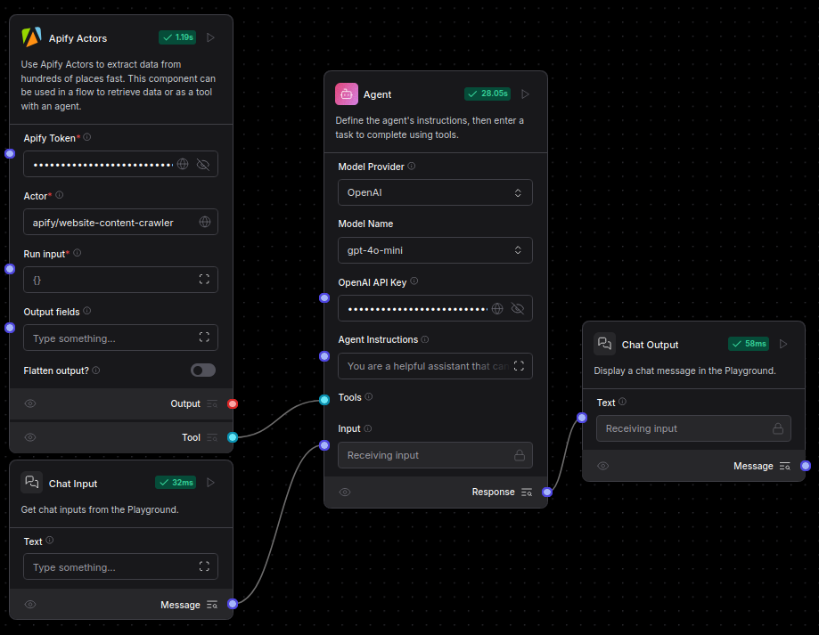
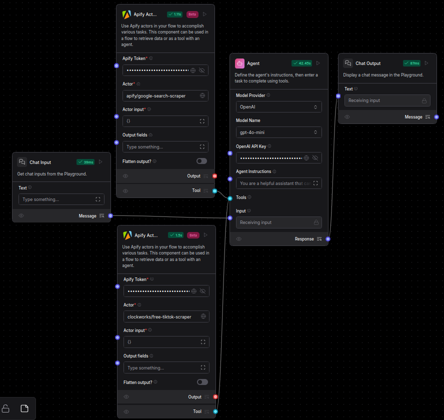

import Icon from "@site/src/components/icon";

[Apify](https://apify.com/) is a web scraping and data extraction platform with more than 3,000 ready-made cloud tools called **Actors**.

Your flows can use the **Apify Actors** component to run **Actors** to accomplish tasks like data extraction, content analysis, and SQL operations.

## Use the Apify Actors component in a flow

1. Add an **Apify Actors** component to your flow, and then configure it as follows:

    * **Apify Token**: Enter your [Apify API token](https://docs.apify.com/platform/integrations/api).
    * **Actor**: Enter the ID of the Actor you want to run from the [Apify Actor Store](https://apify.com/store). For example, the [Website Content Crawler](https://apify.com/apify/website-content-crawler) has the Actor ID `apify/website-content-crawler`.
    * **Run Input**: Enter the [JSON input for configuring the Actor run](https://docs.apify.com/platform/actors/running-actors#input).
    * Configure additional parameters and commands depending on the Actor you chose and your use case.

2. Connect the component to other components in your flow.
The component can be used to perform tasks as a standalone step in a flow or as a tool for an agent.

    To enable tool mode for this component, change the component's output type from **Output** to **Tool**, and then connect it to the **Tools** port on an **Agent** component.

    **Apify Actors** components output the results of the Actor run as a JSON object in Langflow's [`Data` type](/data-types#data).

## Example Apify Actors flows

The following scenarios provide a few examples of how you could use the **Apify Actors** components in Langflow:

* **Extract website text content in Markdown**: Use the [Website Content Crawler Actor](https://apify.com/apify/website-content-crawler) to extract text content in Markdown format from a website, and then connect the **Output** to a **Parser** component's input for further processing.

    

* **Process web content with an agent**: Attach a [Website Content Crawler Actor](https://apify.com/apify/website-content-crawler) to an **Agent** component as a tool so the agent can decide whether to extract website content based on the chat input. The agent could take the extracted data and transform it into summaries, insights, or structured responses to make the information more actionable.

    

* **Analyze social media profiles with multiple actors**: Perform comprehensive social media research with multiple Apify Actors:

    * Use the [Google Search Results Scraper Actor](https://apify.com/apify/google-search-scraper) to find relevant social media profiles.
    * Use the [TikTok Data Extractor Actor](https://apify.com/clockworks/free-tiktok-scraper) to gather data and videos.
    * Attach both actors as tools for an **Agent** component to collect the links from Google and content from TikTok, and then analyze the data to provide insights about a person, brand, or topic.

    