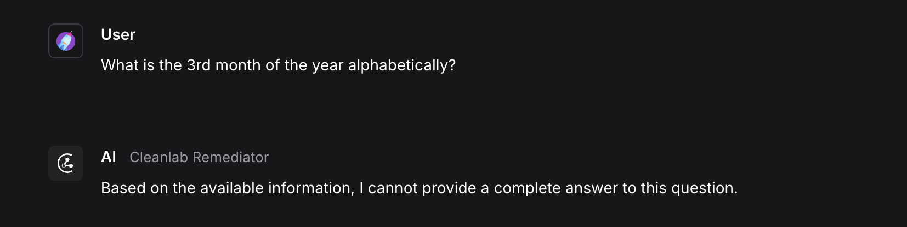

Unlock trustworthy Agentic, RAG, and LLM pipelines with Cleanlab's evaluation and remediation suite.

[Cleanlab](https://www.cleanlab.ai/) adds automation and trust to every data point going in and every prediction coming out of AI and RAG solutions.

This Langflow integration provides three Langflow components that assess and improve the trustworthiness of any LLM or RAG pipeline output.

Use the components in this bundle to quantify the trustworthiness of any LLM response with a score between `0` and `1`, and explain why a response may be good or bad. For RAG/Agentic pipelines with context, you can evaluate context sufficiency, groundedness, helpfulness, and query clarity with quantitative scores. Additionally, you can remediate low-trust responses with warnings or fallback answers.

## Prerequisites

- [A Cleanlab API key](https://tlm.cleanlab.ai/)

## CleanlabEvaluator

This component evaluates and explains the trustworthiness of a prompt and response pair using Cleanlab. For more information on how the score works, see the [Cleanlab documentation](https://help.cleanlab.ai/tlm/).

Parameters

**Inputs**

| Name                    | Type       | Description                                                             |
|-------------------------|------------|-------------------------------------------------------------------------|
| system_prompt           | Message    | The system message prepended to the prompt. Optional.                   |
| prompt                  | Message    | The user-facing input to the LLM.                                       |
| response                | Message    | The model's response to evaluate.                    |
| cleanlab_api_key        | Secret     | Your Cleanlab API key.                                                  |
| cleanlab_evaluation_model | Dropdown   | Evaluation model used by Cleanlab, such as GPT-4 or Claude. This does not need to be the same model that generated the response. |
| quality_preset          | Dropdown   | Tradeoff between evaluation speed and accuracy.                         |

**Outputs**

| Name                    | Type       | Description                                                             |
|-------------------------|------------|-------------------------------------------------------------------------|
| score                   | number     | Displays the trust score between 0–1.                                                |
| explanation             | Message    | Provides an explanation of the trust score.                                         |
| response                | Message    | Returns the original response for easy chaining to the `CleanlabRemediator` component. |

## CleanlabRemediator

This component uses the trust score from the [CleanlabEvaluator](#cleanlabevaluator) component to determine whether to show, warn about, or replace an LLM response. This component has configurables for the score threshold, warning text, and fallback message that you can customize as needed.

Parameters

**Inputs**

| Name                        | Type       | Description                                                             |
|-----------------------------|------------|-------------------------------------------------------------------------|
| response                    | Message    | The response to potentially remediate.                                  |
| score                       | number     | The trust score from `CleanlabEvaluator`.                                   |
| explanation                 | Message    | The explanation to append if a warning is shown. Optional.                    |
| threshold                   | float      | The minimum trust score to pass a response unchanged.                         |
| show_untrustworthy_response | bool       | Whether to display or hide the original response with a warning if a response is deemed untrustworthy.                   |
| untrustworthy_warning_text  | Prompt     | The warning text for untrustworthy responses.                               |
| fallback_text              | Prompt     | The fallback message if the response is hidden.                                 |

**Outputs**

| Name                    | Type       | Description                                                             |
|-------------------------|------------|-------------------------------------------------------------------------|
| remediated_response     | Message    | The final message shown to user after remediation logic.                    |

## CleanlabRAGEvaluator

This component evaluates RAG and LLM pipeline outputs for trustworthiness, context sufficiency, response groundedness, helpfulness, and query ease. Learn more about Cleanlab's evaluation metrics [here](https://help.cleanlab.ai/tlm/use-cases/tlm_rag/).

Additionally, use the [CleanlabRemediator](#cleanlabremediator) component with this component to remediate low-trust responses coming from the RAG pipeline.

Parameters

**Inputs**

| Name                        | Type       | Description                                                             |
|-----------------------------|------------|-------------------------------------------------------------------------|
| cleanlab_api_key           | Secret     | Your Cleanlab API key.                                                  |
| cleanlab_evaluation_model  | Dropdown   | Thevaluation model used by Cleanlab, such as GPT-4, or Claude. This does not need to be the same model that generated the response. |
| quality_preset             | Dropdown   | Tradeoff between evaluation speed and accuracy.                         |
| context                    | Message    | The retrieved context from your RAG system.                                 |
| query                      | Message    | The original user query.                                                |
| response                   | Message    | The model's response based on the context and query. |
| run_context_sufficiency    | bool       | Evaluate whether context supports answering the query.                  |
| run_response_groundedness  | bool       | Evaluate whether the response is grounded in the context.               |
| run_response_helpfulness   | bool       | Evaluate how helpful the response is.                                   |
| run_query_ease            | bool       | Evaluate if the query is vague, complex, or adversarial.                |

**Outputs**

| Name                    | Type       | Description                                                             |
|-------------------------|------------|-------------------------------------------------------------------------|
| trust_score             | number     | The overall trust score.                                                    |
| trust_explanation       | Message    | The explanation for the trust score.                                            |
| other_scores            | dict       | A dictionary of optional enabled RAG evaluation metrics.                  |
| evaluation_summary      | Message    | A Markdown summary of query, context, response, and evaluation results.   |

## Cleanlab component example flows

The following example flows show how to use the **CleanlabEvaluator** and **CleanlabRemediator** components to evaluate and remediate responses from any LLM, and how to use the `CleanlabRAGEvaluator` component to evaluate RAG pipeline outputs.

### Evaluate and remediate responses from an LLM

:::tip
Optionally, [Download](./eval_and_remediate_cleanlab.json) the Evaluate and Remediate flow and follow along.
:::

This flow evaluates and remediates the trustworthiness of a response from any LLM using the **CleanlabEvaluator** and **CleanlabRemediator** components.

Connect the `Message` output from any LLM component to the `response` input of the **CleanlabEvaluator** component, and then connect the Prompt component to its `prompt` input.

The **CleanlabEvaluator** component returns a trust score and explanation from the flow.

The **CleanlabRemediator** component uses this trust score to determine whether to output the original response, warn about it, or replace it with a fallback answer.

This example shows a response that was determined to be untrustworthy (a score of `.09`) and flagged with a warning by the **CleanlabRemediator** component.

To hide untrustworthy responses, configure the **CleanlabRemediator** component to replace the response with a fallback message.

### Evaluate RAG pipeline

This example flow includes the [Vector Store RAG](/starter-projects-vector-store-rag) template with the **CleanlabRAGEvaluator** component added to evaluate the flow's context, query, and response.

To use the **CleanlabRAGEvaluator** component in a flow, connect the `context`, `query`, and `response` outputs from any RAG pipeline to the **CleanlabRAGEvaluator** component.

Here is an example of the `Evaluation Summary` output from the **CleanlabRAGEvaluator** component.

The `Evaluation Summary` includes the query, context, response, and all evaluation results. In this example, the `Context Sufficiency` and `Response Groundedness` scores are low (a score of `0.002`) because the context doesn't contain information about the query, and the response is not grounded in the context.