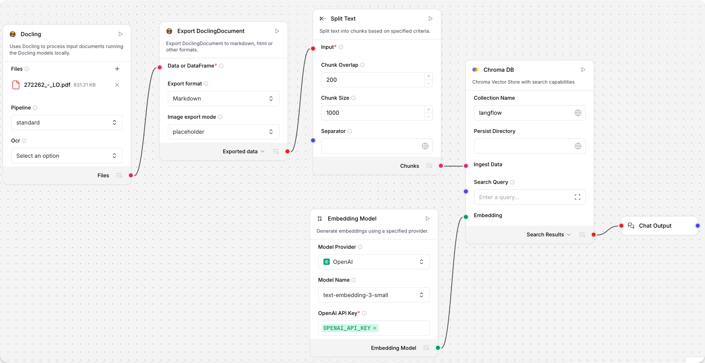

import Tabs from '@theme/Tabs';
import TabItem from '@theme/TabItem';
import Icon from "@site/src/components/icon";

Langflow integrates with [Docling](https://docling-project.github.io/docling/) through a suite of components for parsing documents.

## Prerequisites

* Install the Docling extra in Langflow OSS with `uv pip install langflow[docling]` or `uv pip install docling`.

    To add a dependency to Langflow Desktop, add an entry for Docling to the application's `requirements.txt` file.

    * On macOS, the file is located at `/Users/<name>/.langflow/data/requirements.txt`.
    * On Windows, the file is located at `C:\Users\<name>\AppData\Roaming\com.Langflow\data\requirements.txt`.

    Add the dependency to `requirements.txt` in the following format:
        ```
        docling==2.40.0
        ```
    Restart Langflow desktop to install the dependency.

## Use Docling components in a flow to split a PDF

1. Connect a **Docling** and an **ExportDoclingDocument** component to a [**Split Text**](/components-processing#split-text) component.
    The **Docling** component loads the document, and the **ExportDoclingDocument** component converts the DoclingDocument into the format you select. This example converts the document to Markdown, with images represented as placeholders.
    The **Split Text** component will split the Markdown into chunks for the vector database to store in the next part of the flow.
2. Connect a [**Chroma DB**](/components-vector-stores#chroma-db) component to the **Split text** component's **Chunks** output.
3. Connect an [**Embedding Model**](/components-embedding-model) to Chroma's **Embedding** port, and a **Chat Output** component to view the extracted [DataFrame](/concepts-objects#dataframe).
4. Add your OpenAI API key to the Embedding Model.

The flow looks like this:



5. Add a file to the **Docling** component.
6. To run the flow, click <Icon name="Play" aria-hidden="true"/> **Playground**.
    The chunked document is loaded as vectors into your vector database.

## Docling

This component uses Docling to process input documents running the Docling models locally.

<details>
<summary>Parameters</summary>

**Inputs**

| Name | Type | Description |
|------|------|-------------|
| files | File | The files to process. |
| pipeline | String | Docling pipeline to use (standard, vlm). |
| ocr_engine | String | OCR engine to use (easyocr, tesserocr, rapidocr, ocrmac). |

**Outputs**

| Name | Type | Description |
|------|------|-------------|
| files | File | The processed files with DoclingDocument data. |

</details>

## Docling Serve

This component uses Docling to process input documents connecting to your instance of Docling Serve.

<details>
<summary>Parameters</summary>

**Inputs**

| Name | Type | Description |
|------|------|-------------|
| files | File | The files to process. |
| api_url | String | URL of the Docling Serve instance. |
| max_concurrency | Integer | Maximum number of concurrent requests for the server. |
| max_poll_timeout | Float | Maximum waiting time for the document conversion to complete. |
| api_headers | Dict | Optional dictionary of additional headers required for connecting to Docling Serve. |
| docling_serve_opts | Dict | Optional dictionary of additional options for Docling Serve. |

**Outputs**

| Name | Type | Description |
|------|------|-------------|
| files | File | The processed files with DoclingDocument data. |

</details>

## Chunk DoclingDocument

This component uses the DocumentDocument chunkers to split the document into chunks.

<details>
<summary>Parameters</summary>

**Inputs**

| Name | Type | Description |
|------|------|-------------|
| data_inputs | Data/DataFrame | The data with documents to split in chunks. |
| chunker | String | Which chunker to use (HybridChunker, HierarchicalChunker). |
| provider | String | Which tokenizer provider (Hugging Face, OpenAI). |
| hf_model_name | String | Model name of the tokenizer to use with the HybridChunker when Hugging Face is chosen. |
| openai_model_name | String | Model name of the tokenizer to use with the HybridChunker when OpenAI is chosen. |
| max_tokens | Integer | Maximum number of tokens for the HybridChunker. |
| doc_key | String | The key to use for the DoclingDocument column. |

**Outputs**

| Name | Type | Description |
|------|------|-------------|
| dataframe | DataFrame | The chunked documents as a DataFrame. |

</details>

## Export DoclingDocument

This component exports DoclingDocument to markdown, html or other formats.

<details>
<summary>Parameters</summary>

**Inputs**

| Name | Type | Description |
|------|------|-------------|
| data_inputs | Data/DataFrame | The data with documents to export. |
| export_format | String | Select the export format to convert the input (Markdown, HTML, Plaintext, DocTags). |
| image_mode | String | Specify how images are exported in the output (placeholder, embedded). |
| md_image_placeholder | String | Specify the image placeholder for markdown exports. |
| md_page_break_placeholder | String | Add this placeholder between pages in the markdown output. |
| doc_key | String | The key to use for the DoclingDocument column. |

**Outputs**

| Name | Type | Description |
|------|------|-------------|
| data | Data | The exported data. |
| dataframe | DataFrame | The exported data as a DataFrame. |

</details>


