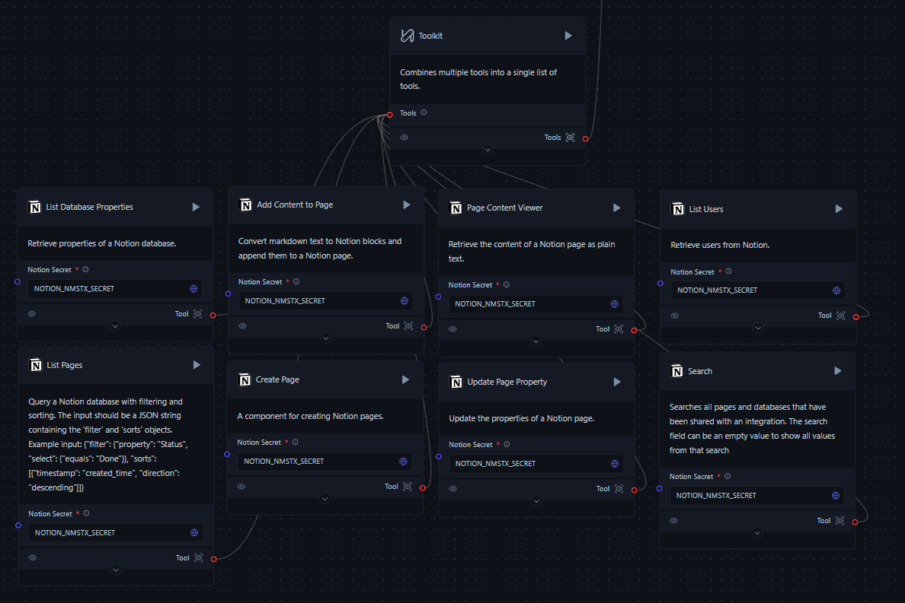

The Notion Conversational Agent is an AI-powered assistant that interacts with your Notion workspace through natural language conversations. This flow performs Notion-related tasks like creating pages, searching for information, and managing content, all through a chat interface.



## Prerequisites

- [Notion App](/integrations/notion/setup)
- [Notion account and API key](https://www.notion.so/my-integrations)
- [OpenAI API key](https://platform.openai.com/account/api-keys)
- [Download Flow Conversation Agent Flow](./Conversational_Notion_Agent.json)(Download link)


## Components

- **Chat Input**: Accepts user queries and commands
- **Chat Output**: Displays the agent's responses
- **Language Model**: Processes user input and generates responses with an OpenAI model
- **Tool Calling Agent**: Coordinates the use of various Notion tools based on user input
- **Toolkit**: Combines multiple Notion-specific tools into a single toolkit
- **Notion Tools**: Various components for interacting with Notion, including:
  - List Users
  - List Database Properties
  - List Pages
  - Page Content Viewer
  - Create Page
  - Update Page Property
  - Add Content to Page
  - Search
- **Message History**: Stores conversation history
- **Prompt Template**: Provides system instructions and context for the agent
- **Current Date**: Supplies the current date and time for context

## Run the Conversational Notion Agent

1. Open Langflow and create a new flow.
2. Add the components listed above to your flow canvas, or Download the [Conversation Agent Flow](./Conversational_Notion_Agent.json)(Download link) and **Import** the JSON file into Langflow.
3. Connect the components as shown in the flow diagram.
4. Input the Notion and OpenAI API keys in their respective components.
5. To start the flow, click the "Play" button in Langflow.
6. In the chat interface, enter a Notion-related request or question. For example:
   - "Create a new page in my task database"
   - "Search for pages about project management"
   - "List all users in my Notion workspace"
7. The agent will process your request, use the appropriate Notion tools, and provide a response.
8. Continue the conversation, asking follow-up questions or giving new commands as needed.

## Example Interactions

```
User: List all the users in my Notion workspace.

Agent: Certainly! I'll use the Notion User List tool to retrieve that information for you. One moment please.

[Agent uses the Notion User List tool]

Here's a list of users in your Notion workspace:

1. John Doe (john@example.com)
2. Jane Smith (jane@example.com)
3. Alex Johnson (alex@example.com)

Is there anything specific you'd like to know about these users or any other Notion-related task I can help you with?

User: Create a new page in my Projects database with the title "Website Redesign".

Agent: Certainly! I'd be happy to create a new page in your Projects database with the title "Website Redesign". I'll use the Notion Page Creator tool to do this. First, let me check the properties of your Projects database to ensure we include all necessary information.

[Agent uses the Notion Database Properties tool]

I've retrieved the properties for your Projects database. Now, I'll create the new page with the title "Website Redesign". One moment please.

[Agent uses the Notion Page Creator tool]

Great news! I've successfully created a new page in your Projects database with the title "Website Redesign". Here are the details:

- Title: Website Redesign
- Page ID: [page_id_here]
- URL: [page_url_here]

Is there any additional information you'd like me to add to this new project page, such as a description, due date, or assigned team members?

User: Yes, please add a description: "Redesign company website to improve user experience and modernize the look."

Agent: Certainly! I'd be happy to add that description to the "Website Redesign" project page. I'll use the Add Content to Page tool to update the page with this information.

[Agent uses the Add Content to Page tool]

I've successfully added the description to your "Website Redesign" project page. Here's a summary of what I've done:

1. Located the "Website Redesign" page using the page ID from our previous interaction.
2. Added the following content to the page:

   Description: Redesign company website to improve user experience and modernize the look.

The description has been added as a new text block on the page. Is there anything else you'd like me to add or modify on this project page?
```

## Customization

The flow can be customized to meet your team's specific needs.
For example:

1. Adjust the system prompt to change the agent's behavior or knowledge base.
2. Add or remove Notion tools based on your specific needs.
3. Modify the OpenAI model parameters (e.g., temperature) to adjust the agent's response style.

## Troubleshooting

If you encounter issues:

1. Ensure all API keys are correctly set and have the necessary permissions.
2. Check that your Notion integration has access to the relevant pages and databases.
3. Verify that all components are properly connected in the flow.
4. Review the Langflow logs for any error messages.

For more advanced usage and integration options, refer to the [Notion API documentation](https://developers.notion.com/) and [Langflow documentation](/).