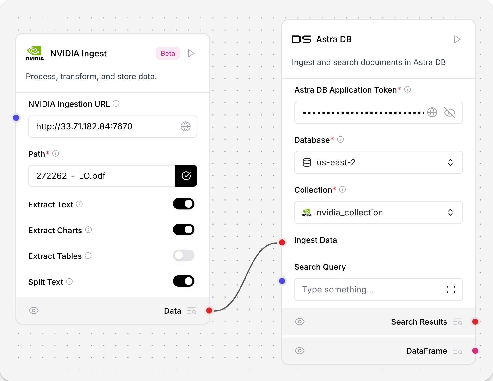

:::note
NVIDIA Retriever Extraction is also known as NV-Ingest and NeMo Retriever Extraction.
:::

The **NVIDIA Retriever Extraction** component integrates with the [NVIDIA nv-ingest](https://github.com/NVIDIA/nv-ingest) microservice for data ingestion, processing, and extraction of text files.

The `nv-ingest` service supports multiple extraction methods for PDF, DOCX, and PPTX file types, and includes pre- and post-processing services like splitting, chunking, and embedding generation. The extractor service's High Resolution mode uses the `nemoretriever-parse` extraction method for better quality extraction from scanned PDF documents. This feature is only available for PDF files.

The **NVIDIA Retriever Extraction** component imports the NVIDIA `Ingestor` client, ingests files with requests to the NVIDIA ingest endpoint, and outputs the processed content as a list of [Data](/data-types#data) objects. `Ingestor` accepts additional configuration options for data extraction from other text formats. To configure these options, see the [component parameters](/integrations-nvidia-ingest#parameters).

## Prerequisites

- An NVIDIA Ingest endpoint. For more information on setting up an NVIDIA Ingest endpoint, see the [NVIDIA Ingest quickstart](https://github.com/NVIDIA/nv-ingest?tab=readme-ov-file#quickstart).

- The **NVIDIA Retriever Extraction** component requires the installation of additional dependencies to your Langflow environment. To install the dependencies in a virtual environment, run the following commands.

  - If you have the Langflow repository cloned and installed from source:

  ```bash
  source **YOUR_LANGFLOW_VENV**/bin/activate
  uv sync --extra nv-ingest
  uv run langflow run
  ```

  - If you are installing Langflow from the Python Package Index:

  ```bash
  source **YOUR_LANGFLOW_VENV**/bin/activate
  uv pip install --prerelease=allow 'langflow[nv-ingest]'
  uv run langflow run
  ```

## Use the NVIDIA Retriever Extraction component in a flow

The **NVIDIA Retriever Extraction** component accepts **Message** inputs and outputs **Data**. The component calls an NVIDIA Ingest microservice's endpoint to ingest a local file and extract the text.

To use the NVIDIA Retriever Extraction component in your flow, follow these steps:

1. In the component library, click the **NVIDIA Retriever Extraction** component, and then drag it onto the canvas.
2. In the **Base URL** field, enter the URL of the NVIDIA Ingest endpoint.
   Optionally, add the endpoint URL as a **Global variable**: 1. Click **Settings**, and then click **Global Variables**. 2. Click **Add New**. 3. Name your variable. Paste your endpoint in the **Value** field. 4. In the **Apply To Fields** field, select the field you want to globally apply this variable to. In this case, select **NVIDIA Base URL**. 5. Click **Save Variable**.
3. Click the **Select files** button to select which file you want to ingest.
4. Select which text type to extract from the file.
   The component supports text, charts, tables, images, and infographics.
   Optionally, for PDF files, enable High Resolution mode for better quality extraction from scanned documents.
5. Select whether to split the text into chunks.
   Modify the splitting parameters in the component's **Configuration** tab.
6. Click **Run** to ingest the file.
7. To confirm the component is ingesting the file, open the **Logs** pane to view the output of the flow.
8. To store the processed data in a vector database, add an **Astra DB Vector** component to your flow, and connect the **NVIDIA Retriever Extraction** component to the **Astra DB Vector** component with a **Data** output.



9. Run the flow.
   Inspect your Astra DB vector database to view the processed data.

## NVIDIA Retriever Extraction component parameters {#parameters}

The **NVIDIA Retriever Extraction** component has the following parameters.

For more information, see the [NV-Ingest documentation](https://nvidia.github.io/nv-ingest/user-guide/).

### Inputs

| Name                 | Display Name                | Info                                                                                                         |
| -------------------- | --------------------------- | ------------------------------------------------------------------------------------------------------------ |
| base_url             | NVIDIA Ingestion URL        | The URL of the NVIDIA Ingestion API.                                                                         |
| path                 | Path                        | File path to process.                                                                                        |
| extract_text         | Extract Text                | Extract text from documents. Default: `True`.                                                                |
| extract_charts       | Extract Charts              | Extract text from charts. Default: `False`.                                                                  |
| extract_tables       | Extract Tables              | Extract text from tables. Default: `True`.                                                                   |
| extract_images       | Extract Images              | Extract images from document. Default: `True`.                                                               |
| extract_infographics | Extract Infographics        | Extract infographics from document. Default: `False`.                                                        |
| text_depth           | Text Depth                  | The level at which text is extracted. Options: 'document', 'page', 'block', 'line', 'span'. Default: `page`. |
| split_text           | Split Text                  | Split text into smaller chunks. Default: `True`.                                                             |
| chunk_size           | Chunk Size                  | The number of tokens per chunk. Default: `500`.                                                              |
| chunk_overlap        | Chunk Overlap               | Number of tokens to overlap from previous chunk. Default: `150`.                                             |
| filter_images        | Filter Images               | Filter images (see advanced options for filtering criteria). Default: `False`.                               |
| min_image_size       | Minimum Image Size Filter   | Minimum image width/length in pixels. Default: `128`.                                                        |
| min_aspect_ratio     | Minimum Aspect Ratio Filter | Minimum allowed aspect ratio (width / height). Default: `0.2`.                                               |
| max_aspect_ratio     | Maximum Aspect Ratio Filter | Maximum allowed aspect ratio (width / height). Default: `5.0`.                                               |
| dedup_images         | Deduplicate Images          | Filter duplicated images. Default: `True`.                                                                   |
| caption_images       | Caption Images              | Generate captions for images using the NVIDIA captioning model. Default: `True`.                             |
| high_resolution      | High Resolution (PDF only)  | Process PDF in high-resolution mode for better quality extraction from scanned PDF. Default: `False`.        |

### Outputs

The **NVIDIA Retriever Extraction** component outputs a list of [Data](/data-types#data) objects where each object contains:

- `text`: The extracted content.
  - For text documents: The extracted text content.
  - For tables and charts: The extracted table/chart content.
  - For images: The image caption.
  - For infographics: The extracted infographic content.
- `file_path`: The source file name and path.
- `document_type`: The type of the document, which can be `text`, `structured`, or `image`.
- `description`: Additional description of the content.

The output varies based on the `document_type`:

- Documents with `document_type: "text"` contain:

  - Raw text content extracted from documents, for example, paragraphs from PDFs or DOCX files.
  - Content stored directly in the `text` field.
  - Content extracted using the `extract_text` parameter.

- Documents with `document_type: "structured"` contain:

  - Text extracted from tables, charts, and infographics and processed to preserve structural information.
  - Content extracted using the `extract_tables`, `extract_charts`, and `extract_infographics` parameters.
  - Content stored in the `text` field after being processed from the `table_content` metadata.

- Documents with `document_type: "image"` contain:
  - Image content extracted from documents.
  - Caption text stored in the `text` field when `caption_images` is enabled.
  - Content extracted using the `extract_images` parameter.
