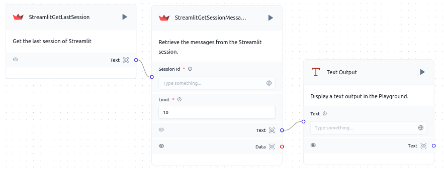

# Streamlit Get Session Messages

Langflow enhances its functionality with custom components like `StreamlitGetSessionMessages`. This component retrieves all messages from the latest session of a specified Streamlit application.


## Component Functionality

<Admonition type="tip" title="Component Functionality">

The `StreamlitGetSessionMessages` component allows you to:

- Retrieve messages of session from a Streamlit server.
- Integrate Streamlit seamlessly into your Langflow workflow.

</Admonition>

## Component Usage

To incorporate the `StreamlitGetSessionMessages` component into a Langflow flow:

1. **Add the `StreamlitGetSessionMessages` component** to your flow.
2. **Configure the component** by providing:
   - `SessionId`: The ID of the session from which you want to retrieve messages.
   - `Limit`: The limit of messages you want to retrieve, 0 means limitless.
2. **Connect the component** to other nodes in your flow as needed.
3. **Initiate the flow** to begin retrieving the messages of session from a Streamlit server.

## Code Block for the `StreamlitGetSessionMessages` Component

```python
from typing import Optional
from langflow.custom import Component
from langflow.schema.message import Message, Data
from langflow.inputs import MessageTextInput, IntInput
import sys
from json import loads, dumps

def install(package):
    subprocess.check_call([sys.executable, "-m", "pip", "install", package])
    return 1

install("requests")

class StreamlitGetSessionMessages(Component):
    display_name = "StreamlitGetSessionMessages"
    description = "Retrieve the messages from the Streamlit session."
    icon = "Streamlit"
    response = None

    inputs = [
        MessageTextInput(
            name="session_id",
            display_name="Session Id",
            info="The streamlit sessionID",
            required=True
        ),
        IntInput(
            name="limit",
            display_name="Limit",
            info="The limit of messages returned, 0 means limitless",
            value=10,
            required=True
        ),
    ]

    outputs = [
        Output(display_name="Text", name="text", method="text_response"),
        Output(display_name="Data", name="data", method="data_response"),
    ]

    def get_messages(self):
        import requests
        resp = requests.get(f"http://streamlit:7881/api/v1/sessions/{self.session_id}/messages?limit={self.limit}")
        if resp.status_code == 200:
            self.response = loads(resp.content)
            return self.response
        else:
            raise Exception("Timeout exception")

    def text_response(self) -> Message:
        if self.response is not None:
            return dumps(self.response)
        return dumps(self.get_messages())

    def data_response(self) -> Data:
        if self.response is not None:
            return self.response
        return self.get_messages()


```

## Example Usage

<Admonition type="info" title="Example Usage">

Example of using the `StreamlitGetSessionMessages` component in a Langflow flow:



In this example, the `StreamlitGetSessionMessages` component connects to a text output node to display messages of session.

</Admonition>


## Troubleshooting

<Admonition type="caution" title="Troubleshooting">

If you encounter any issues while using the `StreamlitGetSessionMessages` component, consider the following:

- Ensure the provided session ID is correct and the Streamlit application is accessible.
- Verify that the limit parameter is set appropriately (0 means limitless).
- Consult the Streamlit Developers APP Page for documentation updates.

</Admonition>
