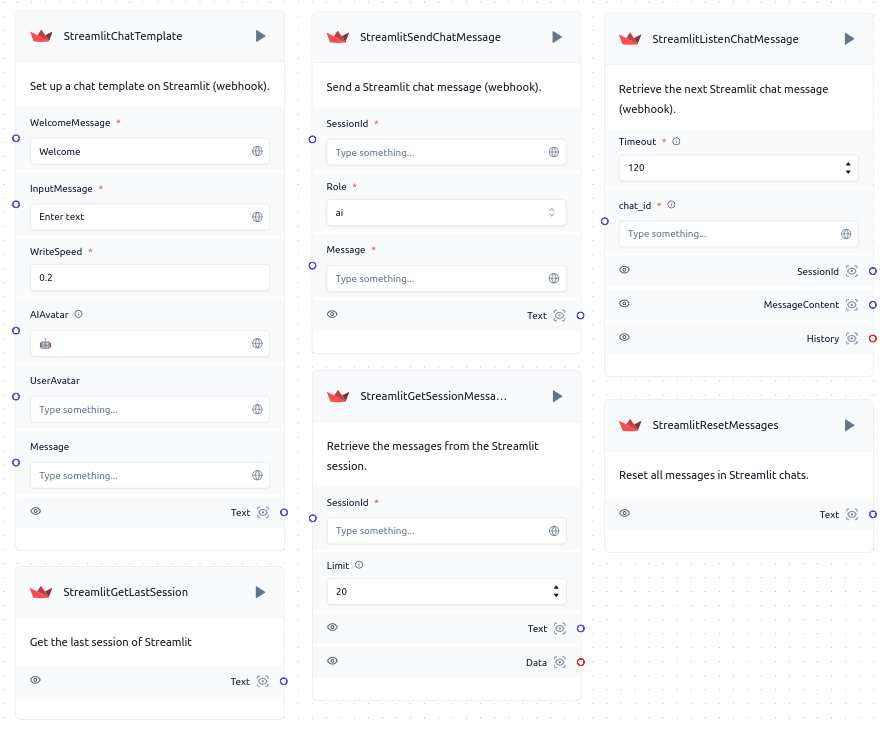

# Introduction to Streamlit in Langflow

The Streamlit integration provides chat interactions through the exchange of messages.

#### Components Bundle, flowId: 6704991d-289d-4bea-bb12-59e9b80b4ea8

### Key Features of Streamlit Integration in Langflow

- **Send**: Sends message to a Streamlit chat.
- **Listen**: Listens for incoming messages in Streamlit chats and personalizes the chat template.

### Potential Use Cases for Streamlit Integration in Langflow

- **Real-Time Data Interaction**: Enable dynamic data interaction in Streamlit applications using Langflow's components.
- **Automated Responses**: Create automated responses to user interactions in Streamlit, improving user experience.

### Getting Started with Streamlit Integration in Langflow

1. **Setting up a Streamlit App**: Follow the guide [Setting up a Streamlit App](./setup) to set up a Streamlit application in your workspace.
3. **Connect Components**: Integrate Streamlit components with other Langflow components to build your workflow.
4. **Test and Refine**: Ensure your Langflow flow operates as intended by testing and refining it.
5. **Deploy and Run**: Deploy your Langflow flow to automate Streamlit-related tasks and processes.
