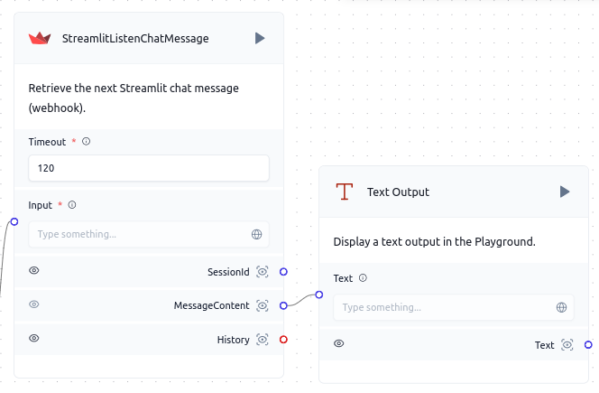

# Streamlit Listen Chat Message

Langflow enhances its functionality with custom components like `StreamlitListenChatMessage`. This component listen for message of a specified Streamlit application.


## Component Functionality

<Admonition type="tip" title="Component Functionality">

The `StreamlitListenChatMessage` component allows you to:

- Listen for the next message from a Streamlit server.
- Integrate Streamlit seamlessly into your Langflow workflow.

</Admonition>

## Component Usage

To incorporate the `StreamlitListenChatMessage` component into a Langflow flow:

1. **Add the `StreamlitListenChatMessage` component** to your flow.
2. **Configure the component** by providing:
   - `Timeout`: The time limit provided to wait for the next message.
2. **Connect the component** to other nodes in your flow as needed.
3. **Initiate the flow** to begin retrieving the messages of session from a Streamlit server.

## Code Block for the `StreamlitListenChatMessage` Component

```python
from typing import Optional
from langflow.custom import Component
from langflow.schema.message import Message, Data
from langflow.inputs import MessageTextInput, IntInput, DataInput
import sys
from json import loads, dumps

def install(package):
    subprocess.check_call([sys.executable, "-m", "pip", "install", package])
    return 1

install("requests")

class StreamlitListenChatMessage(Component):
    display_name = "StreamlitListenChatMessage"
    description = "Retrieve the next Streamlit chat message (webhook)."
    icon = "Streamlit"
    response = None

    inputs = [
        IntInput(
            name="timeout",
            display_name="Timeout",
            info="Timeout in seconds",
            value=10,
            required=True
        ),
        MessageTextInput(
            name="input",
            display_name="Input",
            info="One more way to connect the Component"
        )
    ]

    outputs = [
        Output(display_name="SessionId", name="session_id", method="session_id_response"),
        Output(display_name="MessageContent", name="text", method="text_response"),
        Output(display_name="History", name="chat history", method="chat_history_response"),
    ]

    def get_api_response(self):
        import requests
        resp = requests.get(f"http://localhost:7881/api/v1/listen/message?timeout={self.timeout}")
        if resp.status_code == 200:
            self.response = loads(resp.content)
            return self.response
        else:
            raise Exception("Timeout exception")

    def session_id_response(self) -> Message:
        if self.response is not None:
            return self.response["session_id"]
        return self.get_api_response()["session_id"]

    def text_response(self) -> Message:
        if self.response is not None:
            return self.response["content"]
        return self.get_api_response()["content"]

    def chat_history_response(self) -> Data:
        if self.response is not None:
            return self.response["history"]
        return self.get_api_response()["history"]
```

## Example Usage

<Admonition type="info" title="Example Usage">

Example of using the `StreamlitListenChatMessage` component in a Langflow flow:



In this example, the `StreamlitListenChatMessage` component connects to a text output node to display the listened message.

</Admonition>


## Troubleshooting

<Admonition type="caution" title="Troubleshooting">

If you encounter any issues while using the `StreamlitListenChatMessage` component, consider the following:

- Ensure the provided time limit is correct and the Streamlit application is accessible.
- Consult the Streamlit Developers APP Page for documentation updates.

</Admonition>
