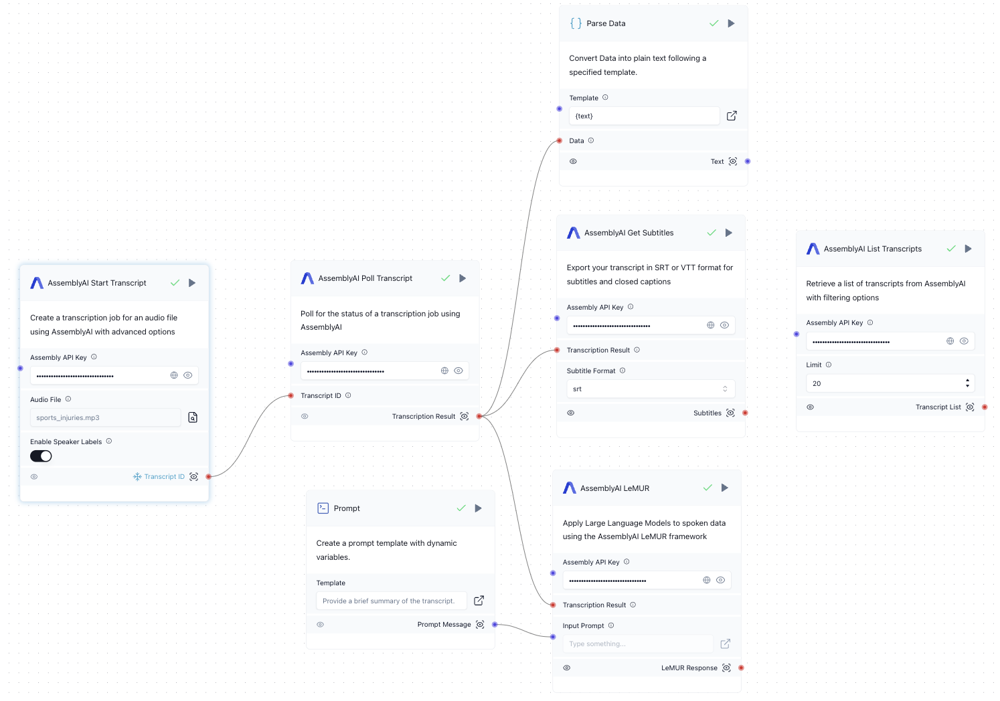

import Icon from "@site/src/components/icon";

# AssemblyAI

The AssemblyAI components allow you to apply powerful Speech AI models to your app for tasks like:

- Transcribing audio and video files
- Formatting transcripts
- Generating subtitles
- Applying LLMs to audio files

More info about AssemblyAI:

- [Website](https://www.assemblyai.com/)
- [AssemblyAI API Docs](https://www.assemblyai.com/docs)
- [Get a Free API key](https://www.assemblyai.com/dashboard/signup)

## Prerequisites

You need an **AssemblyAI API key**. After creating a free account, you'll find the API key in your dashboard. [Get a Free API key here](https://www.assemblyai.com/dashboard/signup).

Enter the key in the *AssemblyAI API Key* field in all components that require the key.

(Optional): To use LeMUR, you need to upgrade your AssemblyAI account, since this is not included in the free account.

## Components

### AssemblyAI Start Transcript

This component allows you to submit an audio or video file for transcription.

**Tip**: You can freeze the path of this component to only submit the file once.

- **Input**:
    - AssemblyAI API Key: Your API key.
    - Audio File: The audio or video file to transcribe.
    - Speech Model (Optional): Select the class of models. Default is *Best*. See [speech models](https://www.assemblyai.com/docs/speech-to-text/speech-recognition#select-the-speech-model-with-best-and-nano) for more info.
    - Automatic Language Detection (Optional): Enable automatic language detection.
    - Language (Optional): The language of the audio file. Can be set manually if automatic language detection is disabled.
            See [supported languages](https://www.assemblyai.com/docs/getting-started/supported-languages) for a list of supported language codes.
    - Enable Speaker Labels (Optional): Detect speakers in an audio file and what each speaker said.
    - Expected Number of Speakers (Optional): Set the expected number of speakers, if Speaker Labels is enabled.
    - Audio File URL (Optional): The URL of the audio or video file to transcribe. Can be used instead of *Audio File*.
    - Punctuate (Optional): Apply punctuation. Default is true.
    - Format Text (Optional): Apply casing and text formatting. Default is true.

- **Output**:
    - Transcript ID: The id of the transcript

### AssemblyAI Poll Transcript

This components allows you to poll the transcripts. It checks the status of the transcript every few seconds until the transcription is completed.

- **Input**:
    - AssemblyAI API Key: Your API key.
    - Polling Interval (Optional): The polling interval in seconds. Default is 3.

- **Output**:
    - Transcription Result: The AssemblyAI JSON response of a completed transcript. Contains the text and other info.

### AssemblyAI Get Subtitles

This component allows you to generate subtitles in SRT or VTT format.

- **Input**:
    - AssemblyAI API Key: Your API key.
    - Transcription Result: The output of the *Poll Transcript* component.
    - Subtitle Format: The format of the captions (SRT or VTT).
    - Character per Caption (Optional): The maximum number of characters per caption (0 for no limit).

- **Output**:
    - Subtitles: A JSON response with the `subtitles` field containing the captions in SRT or VTT format.

### AssemblyAI LeMUR

This component allows you to apply Large Language Models to spoken data using the [AssemblyAI LeMUR framework](https://www.assemblyai.com/docs/lemur).

LeMUR automatically ingests the transcript as additional context, making it easy to apply LLMs to audio data. You can use it for tasks like summarizing audio, extracting insights, or asking questions.

- **Input**:
    - AssemblyAI API Key: Your API key.
    - Transcription Result: The output of the *Poll Transcript* component.
    - Input Prompt: The text to prompt the model. You can type your prompt in this field or connect it to a *Prompt* component.
    - Final Model: The model that is used for the final prompt after compression is performed. Default is Claude 3.5 Sonnet.
    - Temperature (Optional): The temperature to use for the model. Default is 0.0.
    - Max Output Size (Optional): Max output size in tokens, up to 4000. Default is 2000.
    - Endpoint (Optional): The LeMUR endpoint to use. Default is "task". For "summary" and "question-answer", no prompt input is needed. See [LeMUR API docs](https://www.assemblyai.com/docs/api-reference/lemur/) for more info.
    - Questions (Optional): Comma-separated list of your questions. Only used if *Endpoint* is "question-answer".
    - Transcript IDs (Optional): Comma-separated list of transcript IDs. LeMUR can perform actions over multiple transcripts. If provided, the *Transcription Result* is ignored.

- **Output**:
    - LeMUR Response: The generated LLM response.

### AssemblyAI List Transcripts

This component can be used as a standalone component to list all previously generated transcripts.

- **Input**:
    - AssemblyAI API Key: Your API key.
    - Limit (Optional): Maximum number of transcripts to retrieve. Default is 20, use 0 for all.
    - Filter (Optional): Filter by transcript status.
    - Created On (Optional): Only get transcripts created on this date (YYYY-MM-DD).
    - Throttled Only (Optional): Only get throttled transcripts, overrides the status filter

- **Output**:
    - Transcript List: A list of all transcripts with info such as the transcript ID, the status, and the data.

## Flow Process

1. The user inputs an audio or video file.
2. The user can also input an LLM prompt. In this example, we want to generate a summary of the transcript.
3. The flow submits the audio file for transcription.
4. The flow checks the status of the transcript every few seconds until transcription is completed.
5. The flow parses the transcription result and outputs the transcribed text.
6. The flow also generates subtitles.
7. The flow applies the LLM prompt to generate a summary.
8. As a standalone component, all transcripts can be listed.

## Run the Transcription and Speech AI Flow

To run the Transcription and Speech AI Flow:

1. Open Langflow and create a new project.
2. Add the components listed above to your flow canvas, or download the [AssemblyAI Transcription and Speech AI Flow](./AssemblyAI_Flow.json)(Download link) and **Import** the JSON file into Langflow.
3. Connect the components as shown in the flow diagram. **Tip**: Freeze the path of the *Start Transcript* component to only submit the file once.
4. Input the AssemblyAI API key in in all components that require the key (Start Transcript, Poll Transcript, Get Subtitles, LeMUR, List Transcripts).
5. Select an audio or video file in the *Start Transcript* component.
6. Run the flow by clicking <Icon name="Play" aria-hidden="True" /> **Run component** on the *Parse Data* component. Make sure that the specified template is `{text}`.
7. To generate subtitles, click <Icon name="Play" aria-hidden="True" /> **Run component** on the *List Transcript* component.

## Customization

The flow can be customized by:

1. Modifying the parameters in the *Start Transcript* component.
2. Modifying the subtitle format in the *Get Subtitles* component.
3. Modifying the LLM prompt for input of the *LeMUR* component.
4. Modifying the LLM parameters (e.g., temperature) in the *LeMUR* component.

## Troubleshooting

If you encounter issues:

1. Ensure the API key is correctly set in all components that require the key.
2. To use LeMUR, you need to upgrade your AssemblyAI account, since this is not included in the free account.
3. Verify that all components are properly connected in the flow.
4. Review the Langflow logs for any error messages.

For more advanced usage, refer to the [AssemblyAI API documentation](https://www.assemblyai.com/docs/). If you need more help, you can reach out to the [AssemblyAI support](https://www.assemblyai.com/contact/support).
