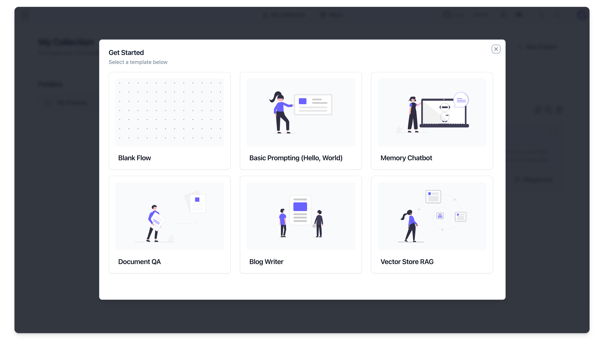
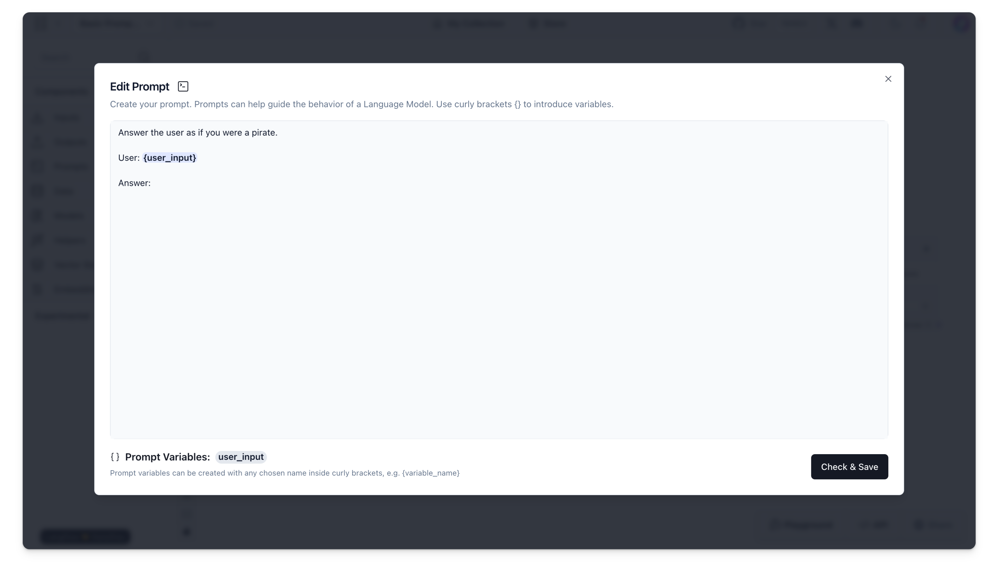

Prompts serve as the inputs to a large language model (LLM), acting as the interface between human instructions and computational tasks.

By submitting natural language requests in a prompt to an LLM, you can obtain answers, generate text, and solve problems.

This article demonstrates how to use Langflow's prompt tools to issue basic prompts to an LLM, and how various prompting strategies can affect your outcomes.

## Prerequisites {#20bd7bc51ce04e2fb4922c95f00870d3}

---

- [Langflow installed and running](/getting-started-installation)
- [OpenAI API key created](https://platform.openai.com/)

## Basic Prompting {#1fae0e83ef08453fba017870d6d981bc}

---

### Create the basic prompting project {#19d5305239c841548a695e2bf7839e7a}

1. From the Langflow dashboard, click **New Project**. 

2. Select **Basic Prompting**.

3. The **Basic Prompting** flow is created.

This flow allows you to chat with the **OpenAI** component through the **Prompt** component. 

Examine the **Prompt** component. The **Template** field instructs the LLM to `Answer the user as if you were a pirate.` This should be interesting...

4. To create an environment variable for the **OpenAI** component, in the **OpenAI API Key** field, click the **Globe** button, and then click **Add New Variable**.

	1. In the **Variable Name** field, enter `openai_api_key`.
	2. In the **Value** field, paste your OpenAI API Key (`sk-...`).
	3. Click **Save Variable**.

### Run {#ce52f8e6b491452a9dfb069feb962eed}

1. Click the **Playground** button on the control panel (bottom right side of the workspace). This is where you can interact with your AI.
2. Type a message and press Enter. The bot should respond in a markedly piratical manner!

### Modify the prompt for a different result {#3ab045fcbe774c8fb3adc528f9042ba0}

1. To modify your prompt results, in the **Prompt** template, click the **Template** field. The **Edit Prompt** window opens.
2. Change `Answer the user as if you were a pirate` to a different character, perhaps `Answer the user as if you were Hermione Granger.`
3. Run the workflow again. The response will be markedly different.
