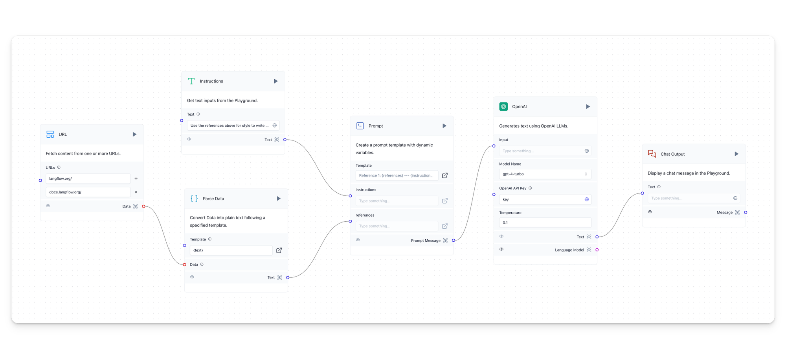
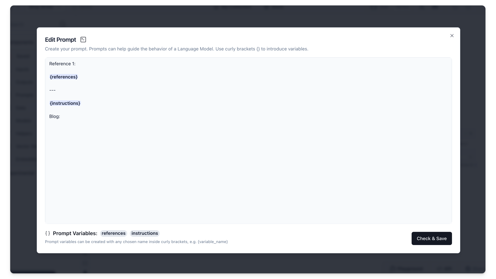

Build a blog writer with OpenAI that uses URLs for reference content.

## Prerequisites {#899268e6c12c49b59215373a38287507}

---

- [Langflow installed and running](/getting-started-installation)
- [OpenAI API key created](https://platform.openai.com/)

## Blog Writer {#ef6e7555a96d4cbab169fbd2d8578bdc}

---

### Create the Blog Writer project {#0c1a9c65b7d640f693ec3aad963416ff}

1. From the Langflow dashboard, click **New Project**.
2. Select **Blog Writer**.
3. A workspace for the **Blog Writer** is displayed.

This flow creates a one-shot article generator with **Prompt**, **OpenAI**, and **Chat Output** components, augmented with reference content and instructions from the **URL** and **Instructions** components.

The **Template** field of the **Prompt** looks like this:

The `{instructions}` value is received from the **Instructions** component. One or more `{references}`  are received from a list of URLs.

- **URL** extracts raw text and metadata from one or more web links.
- **Parse Data** converts the data coming from the **URL** component into plain text to feed a prompt.

### Run the Blog Writer {#b93be7a567f5400293693b31b8d0f81a}

1. Click the **Playground** button. Here you can chat with the AI that has access to the **URL** content.
2. Click the **Lighting Bolt** icon to run it.
3. To write about something different, change the values in the **URL** component and adjust the instructions on the left side bar of the **Playground**. Try again and see what the LLM constructs.

