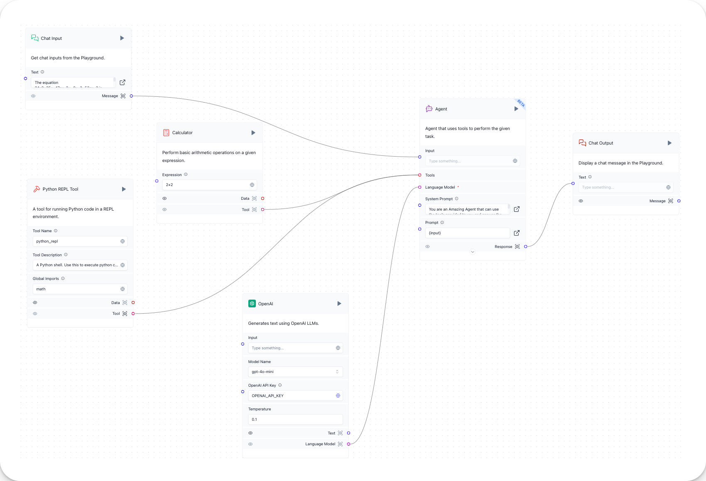

# Simple Agent

Build a **Simple Agent** flow for an agentic application using the Tool-calling agent.

An **agent** uses an LLM as its "brain" to select among the connected tools and complete its tasks.

In this flow, the **Tool-calling agent** reasons using an **Open AI** LLM to solve math problems. It will select the **Calculator** tool for simpler math, and the **Python REPL** tool (with the Python `math` library) for more complex problems.

## Prerequisites

To use this flow, you need an OpenAI API key.

## Open Langflow and start a new project

Click **New Project**, and then select the **Simple Agent** project.

This opens a starter project with the necessary components to run an agentic application using the Tool-calling agent.

## Simple Agent flow



The **Simple Agent** flow consists of these components:

* The **Tool calling agent** component uses the connected LLM to reason through the user's input and select among the connected tools to complete its task.
* The **Python REPL tool** component executes Python code in a REPL (Read-Evaluate-Print Loop) interpreter.
* The **Calculator** component performs basic arithmetic operations.
* The **Chat Input** component accepts user input to the chat.
* The **Prompt** component combines the user input with a user-defined prompt.
* The **Chat Output** component prints the flow's output to the chat.
* The **OpenAI** model component sends the user input and prompt to the OpenAI API and receives a response.

## Run the Simple Agent flow

1. Add your credentials to the Open AI component.
2. In the **Chat output** component, click ▶️ Play to start the end-to-end application flow.
   A **Chat output built successfully** message and a ✅ Check on all components indicate that the flow ran successfully.
3. Click **Playground** to start a chat session.
4. Enter a simple math problem, like `2 + 2`, and then make sure the bot responds with the correct answer.
5. To confirm the REPL interpreter is working, prompt the `math` library directly with `math.sqrt(4)` and see if the bot responds with `4`.
6. The agent will also reason through more complex word problems. For example, prompt the agent with the following math problem:

```plain
The equation 24x2+25x−47ax−2=−8x−3−53ax−2 is true for all values of x≠2a, where a is a constant.
What is the value of a?
A) -16
B) -3
C) 3
D) 16
```

The agent should respond with `B`.

Now that your query has completed the journey from **Chat input** to **Chat output**, you have completed the **Simple Agent** flow.
