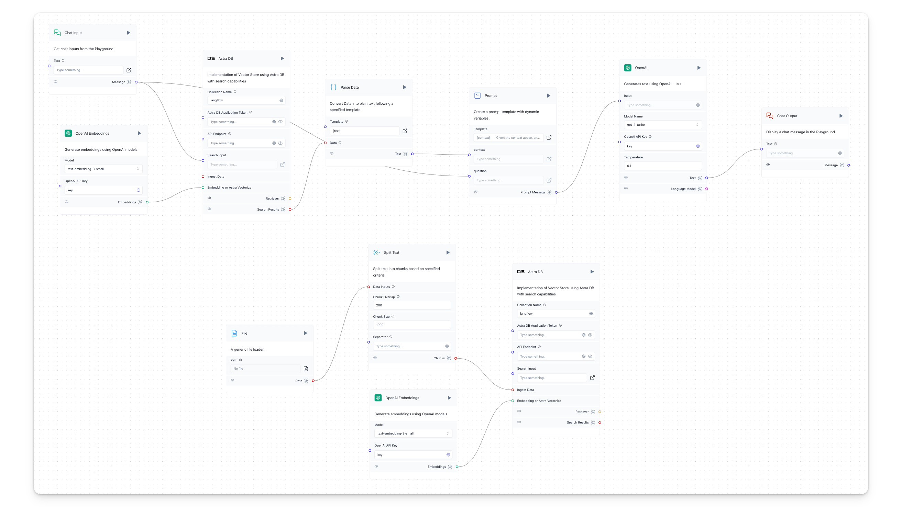

Retrieval Augmented Generation, or RAG, is a pattern for training LLMs on your data and querying it.

RAG is backed by a **vector store**, a vector database which stores embeddings of the ingested data.

This enables **vector search**, a more powerful and context-aware search.

We've chosen [Astra DB](https://astra.datastax.com/signup?utm_source=langflow-pre-release&utm_medium=referral&utm_campaign=langflow-announcement&utm_content=create-a-free-astra-db-account) as the vector database for this starter project, but you can follow along with any of Langflow's vector database options.

## Prerequisites {#6aa2c6dff6894eccadc39d4903d79e66}

---

- [Langflow installed and running](http://localhost:3000/getting-started/install-langflow)
- [OpenAI API key](https://platform.openai.com/)
- [An Astra DB vector database created](https://docs.datastax.com/en/astra-db-serverless/get-started/quickstart.html) with:
	- Application Token
	- API Endpoint

## Vector Store RAG {#1c37d15332f94cfe8f6e11dc6cc8a4ea}

---

### Create the vector store RAG project {#e3ed64193e5e448f81279e1d54ba43cf}

1. From the Langflow dashboard, click **New Project**.
2. Select **Vector Store RAG**.
3. The **Vector Store RAG** project is created.

The vector store RAG flow is built of two separate flows. Ingestion and query.

The **ingestion** part (bottom of the screen) populates the vector store with data from a local file. It ingests data from a file (**File**), splits it into chunks (**Split Text**), indexes it in Astra DB (**Astra DB**), and computes embeddings for the chunks using an embedding model (**OpenAI Embeddings**). 

:::tip

Embeddings are numerical vectors that represent data meaningfully. They enable efficient similarity searches in vector stores by placing similar items close together in the vector space, enhancing search and recommendation tasks.

:::

This part creates a searchable index to be queried for contextual similarity.

The **query** part (top of the screen) allows users to retrieve embedded vector store data. Components:

- **Chat Input** defines where to send the user input (coming from the Playground).
- **OpenAI Embeddings** is the model used to generate embeddings from the user input.
- **Astra DB** retrieves the most relevant chunks from the Astra DB database (here, used for search, not ingestion).
- **Parse Data** converts chunks coming from the **Astra DB** component into plain text to feed a prompt.
- **Prompt** takes in the user input and the retrieved chunks as text and builds a prompt for the model.
- **OpenAI** takes in the prompt to generate a response.
- **Chat Output** component displays the response in the Playground.
1. To create an environment variable for the **OpenAI** component, in the **OpenAI API Key** field, click the **Globe** button, and then click **Add New Variable**.
	1. In the **Variable Name** field, enter `openai_api_key`.
	2. In the **Value** field, paste your OpenAI API Key (`sk-...`).
	3. Click **Save Variable**.
1. To create environment variables for the **Astra DB** and **Astra DB Search** components:
	1. In the **Token** field, click the **Globe** button, and then click **Add New Variable**.
	2. In the **Variable Name** field, enter `astra_token`.
	3. In the **Value** field, paste your Astra application token (`AstraCS:WSnyFUhRxsrg…`).
	4. Click **Save Variable**.
	5. Repeat the above steps for the **API Endpoint** field, pasting your Astra API Endpoint instead (`https://ASTRA_DB_ID-ASTRA_DB_REGION.apps.astra.datastax.com`).
	6. Add the global variable to both the **Astra DB** and **Astra DB Search** components.

### Run the Vector Store RAG {#815a6536d2d548d987f0f4e375a58b15}

1. Click the **Playground** button. Here you can chat with the AI that uses context from the database you created.
2. Type a message and press Enter. (Try something like "What topics do you know about?")
3. The bot will respond with a summary of the data you've embedded.
