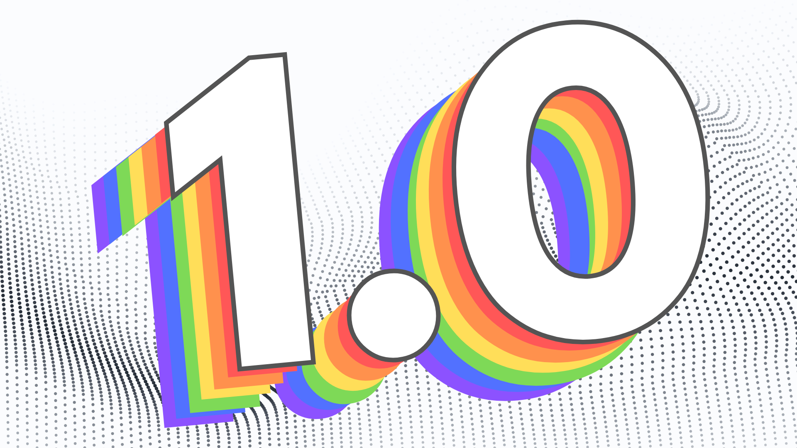

## First things first {#5add758564574950862f689198a4e085}

---

**Thank you all for being part of the Langflow community**. The journey so far has been amazing, and we are thrilled to have you with us.

We have some exciting news to share with you. Langflow is evolving, and we want to tell you all about it!

## What's new? {#ecad059e8f8249c598404c0b2bab36fa}

---

In the past year, we learned a lot from the community and our users. We saw the potential of Langflow and the need for a visual, interactive platform for building conversational AI applications (and beyond). You thought us the importance of a platform that is easy to use, but also powerful and controllable, and that made clear to us how Langflow's transparency could be improved.

Below are some of the new features we included to make that happen!

### Same Component, Multiple Outputs {#85986f3ae303444fb69d9ea1baa2eca8}

Components can now have more than a single output, allowing for unique flexibility in creating complex flows. The game-changer is output routing — it allows for so many new capabilities it’s almost silly to describe!

1. Branch to one or more subsequent components;
2. Apply logic operations like if/else and exploit decision-making;
3. Create classification models that choose between paths;
4. Enable the development of agent architectures from scratch;
5. Build an orchestrator that routes between agents.

### Flow + Composition {#12d86f91b5af4abc9f8e885c5f828df4}

One key change you'll notice is that projects now require you to define **Inputs** and **Outputs**. They allow you to define the structure of your conversation and how data flows through it. This change comes with a new way of visualizing your projects.

Before 1.0 you would connect components to ultimately build one final component that was processed behind the scenes. Now, each step of the process is defined by you, is visible on the workspace, and can be monitored and controlled.

This makes it so that composition is now just **another way** of building in Langflow and **data flows through your project more transparently**. This means that the easy stuff is _really_ easy and the complex parts are still possible!

- **Flow:** Data is processed by one component and then passed to the next component in line for immediate execution.
- **Composition**: Allows components to not only forward data but also share states for modular building.

For example, a flow can sequentially process text, and after a few steps, trigger an agent. It can access functions that wait to be called or to respond. This blend of flow and composition brings an unprecedented level of flexibility and control to data workflows in LLM-based apps and agents that use multiple models and APIs working together to achieve tasks.

### Memory Management {#a9e352272f4a44499f52fae65b663118}

Langflow 1.0 natively allows every chat message to be stored, and a single flow can have multiple memory sessions. This enables you to create multiple “memories” for agents to store and recall specific information as needed.

You can edit and remove previous messages to inspect and validate a model’s response behavior. Control, explore, and manage conversation histories to get your models acting just right.

### Component Freeze 🥶 {#4912d08da5464ff2aff595d6b26fd809}

Component output freezing is back in Langflow, and it’s cooler than ever!

Once a component runs, you can now lock its previous output state to prevent it from re-running.

Avoid spending extra tokens and remove repetition when output should be constant — plus it's great for debugging and prototyping!

### Output Preview {#f56d4400b0214ef2ab1206add068dd99}

Each component now includes an output visualizer that opens a pop-up screen, allowing you to easily inspect and monitor transmissions between components. It provides instant feedback on your workflows, letting you see results as they are processed. 🔍

### Inputs and Outputs Handling {#2112c11dc496480c9bd681f04f8533ea}

Inputs and outputs finally make more sense to us, and hopefully to you too.

We’re proposing Langflow-native types to keep things consistent, but not limited to use any Python type. For instance, a Chat Input component sends out what we call a Message object (text + metadata like date, time, and sender), but maybe you want to introduce external types from your favorite Python package? Go wild. Each native type will have their own visualization modes and will evolve according to new integrations added.

### Custom Endpoint Name {#bfeb7018e8bd46bf9dbef43ce2d3692b}

Now you can pick a custom name for your endpoint used to call your flow from the API.

### Logs & Monitoring {#c902ee43b4b24711b526352ae2451c48}

A new logs page has been added! Now, both component executions and message history from the chat can be inspected in an interactive table. This will make it easier to debug, inspect, and manage messages passing through components.

### Folders 📁 {#d01237fd83e4467994fed6fa7a8ee4f4}

We introduced folders on the home page to help categorize flows and components. Create, remove and edit them to keep your work organized.

### Playground {#27649918dcb64a0ebae83db767bfe2eb}

By having a clear definition of Inputs and Outputs, we could build the experience around that, which led us to create the Playground. 

When building a project, testing and debugging are crucial. The Playground is an interface that changes dynamically based on the Inputs and Outputs you defined in your project.

For example, let's say you are building a simple RAG application. Generally, you have an Input, some references that come from a Vector Store Search, a Prompt, and the answer. Now, you could plug the output of your Prompt into a Text Output, rename that to "Prompt Result," and see the output of your Prompt in the Playground. We have many planned features for the Playground, and we're excited to see how you'll explore it!

### Multi-Modal {#b7753bc9d72f40c49c4074a8d0e51344}

Langflow is now multi-modal! It can now handle images and more soon!

We’ve also improved project organization, global variables and overall settings, added Python 3.12 compatibility, keyboard shortcuts and a lot of new and fun experimental components!

## An Easier Start {#c6bf434c0d35482bbf2ef0bceff902f0}

---

The experience for first-time users is something we wanted to improve. For that we created a couple of Starter Projects. It's now much easier to start a new project, and you can choose from a list of starter projects to get you going.

For now, we have:

- **Basic Prompting (Hello, World)**: Learn the basics of a Prompt Component.
- **Vector Store RAG**: Ingest data into a Vector Store and then use it to run a RAG application.
- **Memory Chatbot**: Create a simple chatbot that can remember things about the user.
- **Document QA**: Build a simple flow that helps you get answers about a document.
- **Blog Writer**: Expand on the Prompt variables and be creative about what inputs you add to it.

Please let us know what other starter projects you would like to see in the future!

## What's Next? {#21004578890d4397bc291b43eb140640}

---

Langflow has gone through a big change, and we are excited to see how you use it and what you think of it. We plan to add more types of Input and Output like Image and Audio, and we also plan to add more Components to help you build more complex projects.

We are excited to see the community embracing Langflow as their number one AI builder and eagerly wait to see what new inspiring projects will come out of this release! A big thanks to everyone who's supporting or being part of this community in any way. ✨

Sincerely,

**The Langflow Team 🚀**

