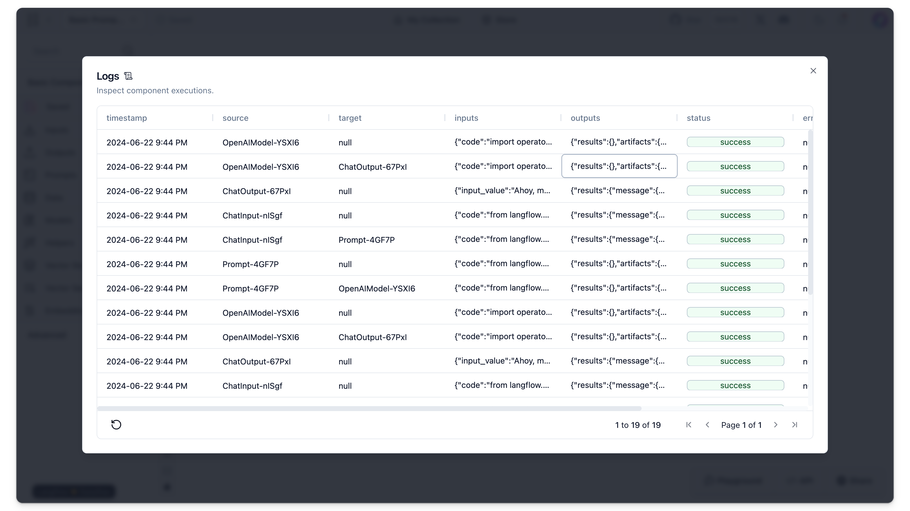

The **Logs** page provides a detailed record of all component executions within a workspace. It is designed to help you track actions, debug issues, and understand the flow of data through various components.

Double click the cells on that table for a detailed view.

