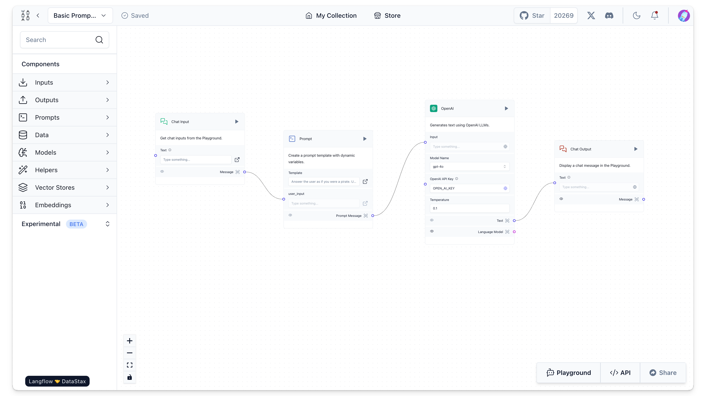
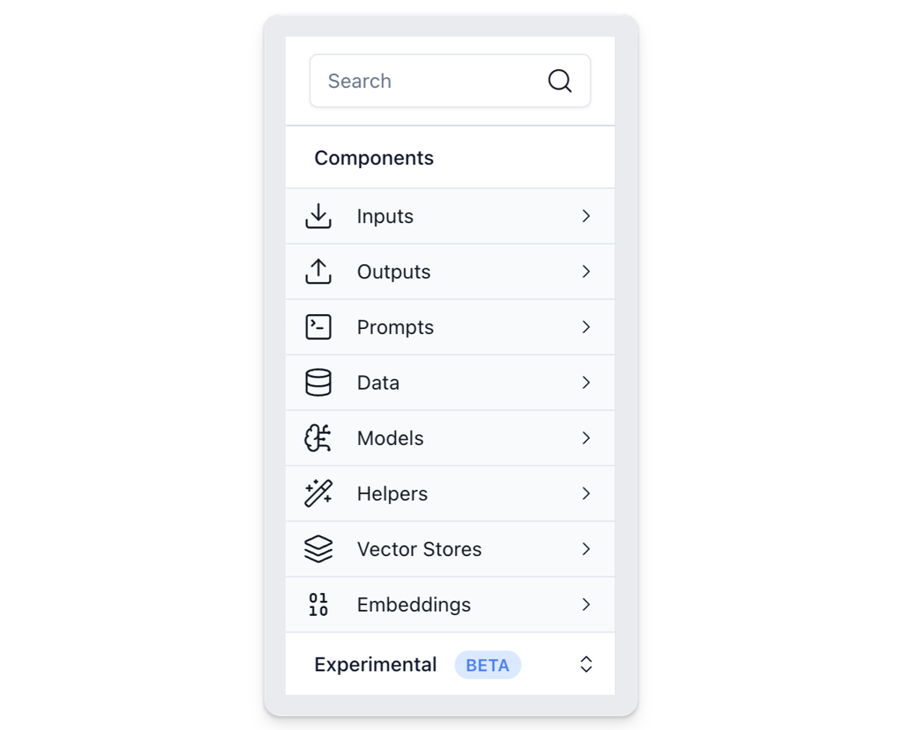
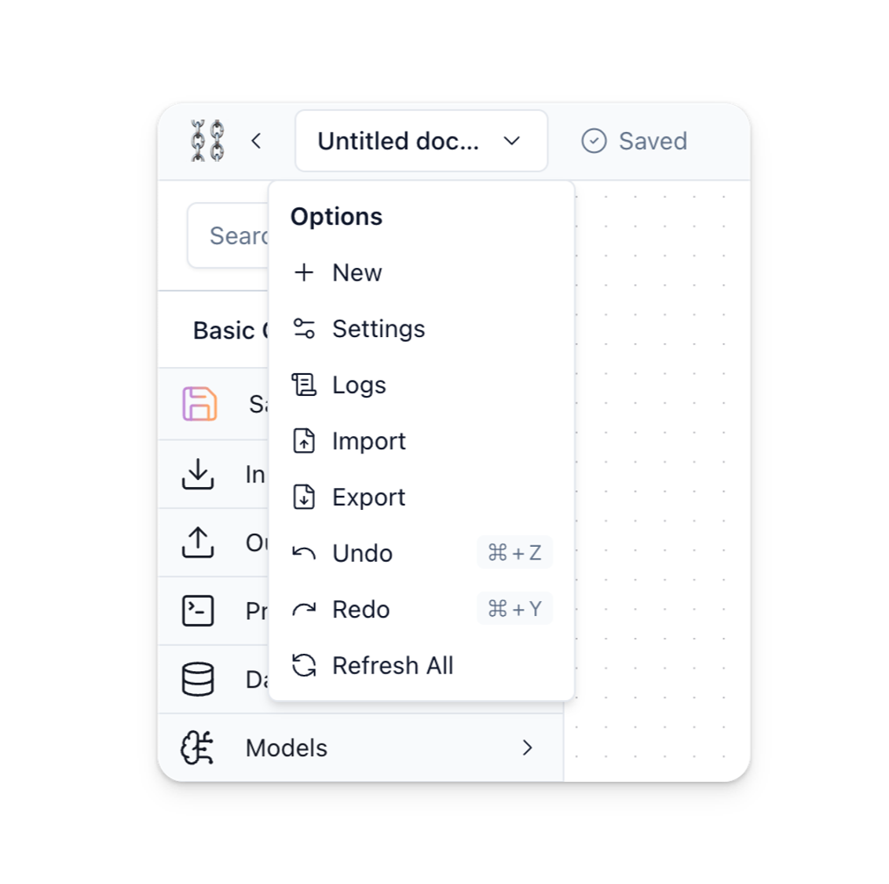
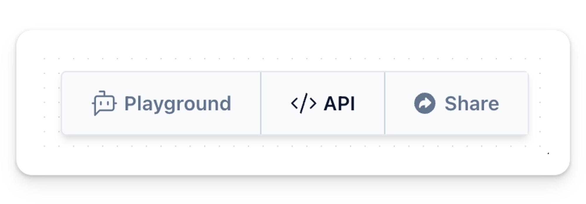

## The Langflow Workspace {#5c8161f9bcc14bfca766685d15251d0c}

---

The **Langflow Workspace** is where you assemble new flows and create AIs by connecting and running components. 

### Sidebar {#9d571b1d46804a01bcd8fbb9a4677af4}

Located on the left, this the sidebar includes several collapsible sections that categorize the different types of pre-built components available in Langflow. Use the search bar to locate components by name.

### Canvas {#5b050d0f8406436a9201f4711f0063ae}

The canvas is the main area in the center where you can drag and drop components to create workflows.

Use canvas controls in the bottom left side for zooming in and out, resetting the view, and locking or unlocking the canvas.

### Top Navigation Bar {#603c9941be154e1eba4e7c9ec9554b92}

In the top navigation bar, the dropdown menu labeled with the project name offers several management and customization options for the current flow in the Langflow Workspace.

- **New**: Create a new flow from scratch.
- **Settings**: Adjust settings specific to the current flow, such as its Name, Description, and Endpoint Name.
- **Logs**: View logs for the current project, including execution history, errors, and other runtime events.
- **Import**: Import a flow or component from a JSON file into the Workspace.
- **Export**: Export the current flow as a JSON file.
- **Undo (⌘Z)**: Revert the last action taken in the project.
- **Redo (⌘Y)**: Reapply a previously undone action.
- **Refresh All**: Refresh all components and delete cache.

### Toolbar {#8038bcc315c34350a1f587e1ad0de59f}

The toolbar at the bottom-right corner that provides options for executing, accessing the API, and sharing workflows.

- **Playground**: Button that executes the current flow in the workspace.
- **API**: Provides API access details and integration options for the current flow.
- **Share**: Allows users to share their AI with others.
