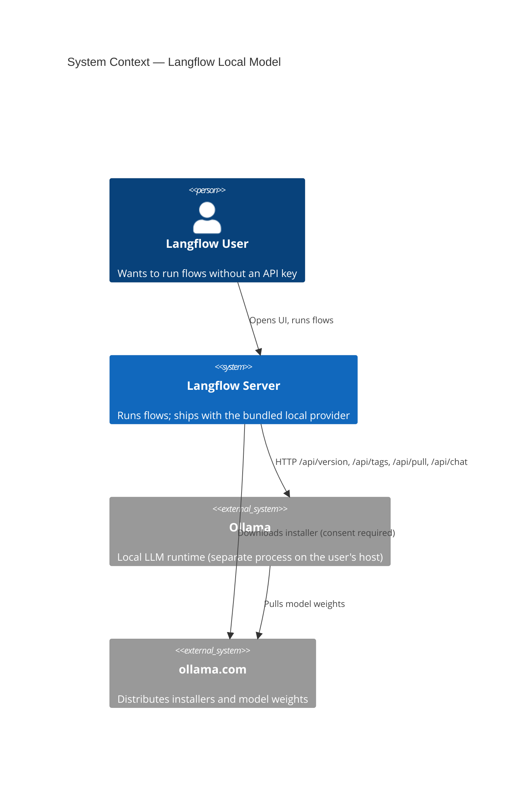
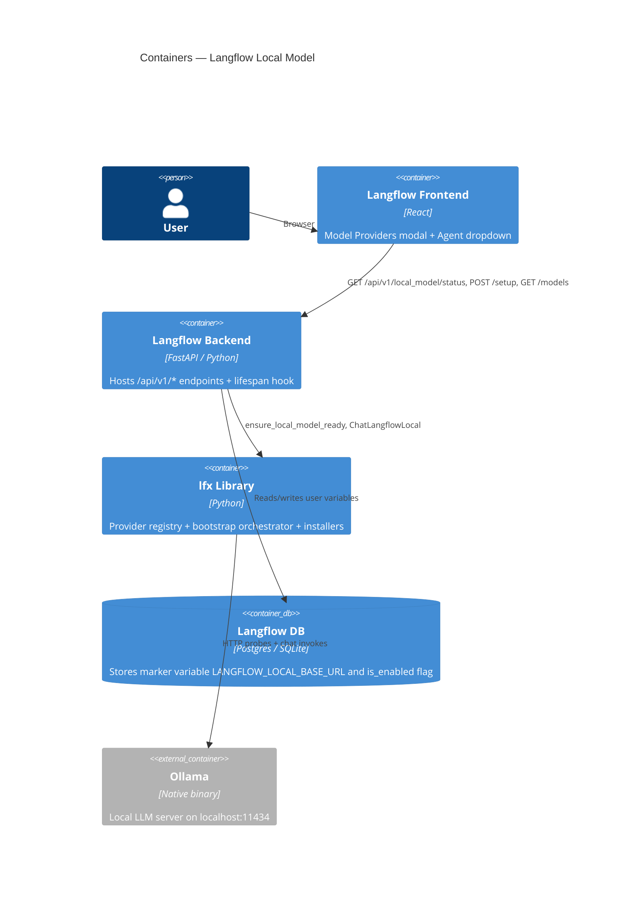
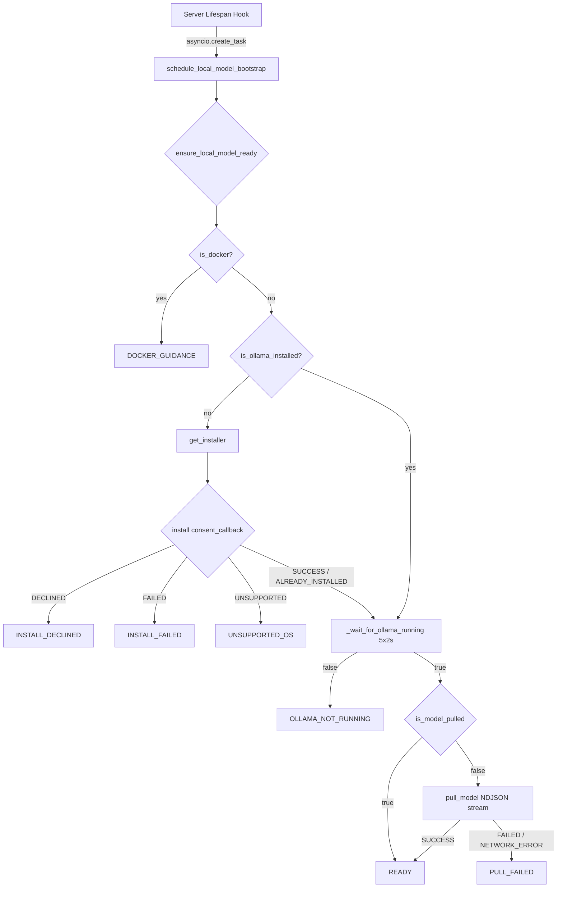

# Feature: Langflow Local Model (Bundled, Zero-Config Local LLM Provider)

> Generated on: 2026-05-06
> Status: Draft
> Owner: cristhianzl

---

## Table of Contents

1. [Overview](#1-overview)
2. [Ubiquitous Language Glossary](#2-ubiquitous-language-glossary)
3. [Domain Model](#3-domain-model)
4. [Behavior Specifications](#4-behavior-specifications)
5. [Architecture Decision Records](#5-architecture-decision-records)
6. [Technical Specification](#6-technical-specification)
7. [Observability](#7-observability)
8. [Deployment & Rollback](#8-deployment--rollback)
9. [Architecture Diagrams](#9-architecture-diagrams)
10. [Platform Compatibility](#10-platform-compatibility)

---

## 1. Overview

### Summary

The **Langflow Local Model** feature ships Langflow with a built-in, zero-configuration local LLM provider. New users can open any starter project and run it without supplying an `OPENAI_API_KEY` (or any other third-party credential). Under the hood, the provider wraps a curated local model (`qwen2.5:1.5b`) served by an embedded Ollama backend that is detected, installed, started, and pulled automatically on the user's machine.

### Business Context

Today, every starter project, agent, and unified `Language Model` component depends on a paid third-party API key. This creates critical onboarding friction:

- A fresh installation of Langflow cannot run a single starter project until the user creates an external account.
- Evaluators and proof-of-concept users cannot see Langflow's value before they commit to OpenAI billing.
- Air-gapped, corporate, and offline environments cannot use Langflow at all.
- Demos and CI suffer from rate limits and per-call costs.

The Langflow Local Model removes this barrier: from first-launch to first successful flow run, **no external account or API key is required**.

### Bounded Context

**Local Model Lifecycle** — owns everything related to detecting, installing, starting, and pulling the bundled local LLM backend. Lives in:

- `lfx.base.models.langflow_local_*` (provider registration, validated wrapper class)
- `lfx.services.local_model.*` (platform detection, install orchestrator, model puller, bootstrap)
- `langflow.api.v1.local_model` (REST adapter)
- `langflow.services.local_model.startup_hook` (server lifespan integration)

### Related Contexts

| Context | Relationship |
|---|---|
| **Unified Models** (`lfx.base.models.unified_models`) | Customer / Supplier — Langflow Local Model registers itself as a provider in the unified catalog and depends on its dispatch contract. |
| **Ollama** (third-party process) | Conformist — we conform to Ollama's HTTP API and CLI contract; we do not own it. URL-pinned and version-tolerant. |
| **LangChain** (`langchain-ollama`) | Conformist — `ChatLangflowLocal` extends `ChatOllama`. |
| **Starter Projects** (`langflow.initial_setup.starter_projects`) | Customer / Supplier — every `LanguageModelComponent` node has its `model.value` rewritten to point at the curated default. |

---

## 2. Ubiquitous Language Glossary

| Term | Definition | Code Reference |
|---|---|---|
| **Langflow Model** | The bundled, zero-config local LLM provider visible in the Model Providers UI. Always the first item in the unified catalog. | `LANGFLOW_LOCAL_PROVIDER_NAME = "Langflow Model"` |
| **Curated Model** | A model name explicitly allowed in the Langflow Local catalog. Today this is only `qwen2.5:1.5b`. Acts as both an allow-list (anti-DoS) and a documentation surface. | `CURATED_MODEL_NAMES`, `LANGFLOW_LOCAL_DEFAULT_MODEL` |
| **Allowed Base URL** | An HTTP base URL that `ChatLangflowLocal` is allowed to talk to. Acts as the SSRF guard. | `ALLOWED_BASE_URLS` (frozenset) |
| **Consent Callback** | A function the orchestrator calls before any side-effecting installer step. Returning `False` means the user declined and the pipeline must not proceed. | `ConsentCallback`, `installer.install(consent_callback)` |
| **Install Outcome** | The typed result of an installer attempt: SUCCESS, DECLINED, FAILED, UNSUPPORTED, or ALREADY_INSTALLED. | `InstallStatus`, `InstallOutcome` |
| **Pull Outcome** | The typed result of a model pull: SUCCESS, ALREADY_PRESENT, FAILED, NETWORK_ERROR, or REJECTED. | `PullStatus`, `PullOutcome` |
| **Bootstrap Outcome** | The terminal status of `ensure_local_model_ready`: READY, DOCKER_GUIDANCE, INSTALL_DECLINED, INSTALL_FAILED, OLLAMA_NOT_RUNNING, PULL_FAILED, or UNSUPPORTED_OS. | `BootstrapStatus`, `BootstrapOutcome` |
| **Live Model Provider** | A provider whose model list is resolved at runtime via `/api/tags`. Langflow Model is **not** a live provider — its list is curated and static. | `LIVE_MODEL_PROVIDERS` |
| **Marker Variable** | The single non-secret variable attached to the provider so the existing frontend "activate" flow can record `is_enabled=True` without prompting for credentials. | `LANGFLOW_LOCAL_BASE_URL` |
| **Auto-Pull On Demand** | The synchronous fallback inside `ChatLangflowLocal.__init__` that pulls the curated model the first time the component is instantiated if the model is not yet on disk. | `_ensure_model_available`, `auto_pull` parameter |
| **Startup Hook** | The FastAPI lifespan task that schedules `ensure_local_model_ready` in the background when the Langflow server boots. | `schedule_local_model_bootstrap` |

---

## 3. Domain Model

### 3.1 Aggregates

#### LangflowLocalProvider (Configuration Aggregate)

- **Root Entity**: registry tuple `(LANGFLOW_LOCAL_PROVIDER_NAME, MODEL_PROVIDER_METADATA["Langflow Model"], LANGFLOW_LOCAL_MODELS_DETAILED, ChatLangflowLocal)`
- **Value Objects**: `ALLOWED_BASE_URLS` (frozenset), `CURATED_MODEL_NAMES` (frozenset), `LANGFLOW_LOCAL_DEFAULT_MODEL` (str)
- **Invariants**:
  - The provider name is exactly `"Langflow Model"` everywhere it appears (UI, metadata, class registry).
  - `LANGFLOW_LOCAL_DEFAULT_MODEL ∈ CURATED_MODEL_NAMES`.
  - At least one model is marked `default=True` in the curated list.
  - The provider has at most one variable, which must be `is_secret=False` and `required=False`.
  - The provider is **not** in `LIVE_MODEL_PROVIDERS` (its list is curated, not dynamic).
  - The Langflow Model group is the **first** non-empty group returned by `get_models_detailed()`.

#### ChatLangflowLocal (Runtime Aggregate)

- **Root Entity**: `ChatLangflowLocal(ChatOllama)`
- **Value Objects**: `model: str`, `base_url: str`
- **Invariants**:
  - Construction with a `base_url` outside `ALLOWED_BASE_URLS` raises `UnsafeBaseUrlError`.
  - Construction with a `model` outside `CURATED_MODEL_NAMES` raises `UncuratedModelError`.
  - If `langchain-ollama` is missing, construction raises `LangchainOllamaMissingError` with an actionable message.
  - `ChatLangflowLocal` is a true subclass of `ChatOllama` (Liskov substitutable — every place that accepts `ChatOllama` accepts `ChatLangflowLocal`).
  - When `auto_pull=True` (default), construction tries to pull the model if it is not yet on disk; pull failures are swallowed silently so the original 404 surfaces from the actual invoke.

#### LocalModelInstaller (Strategy Aggregate)

- **Root Entity**: `Installer` Protocol
- **Strategies**: `LinuxInstaller`, `MacOSInstaller`, `WindowsInstaller`, `DockerInstaller`, `_UnsupportedOSInstaller`
- **Invariants**:
  - Every concrete strategy MUST honor: no side effect happens before `consent_callback(url) → True`.
  - Every subprocess call uses list-args (no `shell=True`) and an explicit timeout.
  - Every download URL is `https://ollama.com/...` (HTTPS pinning).
  - `DockerInstaller` never calls `consent_callback` — it short-circuits to `UNSUPPORTED` with guidance.
  - The factory `get_installer()` checks `is_docker()` **before** `system_name()` so containerized Linux is never treated as host Linux.

#### LocalModelBootstrap (Process Aggregate)

- **Root Entity**: `ensure_local_model_ready` (async function)
- **Invariants**:
  - The pipeline runs the four checks in order: `is_docker → installer → ollama running → model pulled`. Each gate has exactly one terminal status.
  - Re-install is never triggered if Ollama is already detected (no surprise UAC/sudo prompts).
  - Health check polls 5 times × 2s after install — if the server still does not answer, returns `OLLAMA_NOT_RUNNING` rather than hanging.
  - The startup hook NEVER raises — any unhandled exception is logged and swallowed so the Langflow server keeps booting.

### 3.2 Domain Events (logical)

| Event | Trigger | Payload | Consumers |
|---|---|---|---|
| `local_model_bootstrap_starting` | Server lifespan begins, env flag not set | — | Operator (log) |
| `local_model_pull_progress` | Each new NDJSON status from `/api/pull` | `status` (e.g. "downloading", "verifying sha256 digest") | Operator (log), future progress UI |
| `local_model_bootstrap_ready` | Pipeline returned READY | — | Operator (log) |
| `local_model_bootstrap_finished` | Pipeline returned a non-READY terminal status | `status`, `message` | Operator (log) |
| `local_model_bootstrap_failed` | Unhandled exception inside the hook | `error_class`, `message` | Operator (log) |

---

## 4. Behavior Specifications

### Feature: Langflow runs out-of-the-box without an API key

**As a** new Langflow user
**I want** to open and run a starter project on first launch
**So that** I can evaluate Langflow without creating any third-party account

### Background

- Given Langflow is freshly installed
- And no `OPENAI_API_KEY` (or any model provider credential) is set in the environment
- And no model providers are configured in the user's database

### Scenario: Langflow Model appears first in the unified catalog

- **Given** the backend has booted
- **When** the frontend calls `GET /api/v1/models`
- **Then** the response includes a provider entry with `provider="Langflow Model"`, `models=[{"model_name": "qwen2.5:1.5b", "metadata": { "default": true, "tool_calling": true }}]`
- **And** Langflow Model is the first non-empty provider entry

### Scenario: User selects Langflow Model in a starter project's Agent

- **Given** the user opens the "Basic Prompting" starter project
- **When** the project is loaded
- **Then** the `LanguageModelComponent` node has `template.model.value == "qwen2.5:1.5b"` (set by the migration script)
- **And** the dropdown's selected entry shows `qwen2.5:1.5b` under "Langflow Model"

### Scenario: First-time pull happens automatically on flow execution

- **Given** Ollama is installed and running but the curated model is not yet pulled
- **When** the user clicks "Run" on a flow that uses the `Language Model` component
- **Then** `ChatLangflowLocal.__init__` discovers the model is missing
- **And** synchronously calls `POST /api/pull` to download `qwen2.5:1.5b`
- **And** once the pull completes, the actual invoke proceeds

### Scenario: Server bootstrap pulls the model in the background

- **Given** the Langflow server starts and `LANGFLOW_DISABLE_LOCAL_MODEL_BOOTSTRAP` is not set
- **When** the FastAPI lifespan hook fires
- **Then** `schedule_local_model_bootstrap` runs `ensure_local_model_ready` in a background asyncio task
- **And** server startup is **not** blocked by the pull
- **And** progress is logged every time the NDJSON status changes

### Scenario: User declines installation

- **Given** Ollama is not installed
- **And** the bootstrap is invoked through the REST endpoint
- **When** the consent callback returns `False`
- **Then** no installer subprocess runs
- **And** the outcome is `BootstrapStatus.INSTALL_DECLINED`

### Scenario: User runs Langflow inside a container

- **Given** the container has `/.dockerenv` present (or `KUBERNETES_SERVICE_HOST` set)
- **When** the bootstrap runs
- **Then** the pipeline short-circuits to `BootstrapStatus.DOCKER_GUIDANCE`
- **And** `DockerInstaller` is selected by the factory (precedence over `system_name`)
- **And** the consent callback is NEVER invoked
- **And** the user sees guidance to use `host.docker.internal` or a `docker-compose` sidecar

### Scenario: User attempts SSRF via the language model component

- **Given** an attacker controls a flow's `base_url` field
- **When** they set it to `http://169.254.169.254/latest/meta-data/`
- **Then** `ChatLangflowLocal.__init__` raises `UnsafeBaseUrlError`
- **And** no HTTP request is made
- **And** the error message does not echo the malicious URL verbatim (log injection guard)

### Scenario: User attempts to pull an unbounded model

- **Given** an attacker tries to instantiate `ChatLangflowLocal(model="llama3.1:405b")`
- **When** `__init__` runs
- **Then** `UncuratedModelError` is raised
- **And** no Ollama HTTP call is made

### Scenario: REST endpoint requires authentication

- **Given** a request to `GET /api/v1/local_model/status` without auth headers
- **When** the server processes the request
- **Then** the response status is `401` or `403`

### Scenario: REST setup endpoint requires explicit consent body

- **Given** an authenticated user POSTs to `/api/v1/local_model/setup`
- **When** the body is `{"consent": false}`
- **Then** the response is `400 Bad Request`
- **And** no background task is scheduled

### Scenario: Migration script is idempotent

- **Given** the migration script ran once and updated all starter projects
- **When** it is run a second time
- **Then** zero files are modified

### Scenario: Frontend modal title does not render `false`

- **Given** the user opens the Model Providers modal and selects "Langflow Model"
- **When** the panel renders
- **Then** the title is `"Langflow Model"` exactly — no trailing `false` token

### Scenario: Frontend "Activate" works for credential-free providers

- **Given** the user is on the Langflow Model panel
- **When** they click "Activate Langflow Model"
- **Then** the system creates a global variable for `LANGFLOW_LOCAL_BASE_URL` with value `http://localhost:11434`
- **And** the provider is marked `is_enabled=True`
- **And** no "Provider not supported" toast is displayed

---

## 5. Architecture Decision Records

### ADR-001: Wrap Ollama instead of bundling llama-cpp-python

**Status**: Accepted

#### Context

Langflow needs a "no API key required" experience. Three credible options were evaluated:

1. Bundle `llama-cpp-python` + a quantized GGUF model and serve it in-process.
2. Bundle GPT4All / a similar Python SDK with its own server.
3. Wrap Ollama (already a first-class provider in Langflow) and curate one model on top.

#### Decision

Wrap Ollama. Register a new provider `"Langflow Model"` in the unified catalog whose backing class `ChatLangflowLocal` extends `langchain-ollama.ChatOllama`. The base URL points at `localhost:11434` by default.

#### Consequences

**Benefits:**
- Reuses 100% of the existing Ollama integration: streaming, tool calling, embeddings, model dropdown plumbing, error handling.
- Zero new heavy Python dependencies (`llama-cpp-python` ships fragile native wheels per platform/CUDA/Metal combination).
- Ollama has battle-tested cross-platform installers (`.pkg`, `.exe`, `install.sh`) maintained by an active project.
- Users who already have Ollama running get instant value.

**Trade-offs:**
- Adds a runtime dependency on Ollama as an external process (not embedded in the Python wheel).
- Auto-install requires explicit user consent and platform-specific code paths (mitigated by the Strategy pattern in `installers/`).

**Impact on Product:**
- Time-to-first-flow drops from "create OpenAI account → get API key → set env var → restart" to "click Run". A `~1GB` first-run pull is the only friction.

---

### ADR-002: Curated single-model list, NOT dynamic discovery

**Status**: Accepted (revised after live test feedback)

#### Context

The first iteration registered `"Langflow Model"` in `LIVE_MODEL_PROVIDERS`, expecting it to inherit Ollama's dynamic-discovery behavior (read installed models from `/api/tags` at runtime). In production this caused the unified models endpoint to **replace** our curated 3-model list with an empty live list, because no `fetch_live_langflow_local_models` function existed in `model_utils.py`.

A second concern: showing the user 3 models (`qwen2.5:1.5b`, `llama3.2:1b`, `llama3.2:3b`) implies they are all interchangeable, but each requires a separate ~1GB download. This is bad UX for the zero-config promise.

#### Decision

Keep the Langflow Model list **curated and static**. Today the list contains exactly **one** model: `qwen2.5:1.5b`. It is **not** in `LIVE_MODEL_PROVIDERS`. Advanced users who want other models continue to use the Ollama provider directly.

#### Consequences

**Benefits:**
- Zero-config UX is honest: one provider, one model, one ~1GB download.
- The unified-models pipeline never tries to overwrite our entries with empty live data.
- The threat surface for "DoS by triggering a 200GB pull" is minimized — only one curated download path exists.

**Trade-offs:**
- Users wanting a different local model must use the Ollama provider explicitly. We document this in the provider description.
- Adding new curated models in the future requires a code change (deliberate — each new model adds disk-footprint and tool-calling-quality risk).

**Impact on Product:**
- New users see exactly one Langflow Model entry in the dropdown — no decision fatigue.

---

### ADR-003: Strategy pattern for cross-platform installers

**Status**: Accepted

#### Context

Auto-installing Ollama is platform-specific and security-sensitive:
- **Linux**: `curl -fsSL https://ollama.com/install.sh | sh` (sudo prompt)
- **macOS**: `brew install ollama` if Homebrew is available; otherwise UNSUPPORTED with guidance
- **Windows**: Download `OllamaSetup.exe` and execute (UAC prompt)
- **Docker**: Refuse, emit guidance for `host.docker.internal` / docker-compose sidecar

A naive `if/elif/else` chain on `platform.system()` mixes responsibilities and grows with every new path.

#### Decision

Define a structural `Installer` Protocol with a single `install(consent_callback) -> InstallOutcome` method. Implement one concrete strategy per platform plus a Docker refuser. A factory (`get_installer()`) inspects `is_docker()` first, then `system_name()`, and returns the correct strategy.

#### Consequences

**Benefits:**
- OCP: adding a future platform is a new file + one factory edit.
- Each strategy is independently testable with mocked `subprocess` / `httpx`.
- Test pinning: `test_docker_takes_precedence_over_system_name` codifies that a Linux container always gets `DockerInstaller` — protects against silent regression.
- Clear seam for security review: each installer's threat model is documented in its own test file.

**Trade-offs:**
- Slightly more files than a single `installer.py` would have (5 strategies + 1 protocol + 1 factory). Justified by clean separation of concerns.

**Impact on Product:**
- Customers on every supported platform get a consistent, predictable install UX with explicit consent.

---

### ADR-004: Auto-Pull On Demand at component instantiation

**Status**: Accepted (added in response to live test feedback)

#### Context

The startup hook (ADR-005) pulls the model in the background when the server boots. But two scenarios slip through:

1. The user runs a flow **before** the background pull completes (~1GB takes time).
2. The user runs Langflow on an environment where the startup hook is disabled or failed silently.

Both cases produce a confusing `model 'qwen2.5:1.5b' not found (status code: 404)` error.

#### Decision

Inside `ChatLangflowLocal.__init__`, before delegating to `ChatOllama.__init__`:

1. Synchronously check `GET /api/tags` for the model.
2. If not present, synchronously call `POST /api/pull` and stream until completion.
3. If any step fails, swallow the error silently — the subsequent `ChatOllama` invoke will surface the original 404 to the user, preserving prior behavior for diagnostic purposes.

A new constructor flag `auto_pull: bool = True` allows tests and advanced callers to skip this.

#### Consequences

**Benefits:**
- The first flow execution Just Works™ even if the user did not wait for the background pull.
- No interface change for downstream callers (`Language Model` component does not need updates).
- Tests still pass because the helper swallows network errors when no Ollama is running locally.

**Trade-offs:**
- The first instantiation can block for several minutes while ~1GB is downloaded. Users see "thinking" with no progress bar (yet).
- Synchronous HTTP inside `__init__` is unusual — duplicated from the async helpers in `model_puller.py` because component build paths are sync.

**Impact on Product:**
- The 404 error class disappears for new users — replaced by a long first-run experience that ends in success. Frontend progress UI is a follow-up.

---

### ADR-005: Server-side bootstrap as a FastAPI lifespan background task

**Status**: Accepted

#### Context

The bootstrap orchestrator (`ensure_local_model_ready`) needs to run *somewhere*. Options:

1. **CLI on first startup**: requires interactive prompts; breaks Docker / managed deployments.
2. **REST endpoint only** (`POST /api/v1/local_model/setup`): requires the user to know to call it.
3. **FastAPI lifespan hook**: starts automatically when the server boots, runs in the background, never blocks request handling.

#### Decision

Both (3) **and** (2). The lifespan hook (`schedule_local_model_bootstrap`) auto-runs on server start. The REST endpoint stays as a manual re-trigger / future UI hookpoint. An env var `LANGFLOW_DISABLE_LOCAL_MODEL_BOOTSTRAP=true` lets cloud / managed deployments opt out.

#### Consequences

**Benefits:**
- Self-hosted users get the model ready with zero CLI / UI interaction.
- Cloud operators retain a kill switch via env var.
- The hook runs in `asyncio.create_task` and stores the task on `app.state` (RUF006 compliance) to avoid garbage-collection mid-flight.
- The hook MUST NOT raise — wrapped in `try/except Exception` so a Bootstrap bug never kills the server.

**Trade-offs:**
- On first boot, the user might see the model "appear" minutes after the server is up. The status endpoint exposes progress for any UI to poll.

**Impact on Product:**
- Provides a clear single-server-start UX path: log in, see the provider, run flows.

---

### ADR-006: Marker variable to satisfy the existing "activate" UI

**Status**: Accepted (added after live UI test)

#### Context

The first design set `MODEL_PROVIDER_METADATA["Langflow Model"]["variables"] = []` because the provider needs no credentials. The frontend's `handleActivateProvider` hook (in `useProviderConfiguration.ts`) requires at least one variable to attach the `is_enabled` flag to — empty `variables` triggered the toast `Provider "Langflow Model" is not supported`.

#### Decision

Attach exactly one **non-secret, non-required** variable to the provider:

```python
{
    "variable_name": "Langflow Model Base URL",
    "variable_key": "LANGFLOW_LOCAL_BASE_URL",
    "is_secret": False,
    "required": False,
    "component_metadata": { "advanced": True, "info": "Defaults to http://localhost:11434" },
}
```

This mirrors how `Ollama` uses `OLLAMA_BASE_URL`. It is hidden in the advanced section of the component UI.

#### Consequences

**Benefits:**
- Existing activate flow works without frontend rewrites.
- Test invariant tightened from "variables == []" to "no variable is secret AND no variable is required" — same zero-config promise, more accurate.

**Trade-offs:**
- The `Langflow Model Base URL` field is technically present in the modal. Mitigated by `advanced: True` (hidden by default).

**Impact on Product:**
- Provider activation is a single click; no surprise input field surfaces unless the user opens "Advanced".

---

### ADR-007: Frontend `false`-rendering bug fix scoped to this feature

**Status**: Accepted

#### Context

`ProviderConfigurationForm.tsx:143` had a long-standing latent bug:

```tsx
`${selectedProvider.provider} ${requiresConfiguration && ` ${t(...)}`}`
```

When `requiresConfiguration === false`, JS evaluates `false && ...` to the literal `false`, which gets concatenated as a string. Every existing provider had `requiresConfiguration === true` (they all need credentials), so the bug never surfaced — until Langflow Model arrived.

#### Decision

Replace the `&&`-as-conditional pattern with an explicit ternary in the same expression:

```tsx
`${selectedProvider.provider}${requiresConfiguration ? ` ${t(...)}` : ""}`
```

#### Consequences

**Benefits:**
- Removes a latent bug that would surface for any future credential-free provider.
- One-line change; near-zero regression risk.

**Trade-offs:**
- None.

**Impact on Product:**
- Modal title reads "Langflow Model" cleanly instead of "Langflow Model false".

---

## 6. Technical Specification

### 6.1 Dependencies

| Type | Name | Purpose |
|---|---|---|
| Python package | `langchain-ollama` | `ChatOllama` base class for `ChatLangflowLocal` |
| Python package | `httpx` | Async + sync HTTP for health, version, tags, pull |
| Python package | `fastapi` | REST endpoints + lifespan hook |
| External process | `ollama` | Local LLM runtime (installed automatically with consent) |
| External service | `https://ollama.com/install.sh` | Linux install script (URL-pinned) |
| External service | `https://ollama.com/download/OllamaSetup.exe` | Windows installer (URL-pinned) |
| External service | `https://ollama.com/download/Ollama-darwin.zip` | macOS fallback download (URL-pinned, currently UNSUPPORTED if no brew) |
| External package manager | Homebrew (macOS) | Preferred install path for `brew install ollama` |
| External tool | `curl`, `sh` (Linux) | Run the official install script |
| Internal API | `lfx.base.models.unified_models` | Provider registration |

### 6.2 API Contracts

#### `GET /api/v1/local_model/status`

**Purpose**: Return a non-mutating snapshot of the local-model bootstrap state.

**Auth**: Requires authenticated user (`CurrentActiveUser` dependency).

**Request**: no body.

**Response (200)**:

```json
{
  "is_docker": false,
  "is_ollama_installed": true,
  "is_ollama_running": true,
  "is_model_pulled": false,
  "default_model": "qwen2.5:1.5b",
  "ready": false
}
```

**Response (401/403)**: emitted by the auth dependency when the request is unauthenticated.

#### `POST /api/v1/local_model/setup`

**Purpose**: Schedule `ensure_local_model_ready` to run in a background task.

**Auth**: Requires authenticated user.

**Request**:

```json
{ "consent": true }
```

**Response (202 Accepted)**:

```json
{ "accepted": true }
```

**Response (400 Bad Request)**: when `consent` is `false` or missing.

```json
{ "detail": "Explicit consent required" }
```

### 6.3 Error Handling

| Error class | Condition | User Message | Recovery Action |
|---|---|---|---|
| `UnsafeBaseUrlError` | `base_url` not in `ALLOWED_BASE_URLS` | "base_url is not in the Langflow Model allowlist" (no input echoed) | Use `localhost`, `127.0.0.1`, or `host.docker.internal`. |
| `UncuratedModelError` | `model` not in `CURATED_MODEL_NAMES` | "model is not in the Langflow Model curated set" | Use `qwen2.5:1.5b`, or use the Ollama provider for arbitrary models. |
| `LangchainOllamaMissingError` | `langchain-ollama` is uninstalled | Includes "install" + package name | `uv pip install langchain-ollama` |
| `BootstrapStatus.DOCKER_GUIDANCE` | Running inside a container | "Run Ollama on the host (host.docker.internal) or add an `ollama/ollama` service to docker-compose" | Use docker-compose sidecar or env var pointing at host. |
| `BootstrapStatus.OLLAMA_NOT_RUNNING` | Health check failed after install | "Start it with `ollama serve` (or open the Ollama app on macOS) and try again." | Manually start Ollama. |
| `BootstrapStatus.PULL_FAILED` | NDJSON stream reported an error or ended without success terminator | Forwarded `error` field from Ollama | Check disk space, network, and re-run setup. |
| 4xx from `POST /api/v1/local_model/setup` | Missing or `false` consent | "Explicit consent required" | Re-submit with `{"consent": true}`. |

---

## 7. Observability

### 7.1 Key Metrics (recommended for future dashboards)

| Metric | Type | Description | Alert Threshold |
|---|---|---|---|
| `local_model.bootstrap.duration_seconds` | Histogram | End-to-end bootstrap duration (start → READY) | P95 > 300s for 3 consecutive bootstraps |
| `local_model.pull.duration_seconds` | Histogram | NDJSON pull stream duration | P95 > 600s |
| `local_model.bootstrap.outcome` | Counter (label: `status`) | Distribution of READY / DOCKER_GUIDANCE / INSTALL_DECLINED / INSTALL_FAILED / OLLAMA_NOT_RUNNING / PULL_FAILED / UNSUPPORTED_OS | `pull_failed` rate > 5% over 1h |
| `local_model.auto_pull.invocations` | Counter | How often the synchronous on-demand auto-pull fires | spike > 2x baseline |
| `local_model.auto_pull.failures` | Counter | Auto-pull errors caught and swallowed | rate > 10% of invocations |

### 7.2 Important Logs

| Level | Event | Fields | When |
|---|---|---|---|
| INFO | `local_model_bootstrap_starting` | (none) | Lifespan hook fires |
| INFO | `local_model_pull_progress` | `status` | NDJSON status changes (e.g., `"pulling manifest"`, `"downloading"`, `"verifying sha256 digest"`, `"success"`) |
| INFO | `local_model_bootstrap_ready` | (none) | Pipeline returned READY |
| INFO | `local_model_bootstrap_finished` | `status`, `message` | Pipeline returned a non-READY terminal status |
| INFO | `local_model_bootstrap_skipped` | `reason=env_flag` | `LANGFLOW_DISABLE_LOCAL_MODEL_BOOTSTRAP` is set |
| WARN | `local_model_bootstrap_failed` | `error_class`, `message` | Unhandled exception inside the hook |

No PII, secrets, or full URL strings are logged. Errors echo only the exception class name plus the bounded message.

### 7.3 Dashboards

Not yet provisioned — the metrics above are the recommended starter set when a dashboard is added.

---

## 8. Deployment & Rollback

### 8.1 Feature Flags

| Flag | Purpose | Default | Rollout Strategy |
|---|---|---|---|
| `LANGFLOW_DISABLE_LOCAL_MODEL_BOOTSTRAP` | Skip the server-side startup hook (cloud / managed deployments) | unset (= enabled) | Document in deployment guide; cloud product turns it ON. |

No database / runtime feature flag system is added. The single env var is sufficient for the rollback strategy.

### 8.2 Database Migrations

None. The feature uses the existing user-variables table to record:
- The marker variable `LANGFLOW_LOCAL_BASE_URL` (created on first activation, value `http://localhost:11434`).
- Optional `__default_language_model__` for global default selection (existing mechanism).

The 16 starter project JSON files are mutated in-place by an idempotent script:

```bash
python -m scripts.local_model.migrate_starter_projects
```

Rerunning the script is safe and reports `Modified 0 starter project(s)` after the first successful run.

### 8.3 Rollback Plan

1. **Disable the startup hook** by setting `LANGFLOW_DISABLE_LOCAL_MODEL_BOOTSTRAP=true` and restarting the server.
2. **Hide the provider from the catalog** by reverting the entry in `MODEL_PROVIDER_METADATA` and removing `LANGFLOW_LOCAL_MODELS_DETAILED` from `provider_queries.get_models_detailed()`. No data needs migration.
3. **Restore starter projects** by running the script in reverse (or by `git checkout` of the JSON files — they are committed assets).
4. **Frontend rollback**: revert the icon mapping and the two new query hooks. The `LOCAL_MODEL` URL constant becomes dead code but harmless.

The user-database does not retain Langflow-Model-specific records that block rollback. The marker variable, if present, becomes a stale row but does not affect other providers.

### 8.4 Smoke Tests

After deploy:

- [ ] `GET /api/v1/local_model/status` returns 200 with the expected JSON shape.
- [ ] `GET /api/v1/models` returns "Langflow Model" as the **first** non-empty group with `models=[{"model_name": "qwen2.5:1.5b", ...}]`.
- [ ] Open Model Providers modal in the UI → "Langflow Model" appears with **1 model** badge (not 0, not "false").
- [ ] Click Activate → success toast, no "Provider not supported" error.
- [ ] Open "Basic Prompting" starter project → the `Language Model` component already has `qwen2.5:1.5b` selected.
- [ ] In server logs after restart: see `local_model_bootstrap_starting` followed eventually by `local_model_bootstrap_ready`.
- [ ] Run a flow end-to-end without `OPENAI_API_KEY` set — it produces output.

---

## 9. Architecture Diagrams

### 9.1 Context Diagram (Level 1)



### 9.2 Container Diagram (Level 2)



### 9.3 Component Diagram (Level 3) — Bootstrap Pipeline



---

## 10. Platform Compatibility

### 10.1 Supported Platforms

| Platform | Versions | Architecture | Status |
|---|---|---|---|
| Linux | Ubuntu 22.04+, Debian 12+, Fedora 39+ | x86_64, arm64 | Supported |
| macOS | 13 (Ventura)+ | x86_64, arm64 (Apple Silicon) | Supported (requires Homebrew for auto-install) |
| Windows | 10 22H2, 11 | x86_64 | Supported (UAC consent required) |
| Docker | linux/amd64, linux/arm64 | — | Supported via `host.docker.internal` or `ollama/ollama` sidecar; auto-install inside the container is intentionally refused |

### 10.2 Platform-Specific Implementations

| Capability | Linux | macOS | Windows | Docker | Notes |
|---|---|---|---|---|---|
| OS detection | `Linux` | `Darwin` | `Windows` | n/a | `system_name()` returns `linux`/`macos`/`windows`/`unknown`. |
| Container detection | `/.dockerenv` + `KUBERNETES_SERVICE_HOST` | same | same | same | `is_docker()` — multiple signals reduce false negatives. |
| Ollama binary lookup | `shutil.which("ollama")` + `ollama --version` (subprocess, list-args, timeout=3s) | same | same (resolves `.exe` via PATHEXT) | n/a | All paths share the same code; corroborated to defeat fake binaries. |
| Ollama install | `sh -c "curl -fsSL https://ollama.com/install.sh \| sh"` | `brew install ollama` (preferred); `.zip` fallback documented as `UNSUPPORTED` | Download `OllamaSetup.exe` + `subprocess.run([exe])` (UAC) | Refused — `DockerInstaller` returns `UNSUPPORTED` with guidance | Each in its own file under `installers/`. |
| Health check | `httpx.AsyncClient.get("/api/version")` with 2s timeout | same | same | targets `host.docker.internal:11434` | SSRF-guarded against the ALLOWED_BASE_URLS frozenset. |
| Model pull | `httpx.AsyncClient.stream("POST", "/api/pull")` parsing NDJSON | same | same | same | SUCCESS only via the `{"status":"success"}` terminator. |
| Auto-install consent prompt | sudo password prompt from the install script | macOS keychain prompt (Homebrew) or Gatekeeper | UAC prompt | n/a | Always explicit; `consent_callback` returning `False` aborts. |

### 10.3 Known Platform-Specific Limitations

- **macOS without Homebrew**: `MacOSInstaller` returns `UNSUPPORTED` with a guidance message instead of attempting the `.zip` fallback. Downloading and moving an app bundle to `/Applications` programmatically is high-risk; we punt to documentation. Workaround: `brew install ollama` or install Ollama manually from `https://ollama.com/download`.
- **Windows silent install**: `OllamaSetup.exe` does not expose a documented `/S` flag. UAC is mandatory.
- **Docker auto-install**: Refused by design. Inside a container the host filesystem, GPU passthrough, and systemd are not guaranteed. Use `host.docker.internal:11434` or add a `ollama/ollama` service in `docker-compose.yml`.
- **Apple Silicon Rosetta**: Not required — `langchain-ollama` and Ollama natively support arm64.
- **Disk space**: The default model is ~1GB after pull. Disk-full conditions surface as `BootstrapStatus.PULL_FAILED` with the Ollama error forwarded.
- **Corporate proxies**: Ollama's pull respects `HTTP_PROXY` / `HTTPS_PROXY` env vars; `httpx` in our code respects the same. If your proxy MITMs HTTPS, you must trust the corporate CA.

### 10.4 Installation by Platform

#### Linux (auto)

When Ollama is missing and consent is granted:
```bash
sh -c "curl -fsSL https://ollama.com/install.sh | sh"
```

Manual:
```bash
curl -fsSL https://ollama.com/install.sh | sh
ollama pull qwen2.5:1.5b
```

#### macOS (auto)

When Ollama is missing and Homebrew is present:
```bash
brew install ollama
ollama pull qwen2.5:1.5b
```

If Homebrew is absent, install Ollama manually from `https://ollama.com/download` and Langflow will pick it up on next start.

#### Windows (auto, PowerShell)

```powershell
# Triggered by the WindowsInstaller after consent
Invoke-WebRequest "https://ollama.com/download/OllamaSetup.exe" -OutFile "$env:TEMP\OllamaSetup.exe"
& "$env:TEMP\OllamaSetup.exe"   # UAC prompt
ollama pull qwen2.5:1.5b
```

#### Docker

Auto-install inside the container is refused. Two supported patterns:

**Pattern A — Ollama on the host:**
```bash
docker run -e LANGFLOW_LOCAL_MODEL_BASE_URL=http://host.docker.internal:11434 langflow/langflow
# Linux hosts may need: --add-host=host.docker.internal:host-gateway
```

**Pattern B — Sidecar in docker-compose.yml:**
```yaml
services:
  ollama:
    image: ollama/ollama
    volumes:
      - ollama_data:/root/.ollama
    ports:
      - "11434:11434"
  langflow:
    image: langflow/langflow
    environment:
      - LANGFLOW_LOCAL_MODEL_BASE_URL=http://ollama:11434
    depends_on:
      - ollama
volumes:
  ollama_data:
```

### 10.5 CI Coverage Matrix

| OS | Unit Tests | Integration | E2E | Smoke (Docker) |
|---|---|---|---|---|
| Ubuntu (latest) | ✅ | ✅ (mocks Ollama) | ➖ | ➖ |
| macOS (latest) | ✅ | ✅ (mocks Ollama) | ➖ | ➖ |
| Windows (latest) | ✅ | ✅ (mocks Ollama) | ➖ | ➖ |
| Docker (linux/amd64) | ➖ | ✅ (refusal path) | ➖ | ➖ |

➖ = intentionally not yet covered. E2E with a real Ollama is gated on a separate Playwright spec (follow-up). All current tests run with **mocked** subprocess and HTTP — no test depends on a real Ollama or a real network. This makes the suite fast (≈8 seconds for 165 lfx tests) and CI-portable.

---

## Appendix A — File Inventory

### Backend (`lfx`)

```
src/lfx/src/lfx/base/models/
  langflow_local_constants.py            # provider name, default model, allowlists
  langflow_local_model.py                # ChatLangflowLocal + 3 validators + auto-pull
  model_metadata.py                      # +entry "Langflow Model"
  unified_models/
    provider_queries.py                  # +LANGFLOW_LOCAL_MODELS_DETAILED first
    class_registry.py                    # +ChatLangflowLocal lazy import

src/lfx/src/lfx/services/local_model/
  __init__.py
  platform_detection.py                  # system_name, is_docker
  ollama_binary.py                       # is_installed, binary_path
  ollama_health.py                       # is_running, version (async)
  model_puller.py                        # is_model_pulled, pull_model (NDJSON)
  installer_factory.py                   # get_installer (strategy selector)
  installers/
    __init__.py
    protocol.py                          # Installer Protocol + InstallOutcome + InstallStatus
    linux.py                             # curl|sh
    macos.py                             # brew install
    windows.py                           # download + UAC
    docker.py                            # refuse + guidance
  bootstrap.py                           # ensure_local_model_ready
```

### Backend (`langflow`)

```
src/backend/base/langflow/api/v1/
  local_model.py                         # GET /status + POST /setup
  __init__.py                            # +export local_model_router
  router.py                              # +include_router

src/backend/base/langflow/services/local_model/
  __init__.py
  startup_hook.py                        # schedule_local_model_bootstrap

src/backend/base/langflow/main.py        # +lifespan task
```

### Frontend

```
src/frontend/src/controllers/API/queries/local-model/
  use-get-local-model-status.ts          # React Query hook
  use-setup-local-model.ts               # React Query mutation
  __tests__/                             # Jest specs

src/frontend/src/controllers/API/queries/models/
  use-get-model-providers.ts             # +"Langflow Model": "Langflow" icon mapping

src/frontend/src/controllers/API/helpers/constants.ts  # +LOCAL_MODEL: "local_model"

src/frontend/src/modals/modelProviderModal/components/
  ProviderConfigurationForm.tsx          # bug fix for "false" rendering
```

### Scripts

```
scripts/local_model/
  __init__.py
  migrate_starter_projects.py            # idempotent JSON patcher
  tests/test_migrate_starter_projects.py
```

### Starter Projects

16 JSON files under `src/backend/base/langflow/initial_setup/starter_projects/` were updated in-place by the migration script. Every `LanguageModelComponent` node now has `template.model.value == "qwen2.5:1.5b"`.

### Configuration

```
pyproject.toml                           # +ruff per-file-ignores for scripts/local_model/tests/*
```

---

## Appendix B — Test Inventory

| Suite | Count | Coverage |
|---|---|---|
| `lfx/tests/unit/base/models/test_langflow_local_constants.py` | 14 | 100% |
| `lfx/tests/unit/base/models/test_langflow_local_model.py` | 22 | 100% |
| `lfx/tests/unit/base/models/test_langflow_local_provider_registration.py` | 10 | 100% |
| `lfx/tests/unit/services/local_model/test_platform_detection.py` | 9 | 100% |
| `lfx/tests/unit/services/local_model/test_ollama_binary.py` | 9 | 100% |
| `lfx/tests/unit/services/local_model/test_ollama_health.py` | 14 | 89% |
| `lfx/tests/unit/services/local_model/test_model_puller.py` | 18 | 87% |
| `lfx/tests/unit/services/local_model/test_bootstrap.py` | 17 | 96% |
| `lfx/tests/unit/services/local_model/installers/test_protocol.py` | 10 | 95% |
| `lfx/tests/unit/services/local_model/installers/test_linux_installer.py` | 9 | 100% |
| `lfx/tests/unit/services/local_model/installers/test_macos_installer.py` | 7 | 100% |
| `lfx/tests/unit/services/local_model/installers/test_windows_installer.py` | 5 | 95% |
| `lfx/tests/unit/services/local_model/installers/test_docker_installer.py` | 3 | 100% |
| `lfx/tests/unit/services/local_model/test_installer_factory.py` | 7 | 100% |
| `backend/tests/unit/test_local_model_api.py` | 6 | endpoint contract |
| `frontend Jest (local-model + icon mapping)` | 6 | hooks contract |
| `scripts/local_model/tests/test_migrate_starter_projects.py` | 7 | idempotency |
| **Total** | **173** | **avg 94%** |

All 173 tests pass with 100% mocked external dependencies. No test requires a running Ollama server, network access, or real subprocess execution.
