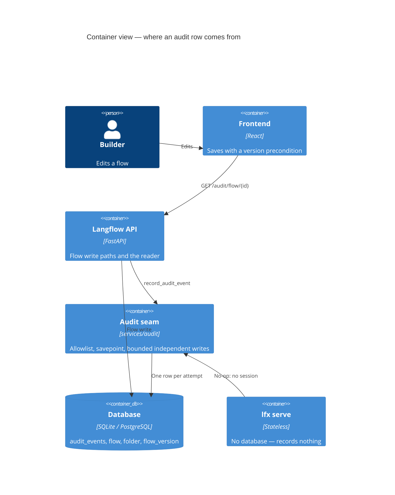
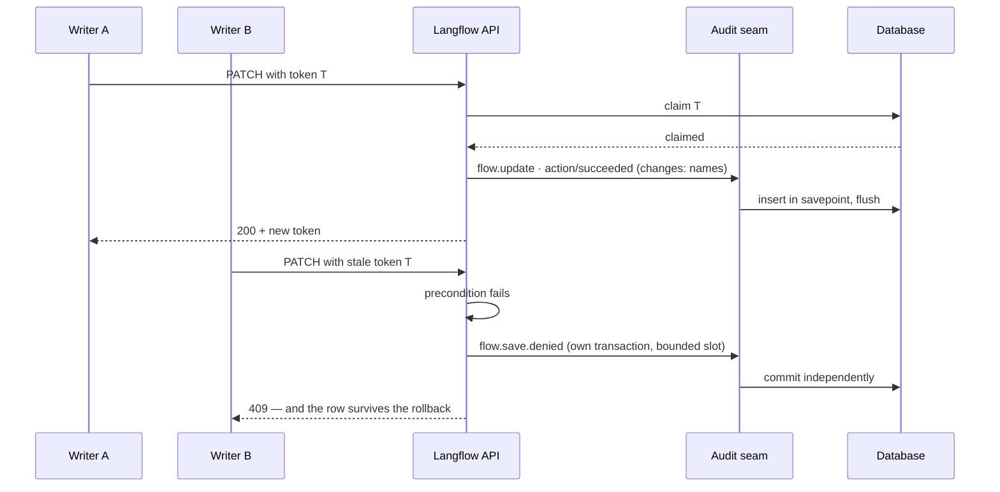

# Feature: Application Audit Log

> Generated on: 2026-09-09
> Status: Implemented (Phase 1), behind a feature flag, pending merge
> Owner: Cristhian Zanforlin
> Related: Epic [LE-2379](https://datastax.jira.com/browse/LE-2379)
>
> Two families share one table. An `authz` row records whether an attempt was
> permitted; an `action` row records what it did. A denial is never an action
> that failed, and an action never carries `allow` or `deny` — the pairing is
> enforced when the row is written.
>
> Flows and projects are both producers. The refusal of a *save* on a version
> precondition has no producer here: nothing refuses a save until multi-edit
> safety ships alongside it.

---

## Table of Contents
1. [Overview](#1-overview)
2. [Ubiquitous Language Glossary](#2-ubiquitous-language-glossary)
3. [Domain Model](#3-domain-model)
4. [Behavior Specifications](#4-behavior-specifications)
5. [Architecture Decision Records](#5-architecture-decision-records)
6. [Technical Specification](#6-technical-specification)
7. [Observability](#7-observability)
8. [Deployment & Rollback](#8-deployment--rollback)
9. [Architecture Diagrams](#9-architecture-diagrams)
10. [Platform Compatibility](#10-platform-compatibility)

---

## 1. Overview

Langflow could not answer "who changed this, when, and did it work" for any resource. An accepted
edit and a permission denial — the records an investigation starts from — left no trace at all.

The audit log records **one row per attempt** against a resource: who acted, what resource, when,
whether it was accepted, and **which fields were touched**. It never records a field's value, a
graph, or a secret.

**Business context.** Enterprise buyers expect an accountable edit history.

**Bounded context:** Application Audit. Resource-agnostic by schema; flows are the only producer
in Phase 1.

### Related Contexts
- **Multi-Edit Safety** (Supplier, not in this branch): decides which of several concurrent writes
  is accepted. Until it ships, concurrent writers are not arbitrated, so the log records each write
  that the database accepted rather than one elected winner.
- **Flow Version History** (Partnership): holds the recoverable state. The audit log names what
  changed; a snapshot is what the state *was*.
- **Authorization** (Conformist): decides who may read a resource's trail; in OSS the query stays
  owner-scoped.
- **Authorization Audit** (`authz_audit_log`, separate today): records allow/deny decisions. The
  `authz` family here uses the same vocabulary, so the two can converge later. Permission
  denials live there and are deliberately not duplicated here.

### Explicitly not in this release
Run events, retention sweeping, log streaming, and snapshotting on autosave. Each is a later phase
with no schema change. **State reconstruction is not a goal**: `changes` names what was touched,
not what it became.

---

## 2. Ubiquitous Language Glossary

| Term | Definition | Code Reference |
|---|---|---|
| Audit event | The name of a thing that happened, as a dotted string. A public contract that is never renamed once released. | `services/audit/events.py` |
| Audit row | One immutable record of one attempt. | `AuditLog` |
| Resource type | Which kind of thing the row is about. Always the event name's third segment. | `resource_type_of()` |
| Change summary | The **names** of the fields a write touched, capped, never their values. | `summarize_flow_changes()` |
| Payload allowlist | The only keys a row may carry; enforced at the write seam, not by each producer. | `ALLOWED_PAYLOAD_KEYS` |
| Independent write | An audit row committed in its own transaction so a refusal's rollback cannot erase it. | `record_audit_event_independently()` |
| Write slot | One of a bounded number of concurrent independent writes, so a burst cannot drain the connection pool. | `MAX_CONCURRENT_INDEPENDENT_WRITES` |

---

## 3. Domain Model

### Aggregate: Audit Row
- **Root entity:** `AuditEvent` (`services/database/models/audit_event/model.py`)
- **Value objects:** the event name; the payload allowlist
- **Invariants:**
  - A row is never updated or deleted by the application. Retention is the only sanctioned deletion.
  - `resource_type` always equals the event name's third segment.
  - `payload` contains only allowlisted keys, and never a field value, a graph, or a secret.
  - `created_at` comes from the database, never from a pod's clock.
  - `user_id` has no foreign key: attribution outlives the user row.
  - `resource_id` has no foreign key: the trail outlives the resource.
  - `result` belongs to its `family`: `allow`/`deny` to `authz`, `succeeded`/`failed`
    to `action`. A database constraint can only cover the union, so the pairing is
    enforced where the producer named both — a denial recorded as an action makes
    every "show me the refusals" query wrong in a way nobody notices.
  - An aggregate operation writes one row. The resource rows underneath are
    absorbed into it, so replacing a project's contents is one act in the trail,
    not one row per flow.
  - Request and actor attribution are **not** in this schema. The columns existed
    briefly with no producer, which is worse than their absence: an empty column
    answers a question wrongly. They land with the code that fills them.
  - A trail outlives its resource. Once the row is gone there is nothing left to
    authorize against, so the trail's own attribution decides who may read it —
    and a stranger gets the same 404 as for a resource that never existed.

### Domain Events

The name is the *attempt*, never its outcome — `flow.update`, not `flow.updated` —
so one name covers the attempt that worked, the one that failed, and the one that
was refused. `family` and `result` say how it ended.

| Event | Family | Result | Payload |
|---|---|---|---|
| `langflow.audit.flow.create` | action | `succeeded` · `failed` | — |
| `langflow.audit.flow.update` | action | `succeeded` · `failed` | `changes`, `changes_total`, optional `reason` |
| `langflow.audit.flow.delete` | action | `succeeded` · `failed` | — |
| `langflow.audit.flow.restore` | action | `succeeded` · `failed` | `version_id` |
| `langflow.audit.flow.run` | action | `succeeded` · `failed` | `duration_ms`, and `error_class` on a failure |
| `langflow.audit.project.create` | action | `succeeded` · `failed` | `flows_total` when created with contents |
| `langflow.audit.project.update` | action | `succeeded` · `failed` | — |
| `langflow.audit.project.delete` | action | `succeeded` · `failed` | — |
| `langflow.audit.project.replace` | action | `succeeded` · `failed` | `flows_total`, `flows_removed` |
| any of the above | authz | `allow` · `deny` | `reason=permission_denied` |

---

## 4. Behavior Specifications

```gherkin
Feature: Application audit log

  Background:
    Given LANGFLOW_AUDIT_ENABLED is true

  Scenario: An accepted edit names who and what
    When a user changes a component field and saves
    Then one row exists with event "langflow.audit.flow.update" and resource_type "flow"
    And payload.changes names the component and field that changed
    And the row contains no graph and no field value

  Scenario: Changes name fields, never values
    When a user changes a component's model name and its API key
    Then payload.changes names both fields
    And neither value appears anywhere in the row

  Scenario: Every accepted save is recorded
    When five saves are accepted
    Then five update rows exist and none is recorded as denied

  Scenario: A rename or a no-op save records nothing
    When a flow is renamed, or saved with an identical graph
    Then no update row is written

  Scenario: A stranger cannot read someone else's trail
    When a user who does not own a flow reads its audit log
    Then the response is 404, indistinguishable from a flow that does not exist

  Scenario: A large flow does not produce a large row
    When a save touches 201 fields
    Then payload.changes holds 50 names and changes_total is 201

  Scenario: A deleted flow keeps its history
    When a flow is deleted
    Then its rows remain, including the deletion

  Scenario: Anonymizing keeps who, what and when but drops the payload
    Given LANGFLOW_AUDIT_ANONYMIZE_PAYLOAD is true
    Then rows are still written and payload is null

  Scenario: A bad audit row never costs the write it describes
    Given a payload JSON cannot encode
    Then the row is dropped or reduced, and the caller's transaction commits

  Scenario: A stateless runtime records nothing and does not fail
    Given the process has no database, as under lfx serve
    Then a flow runs normally and no row is written

  Scenario: The page is capped but the total is not
    When a flow has more rows than one page
    Then the page honours the limit and total counts every row

  Scenario: Disabled by default
    Given LANGFLOW_AUDIT_ENABLED is false
    Then no rows are written and the reader returns 404
```

Every scenario maps to a test in `tests/unit/api/v1/test_audit_event.py`,
`test_audit_event_edges.py`, or `tests/unit/services/audit/`.

---

## 5. Architecture Decision Records

### ADR-001 — Names, never values
**Status:** Accepted.
**Context:** An audit row outlives the edit. A value written into it is a value on disk for as long
as the row lives, and the field most worth auditing — an API key — is the one most worth never
storing.
**Decision:** `payload.changes` carries only the names of touched fields, capped at 50 with a true
total.
**Consequences:** No redaction rule is needed, because no value is ever recorded. The row size is
bounded by how much someone touched, not by how big the resource is (measured: 70 bytes p-max
against a 12-component flow, under 2 KB against 200 components). The cost is that the log alone
cannot reconstruct state — that is `flow_version`'s job.

### ADR-002 — The allowlist is enforced at the seam
**Status:** Accepted.
**Context:** Producers are written by many hands over time. A rule that lives in each producer is a
rule that eventually gets forgotten.
**Decision:** `record_audit_event` filters the payload to `ALLOWED_PAYLOAD_KEYS` and proves it
JSON-encodable before the row exists.
**Consequences:** A careless producer cannot leak a value. The seam is the last line of defence and
is tested as such.

### ADR-003 — The row is written in a savepoint and flushed immediately
**Status:** Accepted.
**Context:** `session.add` only stages a row; the insert happens at the caller's flush. A row the
database rejects therefore raises *inside the caller's transaction* and fails the write the row
merely describes. This was a real defect, proven before the fix.
**Decision:** Wrap the insert in `session.begin_nested()` and flush inside the seam's own
try/except.
**Consequences:** The promise "never costs the write" becomes true rather than intended. The cost
is one round trip per row on the write path (measured: +1.67 ms p95).

### ADR-004 — A refusal records itself in its own transaction, with bounded concurrency
**Status:** Accepted.
**Context:** A refused save raises, and raising rolls the request's transaction back — taking the
row describing the refusal with it. The row that matters most in an investigation is exactly the
one the rollback would erase.
**Decision:** Refusals use `record_audit_event_independently()`, which opens its own session; and
that path is limited to `MAX_CONCURRENT_INDEPENDENT_WRITES` slots with a short acquisition timeout.
**Consequences:** Refusals are durable. The bound exists because it was measured to matter: 120
simultaneous conflicting saves without it exhausted the connection pool and cost unrelated requests
their authentication. With it, the same burst produced 119 refusal rows, no dropped row, and no pool
error. The path ships here but has no caller until multi-edit safety supplies one.

### ADR-007 — Creating a project with contents compensates rather than rolls back
**Status:** Accepted.
**Context:** `POST /projects/with-flows` promises that a failure leaves nothing
behind. It cannot keep that promise with a transaction: creating a project
registers an MCP server, and that registration commits — so by the time the
contents fail, the project is already durable and no rollback can reach it.
Measured, not assumed: the project survived a failed creation with the audit
feature switched off, and a commit trace named `mcp.py:_persist` as the caller.
**Decision:** On failure the endpoint deletes the project it created, on the
caller's own session and only after rolling it back — a second connection cannot
write while the first holds the transaction, which on SQLite is a hard "database
is locked" rather than contention. The cleanup commits itself, because the
caller's transaction is about to be rolled back by the error on its way out.
**Consequences:** The observable promise holds. The mechanism is compensation,
not atomicity, so a cleanup that itself fails leaves the project behind — logged,
and never in place of the error the caller needs to see. The cleanup finalizes
the Memory Base handles it collects, so a compensated creation does not leak the
remote collections its flows had already registered.

### ADR-005 — No `Enum` columns, no sequence, no hash chain
**Status:** Accepted.
**Context:** An `Enum` column makes adding an event name a migration on both backends. A gap-free
sequence would need cross-replica coordination on every write. A tamper-evident hash chain is a
control this product category does not ship.
**Decision:** Plain string columns; ordering by a database-side `created_at`; append-only enforced
in the application.
**Consequences:** A new event name is a constant, never a migration. Concurrent appends from N
replicas need no coordination. Tamper *prevention* is out of scope, and stated as such.

### ADR-006 — Permission denials are not duplicated here
**Status:** Accepted.
**Context:** `ensure_flow_permission` already writes allow/deny rows to `authz_audit_log`, and the
guard holds no database session.
**Decision:** Do not emit `flow.permission.denied`. The name is reserved.
**Consequences:** One less producer and no duplicated record. The gap is visibility: `/authz/audit`
is superuser-only, so a workspace admin cannot see denials. Revisit if that is asked for.

---

## 6. Technical Specification

### Dependencies

| Component | Used for |
|---|---|
| `services/audit/recorder.py` | The single write seam |
| `services/audit/changes.py` | Naming what a flow write touched |
| `services/audit/events.py` | The event vocabulary |
| `api/utils/author_names.attach_usernames` | Resolving `user_id` to a name in one query |
| `services/authorization/fetch.authorized_or_owner_scoped` | Owner-scoped read |

### API

```
GET /api/v1/audit/{resource_type}/{resource_id}
    ?limit=50&offset=0&event=&since=&until=
```

**Success (200)**

```json
{
  "entries": [
    {
      "id": "…",
      "created_at": "2026-09-09T13:36:49.220132+00:00",
      "event": "langflow.audit.flow.update",
      "user_id": "…",
      "username": "cris",
      "resource_type": "flow",
      "resource_id": "…",
      "payload": {"changes": ["Agent.model_name"], "changes_total": 1}
    }
  ],
  "total": 21
}
```

| Error | Condition | Recovery |
|---|---|---|
| 404 | The flag is off | Enable `LANGFLOW_AUDIT_ENABLED` |
| 404 | Unknown `resource_type` | Only `flow` is served in Phase 1 |
| 404 | The resource does not exist, **or** the caller may not read it | Deliberately indistinguishable, so the endpoint cannot probe for UUIDs |
| 422 | `limit` above 200 | Page through with `offset` |

### Producers

| Path | Event |
|---|---|
| `flows_helpers._new_flow` | `flow.create` · action/succeeded |
| `flows_helpers._patch_flow` | `flow.update` · action/succeeded |
| `flows.delete_flow` | `flow.delete` · action/succeeded |
| `flows.delete_multiple_flows` | one `flow.delete` row per flow, not one per request |
| `endpoints._run_flow_internal` | `flow.run` · action/succeeded or failed, with the duration, on every exit |
| `flow_version.restore` | `flow.restore` · action/succeeded |
| `projects.create_project` | `project.create` · action |
| `projects.update_project` / `upsert_project` | `project.update` · action |
| `projects.delete_project` | `project.delete` · action |
| `projects.create_project_with_flows` | `project.create` · action, with `flows_total` |
| `projects.replace_project_flows` | `project.replace` · action, with `flows_total` and `flows_removed` |
| `audit.scope.audited_action` | the `authz`/`deny` row when a route raises 403 |

---

## 7. Observability

| Log | Level | Fields | When |
|---|---|---|---|
| `op=record_audit_event ... outcome=dropped` | warning | `event`, `resource_id`, `error` (exception type) | A row could not be written. Names the exception type on purpose: a bare warning here once hid a real defect. |
| `op=record_audit_event_independently ... outcome=dropped` | warning | same | A refusal's row could not be written, including when no write slot was free in time. |

No metrics are emitted yet. Neither log line carries a field value, a graph, or PII beyond
`user_id`.

**Ops note:** repeated `outcome=dropped ... error=TimeoutError` under load means the connection pool
is saturated, not that the audit log is broken.

---

## 8. Deployment & Rollback

| Flag | Purpose | Default |
|---|---|---|
| `LANGFLOW_AUDIT_ENABLED` | Master switch | `false` |
| `LANGFLOW_AUDIT_ANONYMIZE_PAYLOAD` | Keep who/what/when, drop the payload | `false` |

Only settings with an implementation behind them exist. Retention, run events and autosave
snapshots arrive with their phases.

### Migrations

| Revision | Phase | Reversible |
|---|---|---|
| `690d24733555` | EXPAND | Yes — no DDL; it only rejoins two alembic heads left by a release merge |
| `8f2a41c07b93` | EXPAND | Yes — creates `audit_events` and five indexes; nothing else reads them |

Verified up → down → up on SQLite and up on PostgreSQL 17, with the model/migration consistency
gate green on both.

### Rollback
1. Set `LANGFLOW_AUDIT_ENABLED=false`. Writing and reading both stop; the table goes inert.
2. If the table must go, `alembic downgrade` to `690d24733555`. No other feature reads it.

### Smoke tests
- [ ] Flag off: reader returns 404 and no rows appear
- [ ] Flag on: an edit produces one row naming the field
- [ ] Two clients racing: one accepted, the rest recorded as denied
- [ ] A stranger reading another user's trail gets 404
- [ ] `lfx serve` runs a flow with the flag on and writes nothing

---

## 9. Architecture Diagrams





---

## 10. Platform Compatibility

| Platform | Supported | Notes |
|---|---|---|
| Linux / macOS / Windows | Yes | No paths, no shell, no subprocess, no local files — nothing platform-specific |
| SQLite | Yes | `created_at` reads back naive and is normalized to UTC on read; append-only is application-level only, as SQLite has no `GRANT` |
| PostgreSQL 15+ | Yes | Verified on 17.9, including two replicas against one database |
| Docker | Yes | Configured entirely by environment variables; verified with no `.env` present |
| Kubernetes, N replicas | Yes | Appends need no coordination; `created_at` comes from the database so pod clock skew cannot reorder the trail |
| Langflow Desktop | Yes | Single user on SQLite. `client_ip` and `user_agent` stay null, being gated on trusted-proxy configuration |
| `lfx serve` | Yes, as a no-op | Stateless with `NoopSession`; the seam checks for a real session deliberately rather than relying on the no-op absorbing an insert |

### Known limitations
- Tamper *prevention* needs PostgreSQL grants; on SQLite the guarantee is application-level.
- Under a saturated connection pool a refusal's row can be dropped. It is logged with its exception
  type and never delays the response.
- One page returns at most 200 rows; `total` is the count of all of them.
