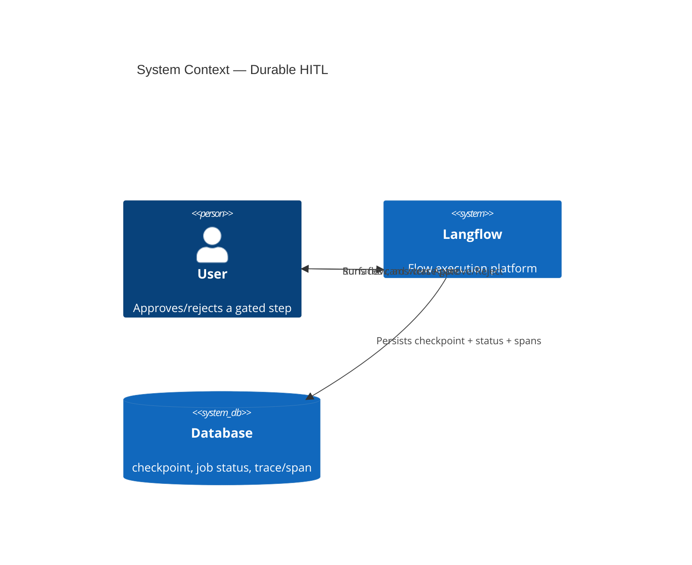
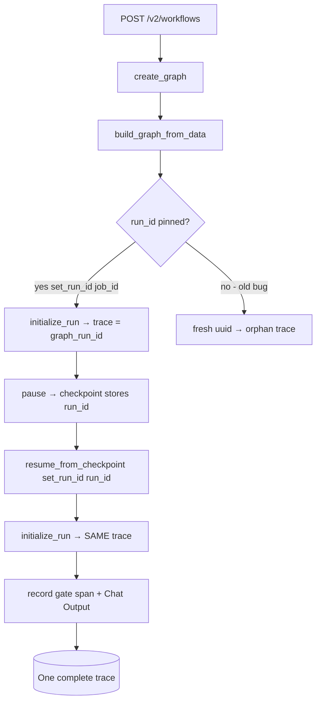
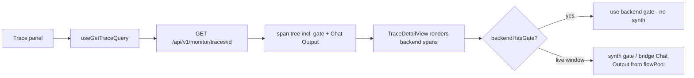

# Feature: Durable Background Execution + Human-in-the-Loop (HITL)

> Generated on: 2026-06-23
> Status: Draft
> Owner: Engineering Team
> Related PRs: #13633 (HITL v2); Epic LE-1437
> Companion document: [`../../CZL/HITL_FEATURE_OVERVIEW.md`](../../CZL/HITL_FEATURE_OVERVIEW.md) — the engineering deep-dive (8-stage code walk-through), and [`../../CZL/HITL_STATUS.md`](../../CZL/HITL_STATUS.md) — the status/decision summary.

---

## Table of Contents
1. [Overview](#1-overview)
2. [Ubiquitous Language Glossary](#2-ubiquitous-language-glossary)
3. [Domain Model](#3-domain-model)
4. [Behavior Specifications](#4-behavior-specifications)
5. [Architecture Decision Records](#5-architecture-decision-records)
6. [Technical Specification](#6-technical-specification)
7. [Observability](#7-observability)
8. [Deployment & Rollback](#8-deployment--rollback)
9. [Architecture Diagrams](#9-architecture-diagrams)

---

## 1. Overview

### Summary
Human-in-the-Loop (HITL) lets a flow **pause mid-run to ask a human to approve, reject, or supply input**, then resume exactly where it stopped. The pause is **durable**: it is checkpointed to the database, survives a process restart, and resumes without re-running or re-billing already-completed work. The paused/resumed run is fully **observable** as a single backend trace, with the approval step and the terminal output recorded as real spans.

### Business Context
Agentic flows take consequential actions (calling tools, sending requests, spending tokens). Teams need a control point where a human gates a risky step before it executes, without losing the run if the browser closes or the server restarts. HITL turns a flow into a long-lived, resumable workflow rather than a single fire-and-forget request.

### Bounded Context
Flow Execution — Durable Background Jobs & Graph Checkpointing.

### Related Contexts
- **Graph Engine** (Customer-Supplier): raises and restores the pause at layer boundaries.
- **Background Execution / Job Service** (Partnership): persists job status and serves the single-flight resume.
- **Tracing** (Conformist): records the run — including the gate and the terminal output — as spans.
- **Frontend (AG-UI)** (Customer-Supplier): reattaches to the live stream and renders the decision surfaces.

### Default-off guarantee
The pause probe is a no-op unless a component requests it, so normal flows are byte-for-byte unaffected: no checkpointing, no extra spans, no status churn.

---

## 2. Ubiquitous Language Glossary

| Term | Definition | Code Reference |
|------|------------|----------------|
| Pause request | A component's signal that it needs a human decision before continuing | `PauseRequested`, `GraphPausedException` |
| Checkpoint | A serialized snapshot of graph state at a layer boundary, written to the DB | `lfx/graph/checkpoint/schema.py`, `checkpoint` table |
| Suspend | The job transitioning to a durable waiting state | `JobStatus.SUSPENDED` |
| Resume | Re-hydrating the graph from its checkpoint and continuing past the pause | `resume_from_checkpoint`, `build_resumed_graph_and_get_order` |
| Single-flight resume | An atomic `SUSPENDED → IN_PROGRESS` claim so a decision is applied exactly once | `claim_suspended_for_resume` |
| Human input request | The pending question shown to the user (tool approval or HumanInput node) | `get_pending_human_request`, `human_input_required` event |
| Decision | The human's answer: `action_id` (e.g. `approve`/`reject`) plus optional `values` | `graph.human_input_decisions` |
| Run id | The graph's tracing identity; equals `graph_run_id` on the messages | `graph.set_run_id`, trace `id` |
| Job id | The durable job identity used for checkpoints + resume | `JobStatus`, `/api/v2/workflows/{job_id}/resume` |
| Gate span | The trace span recording the resolved decision: "Human In The Loop — Approved/Rejected" | `TracingService.record_event_span` |

---

## 3. Domain Model

### 3.1 Aggregates

#### Durable Run Aggregate
- **Root Entity**: the background **Job** (`job_id`)
- **Entities**: the **Graph** (with its `run_id`), the **Checkpoint**, the **Pending Human Request**
- **Value Objects**: `JobStatus`, `Decision` (`action_id` + `values`), `request_id` (`{node_id}:{run_id}`)
- **Invariants**:
  - A pause must persist a checkpoint before the run yields (no lost state).
  - Resume must be single-flight: a decision is applied **exactly once**.
  - Resume must not re-execute already-built vertices (no re-billing, no re-fired tools); dead branches stay dead.
  - The whole run (pre-pause + post-resume) must trace into **one** `run_id`.

### 3.2 Domain Events

| Event | Trigger | Payload | Consumers |
|-------|---------|---------|-----------|
| `human_input_required` | A component raises a pause | card/request descriptor | Frontend (renders card/bar); job runner (suspends) |
| Job `SUSPENDED` | Checkpoint written, run yields | `job_id`, `request_id` | Pending-requests API; UI badges |
| Resume accepted | Valid decision claimed | `job_id`, `decision` | Graph rebuild; tracing |
| Gate resolved span | Resume re-initializes tracing | "Human In The Loop — {decision}" | Trace panel (`/monitor/traces/{id}`) |
| Job `COMPLETED` / terminal span | Resumed run finishes | Chat Output span + flush | Trace panel; message history |

---

## 4. Behavior Specifications

### Feature: A flow pauses for a human decision and resumes durably

**As a** flow author
**I want** a step to pause for human approval and survive interruptions
**So that** risky actions are gated and no run is lost if the server restarts.

### Background
- Given a flow with an agent tool (or HumanInput node) that can request approval
- And durable background execution is enabled

### Scenario: Agent tool pauses for approval
- **Given** the agent decides to call a gated tool
- **When** the run reaches the tool call
- **Then** the graph checkpoints and the job becomes `SUSPENDED`
- **And** a `human_input_required` event surfaces an Approve/Reject card

### Scenario: Resume survives a process restart
- **Given** a job is `SUSPENDED` with a written checkpoint
- **When** the backend process restarts and the user approves
- **Then** the graph is rebuilt from the checkpoint and continues past the pause

### Scenario: Resume is not a re-run
- **Given** a paused run with already-built vertices
- **When** the run resumes
- **Then** built vertices are restored, not re-executed (no LLM re-billing, no re-fired tools)
- **And** branches killed before the pause stay dead

### Scenario: Single-flight resume
- **Given** two resume requests for the same `SUSPENDED` job
- **When** both arrive
- **Then** exactly one claims the `SUSPENDED → IN_PROGRESS` transition; the other is rejected (`NOT_RESUMABLE`)

### Scenario: The resumed run is one complete backend trace
- **Given** a run that paused and resumed
- **When** the resumed run finishes
- **Then** a single trace holds `Chat Input → Human In The Loop — {decision} → … → Chat Output`
- **And** the trace panel shows the gate + terminal output after a full page refresh, with no client-side persistence

### Scenario: A decision applied after timeout is rerouted, not lost
- **Given** a pending request that has a timeout policy
- **When** the decision arrives after the deadline
- **Then** `reroute_decision_on_timeout` resolves the effective decision deterministically

---

## 5. Architecture Decision Records

### ADR-001: The pause is a signal, not a failure

**Status**: Accepted

#### Context
A component needing human input must stop the graph without corrupting state or marking the run failed.

#### Decision
Model the pause as a dedicated exception (`GraphPausedException`) raised at a **layer boundary**, after the graph snapshots itself and writes a checkpoint. The build seam catches it and emits a **non-terminal** `human_input_required` event — the stream ends *without* `on_end`, so the run is "waiting", not "done".

#### Consequences
- **Benefits**: clean separation of "waiting" from "failed"; resumable by construction; default-off (no probe → no-op).
- **Trade-offs**: every layer boundary consults a pause probe (cheap; skipped entirely when no pause is pending).

### ADR-002: Resume is single-flight and rolls back

**Status**: Accepted

#### Context
A decision must apply exactly once even under duplicate clicks, retries, or concurrent callers.

#### Decision
Claim the job with an atomic `SUSPENDED → IN_PROGRESS` transition (`claim_suspended_for_resume`); on failure during resume, roll the status back so the decision is never silently consumed.

#### Consequences
- **Benefits**: exactly-once decisions; safe retries; no lost approvals.
- **Trade-offs**: a stale/duplicate resume returns `NOT_RESUMABLE` (handled by the UI).

### ADR-003: Resume ≠ re-run

**Status**: Accepted

#### Context
Re-executing completed vertices on resume would re-bill LLMs, re-fire tools, and could revive dead branches.

#### Decision
Restore built vertices from the checkpoint; only re-run the paused vertex's **non-input predecessors** (`_rerun_non_input_predecessors`) needed to complete the gated step. Inputs (e.g. Chat Input) are not re-executed.

#### Consequences
- **Benefits**: no double billing, no duplicate side effects, deterministic continuation.
- **Trade-offs**: the resume re-runs a minimal predecessor set; the terminal output is produced fresh on resume (see ADR-004).

### ADR-004: The whole run is one durable backend trace (gate + Chat Output as spans)

**Status**: Accepted (2026-06-23)

#### Context
Originally, resumed runs lost trace data in the backend: the **Chat Output** span was missing and the **Human In The Loop** step existed only as a frontend-injected node persisted in `localStorage` — invisible to other devices/users and incomplete in the DB. Root cause: the resume path **never initialized tracing** (`trace_context_var` was unset, so post-pause vertices skipped `add_trace`), and the initial run traced under a throwaway uuid instead of the `run_id`, splitting the run into an orphan trace.

#### Decision
1. On resume, call `graph.initialize_run()` on the checkpoint's `run_id` so resumed vertices trace into the **same** trace as the pre-pause run, and restore `flow_name` for the trace title.
2. Pin the caller's `run_id` in `build_graph_from_data` **before** `initialize_run` (forwarded by `create_graph`), so the initial run traces into `graph_run_id` — not a fresh uuid.
3. Record the resolved gate as a real span via `TracingService.record_event_span` ("Human In The Loop — Approved/Rejected").
4. Remove the frontend `localStorage` persistence; `TraceDetailView` reads the gate + output from the backend trace and only synthesizes a gate for the live window, deduped by name.

#### Consequences
- **Benefits**: one complete trace (`Chat Input → gate → … → Chat Output`) durable across refresh, devices, and users; no client-side band-aid.
- **Trade-offs**: the resume re-initializes tracing once (a no-op when tracing is disabled).
- **Impact on Product**: the trace panel is now the source of truth for what a HITL run did.

### ADR-005: Terminal span flush race fixed

**Status**: Accepted

#### Context
Component spans are recorded asynchronously via a worker queue. At end-of-run the worker was cancelled while the **terminal** component's end event was still enqueued, dropping the Chat Output span in ~7 of 8 runs.

#### Decision
Drain the queue **inline** after cancelling the worker (`service.py::_stop`), and force-complete any started-but-unended span at flush (`native.py::_finalize_pending_spans`).

#### Consequences
- **Benefits**: no executed component is silently dropped from a trace.
- **Trade-offs**: a tiny synchronous drain at shutdown (bounded by queue size).

---

## 6. Technical Specification

### 6.1 Pause → suspend (initial run)
- The graph consults a pause probe at each layer boundary; on a pending pause it snapshots itself, writes a `checkpoint` row (always-writable schema), and raises `GraphPausedException`.
- The build seam (`api/build.py`) catches it, persists the human-input card to history, emits `human_input_required`, and ends the stream without `on_end`.
- The runner marks the job `SUSPENDED` (`services/background_execution/runner.py`).

### 6.2 Resume (single-flight)
- `POST /api/v2/workflows/{job_id}/resume` with `{request_id, decision}`.
- `claim_suspended_for_resume` performs the atomic status claim; failure → `NOT_RESUMABLE`.
- `build_resumed_graph_and_get_order` (`api/build.py`):
  ```python
  graph = LfxGraph.resume_from_checkpoint(checkpoint, checkpoint_store=store)
  graph.flow_name = graph.flow_name or flow_name
  await graph.initialize_run()                      # re-init tracing on the original run_id
  decision = reroute_decision_on_timeout(pending, resume["decision"])
  graph.human_input_decisions = {resume["request_id"]: decision}
  action_id = str((decision or {}).get("action_id", ""))
  gate_label = "Rejected" if "reject" in action_id.lower() else "Approved"
  graph.tracing_service.record_event_span(
      span_id=f"hitl-{resume['request_id']}",
      name=f"Human In The Loop — {gate_label}",
      outputs={"decision": action_id},
  )
  # restore built vertices; re-run only non-input predecessors of the gated vertex
  ```

### 6.3 Trace continuity (initial run)
- `build_graph_from_data` (`api/utils/flow_utils.py`) pins the run id before tracing starts:
  ```python
  if (caller_run_id := kwargs.get("run_id")) is not None:
      graph.set_run_id(caller_run_id)
  await graph.initialize_run()
  ```
- `create_graph` forwards `run_id=str(job_id) if job_id is not None else run_id` to both `build_graph_from_data` and `build_graph_from_db`.

### 6.4 Gate span recording
- `TracingService.record_event_span(span_id, name, outputs, span_type="chain")` writes a standalone start+end span into the active trace for every ready tracer; deactivated/contextless calls are no-ops.

### 6.5 Frontend (reads backend spans)
- `useGetTraceQuery` → `GET /api/v1/monitor/traces/{id}` returns the span tree.
- `TraceDetailView.tsx`: renders the backend gate span; `backendHasGate` dedup prevents a duplicate synthetic node; `executedOutputSpans` bridges Chat Output from live `flowPool` only during the resume window (deduped by name).
- `hitlStore.ts`: in-memory only (`pending` slot); `localStorage`/`persist` removed.

### 6.6 Component map (quick index)

| Concern | Where | Key symbols |
|---------|-------|-------------|
| Pause signal + checkpoint | `lfx/graph/graph/base.py`, `lfx/graph/checkpoint/` | `GraphPausedException`, `resume_from_checkpoint`, `set_run_id` |
| Build seam + resume rebuild | `api/build.py` | `build_resumed_graph_and_get_order`, `_rerun_non_input_predecessors` |
| Run-id pinning | `api/utils/flow_utils.py` | `build_graph_from_data` |
| Durable job + single-flight | `services/background_execution/{runner,service}.py` | `JobStatus.SUSPENDED`, `claim_suspended_for_resume` |
| Tracing | `services/tracing/{native,service}.py` | `record_event_span`, `_finalize_pending_spans`, `_stop` drain |
| Trace UI | `TraceComponent/TraceDetailView.tsx` | `backendHasGate`, `executedOutputSpans` |
| Live HITL slot | `stores/hitlStore.ts` | `pending` (in-memory) |

---

## 7. Observability

- **Trace panel** (Flow Activity): the run renders as a span tree — `Chat Input → tools → Agent → Chat Output` — and, for a gated run, a `Human In The Loop — {decision}` span. Read via `GET /api/v1/monitor/traces/{id}`.
- **Job status**: `SUSPENDED` / `IN_PROGRESS` / `COMPLETED` / `FAILED` exposed through the workflows API; pending requests via `GET /api/v2/workflows/pending?flow_id=`.
- **Validated end-to-end** (2026-06-23): a driven pause→approve→resume yields **one** trace of 21 spans (`Chat Input → Human In The Loop — Approved → Calculator → URL → Agent → fetch_content → … → Chat Output`), confirmed in the DB, in the `/monitor/traces/{id}` payload, and in the trace panel after a page refresh.

---

## 8. Deployment & Rollback

- **Default-off**: no component requests a pause → no checkpointing, no extra spans, no status churn. Safe to ship.
- **Schema**: the `checkpoint` and `span`/`trace` tables back the durability + observability; no destructive migrations are part of this feature.
- **Run modes**: works under the durable background path (`POST /api/v2/workflows`, `mode: background`) with resume via `POST /api/v2/workflows/{job_id}/resume`.
- **Rollback**: reverting the trace-continuity change restores the prior behavior (Chat Output/gate absent from resumed backend traces) but does not affect pause/resume correctness; reverting the pause/resume layer disables HITL entirely (flows run straight through).

---

## 9. Architecture Diagrams

### 9.1 Context Diagram (Level 1)



### 9.2 Sequence — pause → suspend → resume

```mermaid
sequenceDiagram
  participant U as User
  participant API as Workflows API
  participant G as Graph Engine
  participant DB as Database
  participant T as Tracing

  U->>API: POST /v2/workflows (background)
  API->>G: build + run (run_id pinned)
  G->>T: trace Chat Input … Agent
  G->>DB: write checkpoint (layer boundary)
  G-->>API: GraphPausedException → human_input_required
  API->>DB: job SUSPENDED
  API-->>U: Approve / Reject card
  U->>API: POST /v2/workflows/{job}/resume {decision}
  API->>DB: claim SUSPENDED→IN_PROGRESS (single-flight)
  API->>G: resume_from_checkpoint + initialize_run(run_id)
  G->>T: record "Human In The Loop — Approved" span
  G->>T: trace re-run predecessors … Chat Output
  G->>DB: flush spans (one trace) + job COMPLETED
  API-->>U: result; trace panel shows full run
```

### 9.3 Trace continuity (why one trace)



### 9.4 Frontend read path (no localStorage)


